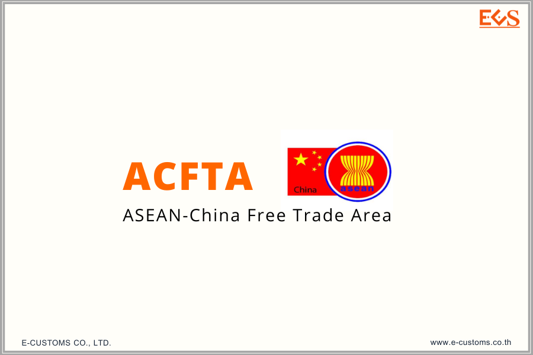

ประกาศกรมศุลกากรที่ 169/2563 เรื่อง **การดำเนินกระบวนการทางศุลกากรสำหรับระบบศุลกากรผ่านแดนอาเซียน (ASEAN Customs Transit System - ACTS)**





## เอกสารแนบท้ายประกาศกรมศุลกากรที่ 169/2563






## คู่มือการใช้งานระบบศุลกากรผ่านแดนอาเซียน สำหรับผู้ประกอบการ




ดาวน์โหลดประกาศ
ดาวน์โหลดคู่มือการใช้งาน

> ที่มา : [กรมศุลกากร](http://www.customs.go.th/cont_strc_download_with_docno_date.php?lang=th&top_menu=menu_homepage&current_id=14232832414c505f47464b4b464a4e)

