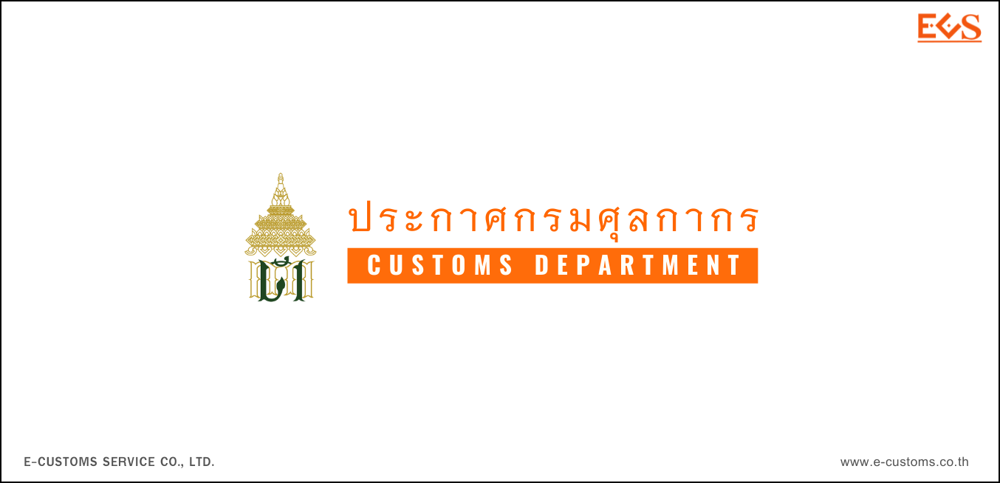


  


**แก้ไขเพิ่มเติมประกาศกรมศุลกากร ที่ 144/2560 เรื่อง หลักเกณฑ์และพิธีการสำหรับการลดอัตราอากรและยกเว้นอากรศุลกากรตามมาตรา 12 แห่งพระราชกำหนดพิกัดอัตราศุลกากร พ.ศ. 2530**


 





 

 

<a class="badge badge-danger" href="./docs.pdf" target="_blank" id="download_files_new">Download</a>

 



> ที่มา : [กรมศุลกากร](http://www.customs.go.th/cont_strc_download_with_docno_date.php?lang=th&top_menu=menu_homepage&current_id=14232932404f505e4f464b4d464b4c)
