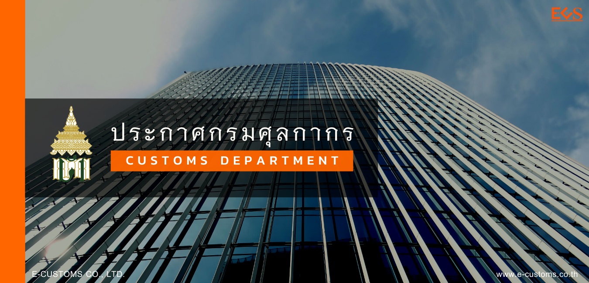

**ประกาศกรมศุลกากร ที่ 150./2564 เรื่อง การขยายระยะเวลาการส่งออกของที่ขอคืนอากรและระยะเวลาการขอคืนอากรตามมาตรา 29 แห่งพระราชบัญญัติศุลกากร พ.ศ. 2560 ในสถานการณ์แพร่ระบาดของโรคติดเชื้อไวรัสโคโรนา 2019 (โควิด-19) (ฉบับที่ 2)**


ข้อ 1 **กรณีที่ไม่สามารถส่งของที่ได้จากการผลิต ผสม ประกอบ บรรจุ หรือดําเนินการ ด้วยวิธีอื่นใด ออกไปนอกราชอาณาจักร** *ภายในกําหนดหนึ่งปีนับแต่วันนําวัตถุดิบเข้ามาในราชอาณาจักร* ให้*ขยายระยะเวลาการส่งออกอีกหกเดือน* **นับแต่วันครบกําหนดระยะเวลาหนึ่งปีดังกล่าว สําหรับการนําเข้า วัตถุดิบ** ตั้งแต่*วันที่ 1 มิถุนายน 2564 ถึงวันที่ 31 ธันวาคม 2564*

 

ข้อ 2 **กรณีที่ไม่สามารถขอคืนอากร** *ภายในกําหนดหกเดือนนับแต่วันที่ส่งของออกไป นอกราชอาณาจักร* ให้*ขยายระยะเวลาการขอคืนอากรอีกหกเดือน* **นับแต่วันครบกําหนดระยะเวลาหกเดือนดังกล่าว สําหรับของส่งออกที่ผลิตจากวัตถุดิบที่นําเข้า**ตั้งแต่*วันที่ 1 มิถุนายน 2564 ถึงวันที่ 31 ธันวาคม 2564*

 
ข้อ 3 กรณีอื่น ๆ นอกเหนือจากที่กําหนดไว้ในข้อ 1 และข้อ 2 ให้ขอผ่อนผันตามประกาศ กรมศุลกากรว่าด้วยการคืนอากรตามมาตรา 29 แห่งพระราชบัญญัติศุลกากร พ.ศ. 2560 

 


 

 

<a class="badge badge-danger" href="./docs.pdf" target="_blank" id="download_files_new">Download</a>

 



> ที่มา : [กรมศุลกากร](http://www.customs.go.th/cont_strc_download_with_docno_date.php?lang=th&top_menu=menu_homepage&current_id=14232932404f505f46464b4a464b48)