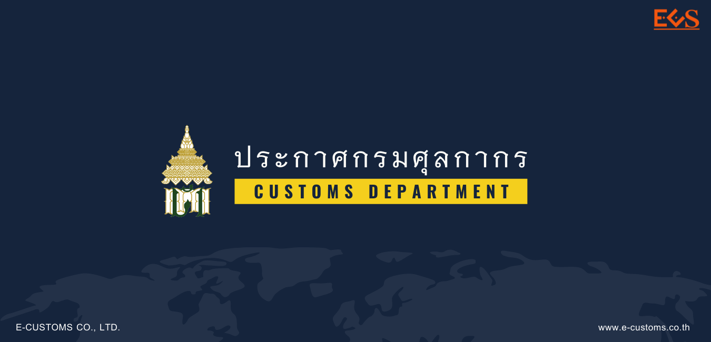

**ประกาศกรมศุลกากร ที่ 171./2564 เรื่อง หลักเกณฑ์ วิธีการ และเงื่อนไข การปฏิบัติพิธีการศุลกากร ในการยกเว้นอากรศุลกากรสำหรับของที่นำเข้ามาเพื่อผลิตเป็นหน้ากาก**

## (ก) การปฏิบัติพิธีการศุลกากรเพื่อขอยกเว้นอากรศุลกากร

ให้ผู้นําของเข้า ยื่นคําร้องขอยกเว้นอากรพร้อมเอกสาร ดังต่อไปนี้

1. กรณีผู้นําของเข้าเป็นผู้ประกอบการอุตสาหกรรมผลิตหน้ากากชนิดที่ใช้ ในห้องผ่าตัดตามประเภทย่อย 6307.40.40 หน้ากากกรองเชื้อโรค หน้ากากทางการแพทย์นอกจากหน้ากาก ชนิดที่ใช้ในห้องผ่าตัด และหน้ากากกรองฝุ่น หมอกควัน หรือสารพิษ บรรดาที่เป็นอุปกรณ์เพื่อความปลอดภัย ตามประเภทย่อย 6307.90.90 ให้ใช้เอกสารหลักฐานเฉพาะในการนําเข้าครั้งแรก ดังนี้

   - แสดงหนังสือรับรองจากกระทรวงอุตสาหกรรม หรือใบรับแจ้ง การประกอบกิจการโรงงานจําพวกที่ 2 (ร.ง. 2) หรือใบอนุญาตประกอบกิจการโรงงาน (ร.ง. 4) หรือหนังสือ รับรองการประกอบกิจการโรงงานในเขตประกอบการอุตสาหกรรมตามมาตรา 30 แห่งพระราชบัญญัติโรงงาน พ.ศ. 2535 (แบบ ข.2) หรือใบแจ้งการประกอบอุตสาหกรรมในนิคมอุตสาหกรรม (กนอ.03/2) หรือหนังสือ รับแจ้งการประกอบอุตสาหกรรม หรือใบอนุญาตให้ใช้ที่ดินและประกอบกิจการในนิคมอุตสาหกรรม (ฉบับต่ออายุ) (กนอ.03/6) ของผู้นําของเข้า
   - ยื่นเอกสารแสดงกําลังการผลิตเต็มที่ของโรงงานต่อปี
   - ยื่นเอกสารแสดงการรับรองตนเองของผู้ประกอบอุตสาหกรรมผลิต หน้ากากตามแบบแนบท้ายประกาศนี้ ว่าของที่นําเข้ามาจะนําไปผลิตเป็นหน้ากากชนิดที่ใช้ในห้องผ่าตัด ตามประเภทย่อย 6307.40.40 หน้ากากกรองเชื้อโรค หน้ากากทางการแพทย์นอกจากหน้ากากชนิด ที่ใช้ในห้องผ่าตัด และหน้ากากกรองฝุ่น หมอกควัน หรือสารพิษ บรรดาที่เป็นอุปกรณ์เพื่อความปลอดภัย ตามประเภทย่อย 6307.90.90 เท่านั้น

2. กรณีผู้นําของเข้ามิใช่ผู้ประกอบอุตสาหกรรมตาม **ข้อ 1** ให้ใช้เอกสารหลักฐาน ในการนําเข้าทุกครั้ง ดังนี้
   - ยื่นเอกสารแสดงรายชื่อและที่อยู่ของผู้ประกอบอุตสาหกรรมผลิต หน้ากาก ที่เป็นลูกค้าในการซื้อของที่ขอยกเว้นอากรศุลกากร
   - ยื่นเอกสารแสดงการรับรองตนเองของผู้นําของเข้าตามแบบแนบท้าย ประกาศนี้ ว่าของที่นําเข้ามาจะนําไปผลิตเป็นหน้ากากชนิดที่ใช้ในห้องผ่าตัดตามประเภทย่อย 6307.40.40 หน้ากากกรองเชื้อโรค หน้ากากทางการแพทย์นอกจากหน้ากากชนิดที่ใช้ในห้องผ่าตัดและหน้ากากกรองฝุ่น หมอกควัน หรือสารพิษ บรรดาที่เป็นอุปกรณ์เพื่อความปลอดภัยตามประเภทย่อย 6307.90.90 เท่านั้น
   - แสดงหนังสือรับรองจากกระทรวงอุตสาหกรรม หรือใบรับแจ้ง การประกอบกิจการโรงงานจําพวกที่ 2 (ร.ง. 2) หรือใบอนุญาตประกอบกิจการโรงงาน (ร.ง. 4) หรือหนังสือ รับรองการประกอบกิจการโรงงานในเขตประกอบการอุตสาหกรรมตามมาตรา 30 แห่งพระราชบัญญัติโรงงาน พ.ศ. 2535 (แบบ ข.2) หรือใบแจ้งการประกอบอุตสาหกรรมในนิคมอุตสาหกรรม (กนอ.03/2) หรือหนังสือ รับแจ้งการประกอบอุตสาหกรรม หรือใบอนุญาตให้ใช้ที่ดินและประกอบกิจการในนิคมอุตสาหกรรม (ฉบับต่ออายุ) (กนอ.03/5) ของผู้ประกอบอุตสาหกรรมผลิตหน้ากาก
   - แสดงเอกสารสัญญาซื้อขายหรือเอกสารอื่นใดที่แสดงได้ว่าผู้นําของเข้า นําเข้ามาเพื่อส่งให้ผู้ประกอบอุตสาหกรรมผลิตหน้ากาก ให้ผู้นําของเข้าจัดทําข้อมูลใบขนสินค้าขาเข้าตามมาตรฐานที่กรมศุลกากรกําหนด โดยบันทึกในช่องสิทธิพิเศษของแต่ละรายการระบุเป็น *“CV5”*

## (ข) ผู้ขอใช้สิทธิในการขออนุมัติยกเว้นอากรศุลกากรสําหรับของที่นําเข้ามา เพื่อผลิตเป็นหน้ากาก

ให้นําพิธีการทั่วไปเกี่ยวกับการขออนุมัติให้ลดอัตราอากรและยกเว้นอากรศุลกากร มาใช้บังคับกับการยกเว้นอากรศุลกากร สําหรับของที่นําเข้ามาเพื่อผลิตเป็นหน้ากาก

1. ให้ผู้นําของเข้ายื่นคําร้องพร้อมเอกสารประกอบตามที่กําหนดไว้ เพื่อขอใช้สิทธิต่อสํานักงานศุลกากร หรือด่านศุลกากร ณ ท่า ที่ หรือสนามบิน ที่นําของเข้าเพื่อประกอบ การพิจารณาอนุมัติให้ได้สิทธิยกเว้นอากรศุลกากร กรณีผู้ขอใช้สิทธิยื่นคําร้องหรือเอกสารไม่ถูกต้อง หรือไม่ครบถ้วน กรมศุลกากรจะมีหนังสือแจ้งให้ผู้ขอใช้สิทธิทราบภายในเจ็ดวันนับแต่วันที่ได้รับคําร้อง และให้ผู้นําของเข้า ยื่นหนังสือหรือเอกสารเพิ่มเติม ให้ถูกต้องครบถ้วนภายในเจ็ดวันนับแต่วันที่ได้รับหนังสือแจ้ง
2. กรมศุลกากรจะมีหนังสือแจ้งเลขที่อนุมัติหลักการ (Permit Number) ให้ผู้ขอใช้สิทธิทราบพร้อมแนบสําเนาเอกสารการอนุมัติหลักการ ซึ่งพิมพ์จากระบบฐานข้อมูลการลดอัตราอากร และยกเว้นอากรศุลกากรตามมาตรา 12 ภายในสิบห้าวันทําการนับแต่วันที่ได้รับคําร้องพร้อมเอกสารถูกต้อง ครบถ้วน หากไม่อนุมัติหลักการกรมศุลกากรจะมีหนังสือแจ้งเหตุผลการไม่อนุมัติให้ทราบ
3. กรณีผู้ได้รับอนุมัติหลักการยื่นคําร้องขอแก้ไขเพิ่มเติม หรือยกเลิก การได้รับอนุมัติหลักการเดิม ให้ยื่นคําร้องพร้อมเอกสารประกอบตามที่กําหนดไว้ในเรื่องนั้น เพื่อประกอบ การพิจารณาให้ครบถ้วน กรณีเป็นการเปลี่ยนแปลงเกี่ยวกับชนิดสินค้าที่นําเข้า ให้ยื่นคําร้องล่วงหน้าก่อนการนําเข้า ที่สํานักงานศุลกากร หรือด่านศุลกากร ณ ท่า ที่ หรือสนามบินแห่งหนึ่งแห่งใดก็ได้ หากยังไม่ได้รับอนุมัติ ให้แก้ไขเปลี่ยนแปลงต้องดําเนินการตาม (ง) ไปก่อน กรณียื่นคําร้องหรือเอกสารไม่ถูกต้องหรือไม่ครบถ้วน กรมศุลกากร จะมีหนังสือแจ้งให้ผู้ได้รับอนุมัติหลักการทราบภายในเจ็ดวันนับแต่วันที่ได้รับคําร้อง และให้ผู้ได้รับอนุมัติหลักการ ยื่นหนังสือหรือเอกสารเพิ่มเติมให้ถูกต้องครบถ้วนภายในเจ็ดวันนับแต่วันที่ได้รับหนังสือแจ้ง
4. กรมศุลกากรจะมีหนังสือแจ้งผลการพิจารณาการขอแก้ไขเพิ่มเติมหลักการ ที่ได้รับอนุมัติไว้เดิมให้แก่ผู้ยื่นคําร้องทราบ ภายในสามสิบวันนับแต่วันที่ได้รับคําร้องและเอกสารถูกต้องครบถ้วน โดยการขอแก้ไขเพิ่มเติมดังกล่าว จะออกเลขที่อนุมัติหลักการใหม่ พร้อมแนบสําเนาเอกสารการอนุมัติหลักการ ซึ่งพิมพ์จากระบบฐานข้อมูลการลดอัตราอากรและยกเว้นอากรตามมาตรา 12 หากเป็นการยื่นขอแก้ไขเพิ่มเติม การคลาดเคลื่อนเกี่ยวกับข้อมูลอนุมัติ วันเริ่มต้นการได้รับสิทธิและวันหมดอายุการใช้สิทธิ จะใช้เลขที่อนุมัติหลักการเดิม โดยมีการแก้ไขข้อมูล วันเริ่มต้นการได้รับสิทธิและวันหมดอายุให้ถูกต้องเท่านั้น

## (ค) ให้ผู้นําของเข้าบันทึกข้อมูล (Import Declaration Detail (Permit))

1. ระบุเลขที่อนุมัติหลักการยกเว้นอากรในช่องเลขที่ใบอนุญาต/หนังสือ รับรอง (Permit No.)
2. ระบุวันที่ได้รับอนุมัติหลักการ ในช่องวันที่ออกใบอนุญาต/หนังสือรับรอง (Issue Date)
3. ระบุเลขประจําตัวผู้เสียภาษีอากรของกรมศุลกากร (09544000163011) ในช่องเลขประจําตัวผู้เสียภาษีอากรของหน่วยงานผู้ออกใบอนุญาต/หนังสือรับรอง (Permit Issue Authority)

## (ง) การขอรับของออกไปก่อนที่จะได้รับอนุมัติให้ยกเว้นอากร

ให้ผู้นําของเข้า ดําเนินการดังนี้

1. ให้ชําระอากรในอัตราปกติ โดยในแต่ละรายการของข้อมูลใบขนสินค้าขาเข้า ใน**ซ่องสิทธิพิเศษ**ให้ระบุเป็น *“000”* หรือ *“999”* แล้วแต่กรณี
2. ระบุการใช้สิทธิ โดยบันทึกข้อมูลในส่วนรายการของใบขนสินค้าขาเข้า (Import Declaration Detail (Detail) ในช่อง **Argumentative Reason Code** เป็น *“P12”* (หมายถึง การยื่นขอใช้สิทธิลดอัตราอากรและยกเว้นอากรศุลกากรตามมาตรา 12 แห่งพระราชกําหนดพิกัดอัตราศุลกากร พ.ศ. 2530 แต่ยังไม่ได้รับอนุมัติ) และในช่อง **Argumentative Privilege Code ที่ขอใช้สิทธิ** เป็น *“CV5”*
3. ให้แจ้งความประสงค์*ขอตรวจสอบพิกัดและ/หรือราคา* ในขณะส่งข้อมูล ใบขนสินค้าขาเข้า เข้าสู่ระบบคอมพิวเตอร์ของศุลกากร
4. ต้องยื่นคําร้องในการขอคืนเงินอากรภายในระยะเวลาที่กฎหมายกําหนด

## (จ) กรณีการจัดทําและยื่นใบขนสินค้าในรูปแบบเอกสาร

ให้ผู้นําของเข้า ยื่นเอกสารให้ครบถ้วน เพื่อขอใช้สิทธิยกเว้นอากรพร้อมกับการยื่นใบขนสินค้า โดยสําแดงเลขที่เอกสาร ชื่อหน่วยงานที่ออกเอกสาร และการขอใช้สิทธิตามประกาศกระทรวงการคลัง เรื่อง การยกเว้นอากรศุลกากร สําหรับของที่นําเข้ามาเพื่อผลิตเป็นหน้ากาก (ฉบับที่ 3) ลงวันที่ 4 ตุลาคม พ.ศ. 2524 ไว้ในใบขนสินค้า

## (ฉ) เมื่อหน่วยบริการศุลกากร สํานักงานศุลกากร หรือด่านศุลกากร ณ ท่า ที่ หรือสนามบินที่นําของเข้า

ได้ตรวจสอบความถูกต้องครบถ้วนของเอกสารและตรงตามข้อมูลใบขนสินค้าขาเข้าแล้ว จะพิจารณาอนุมัติการให้ยกเว้นอากร แต่ถ้าตรวจพบว่าเอกสารไม่ตรงกับข้อมูลใบขนสินค้าขาเข้าจะพิจารณา ดําเนินการตามระเบียบต่อไป

 




 

 

<a class="badge badge-danger" href="./docs.pdf" target="_blank" id="download_files_new">Download</a>

 



## เอกสารที่เกี่ยวข้อง

- ประกาศกระทรวงการคลัง เรื่อง การยกเว้นอากรศุลกากรสำหรับของที่นำเข้ามาเพื่อผลิตเป็นหน้ากาก (ฉบับที่ 3) [(ดาวน์โหลด)](docs-01.pdf)
- ประกาศกระทรวงการคลัง เรื่อง การลดอัตราอากรและยกเว้นอากรศุลกากรตามมาตรา 12 แห่งพระราชกำหนดพิกัดอัตราศุลกากร พ.ศ. 2530 (ฉบับที่ 9) [(ดาวน์โหลด)](docs-02.pdf)

> ที่มา : [กรมศุลกากร](http://www.customs.go.th/cont_strc_download_with_docno_date.php?lang=th&top_menu=menu_homepage&current_id=14232932404f505f49464b48464a4f)
