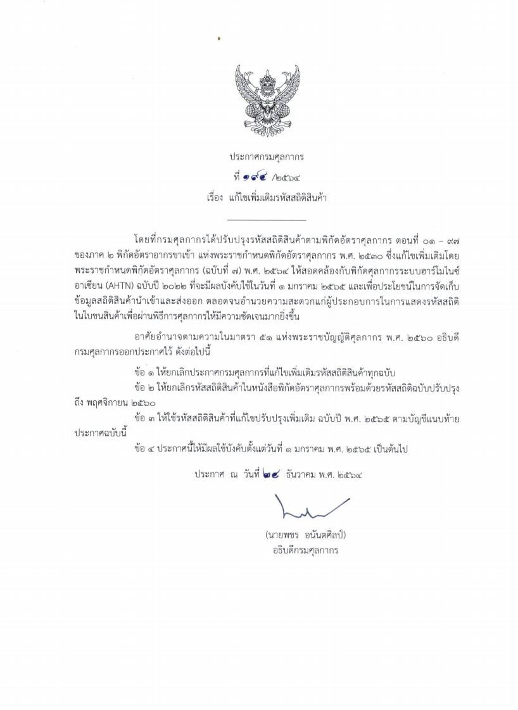


 

 

<a class="badge badge-danger" href="/../../KM/customs/pages/tariff/ts_2022/" target="_blank" id="download_files_new">รายละเอียดรหัสสถิติสินค้า</a>
<a class="badge badge-danger" href="https://www.customs.go.th/cont_strc_download_with_docno_date.php?lang=th&top_menu=menu_homepage&current_id=142329324146505e4f464b4b464b47" target="_blank" id="download_files_new">ดาวน์โหลดรหัสสถิติสินค้า</a>

 



> ที่มา : [กรมศุลกากร](https://www.customs.go.th/cont_strc_download_with_docno_date.php?lang=th&top_menu=menu_homepage&current_id=142329324146505e4f464b4b464b47)