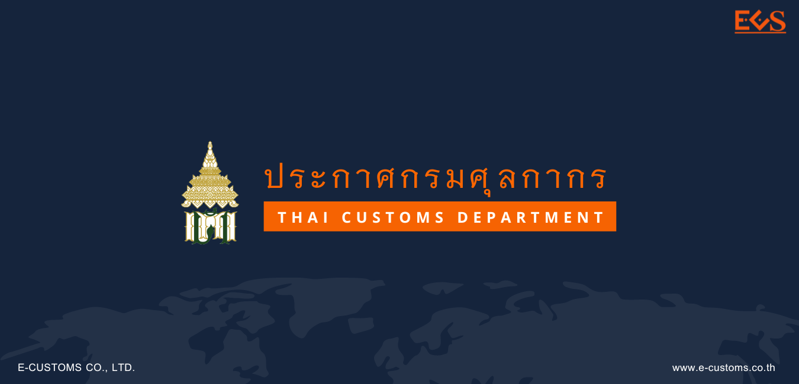



โดยที่เป็นการสมควรปรับปรุงหลักเกณฑ์และพิธีการสำหรับการลดอัตราอากรและยกเว้นอากรศุลกากร เพื่อให้เป็นไปตามประกาศกระทรวงการคลัง เรื่อง การลดอัตราอากรและยกเว้นอากรศุลกากรตามมาตรา 12 แห่งพระราชกำหนดพิกัดอัตราศุลกากร พ.ศ. 2530 ลงวันที่ 28 ธันวาคม พ.ศ. 2564 อธิบดีจึงออกประกาศไว้ดังต่อไปนี้

ส่วนที่ 1 พิธีการทั่วไป
ข้อ 3 ให้ผู้นําของเข้าผู้ส่งของออกปฏิบัติพิธีการศุลกากรในการลดอัตราอากรและยกเว้นอากรศุลกากร ดังต่อไปนี้

(ก) จัดทำข้อมูลใบขนสินค้าขาเข้าและใบขนสินค้าขาออกตามมาตรฐานที่กรมศุลกากรกำหนด โดยให้บันทึกรหัสสิทธิพิเศษตามที่กำหนดเป็นการเฉพาะเรื่องในช่องสิทธิพิเศษ (Privilege Code) ของแต่ละรายการใน ใบขนสินค้า (Declaration Detail)

(ข) การขออนุมัติให้ลดอัตราอากรและยกเว้นอากรศุลกากร
“ระบบฐานข้อมูลการลดอัตราอากรและยกเว้นอากรตามมาตรา 12” หมายความว่า ระบบคอมพิวเตอร์ของศุลกากรสำหรับใช้เป็นฐานข้อมูลการอนุมัติหลักการและรายละเอียดที่เกี่ยวข้องกับการลดอัตรา อากรและยกเว้นอากรศุลกากรตามมาตรา 12 แห่งพระราชกำหนดพิกัดอัตราศุลกากร พ.ศ. 2530
“ผู้ขอใช้สิทธิ” หมายความว่า ผู้นําของเข้าหรือผู้ส่งของออกที่ได้ยื่นคําร้องในการขอ ลดอัตราอากรและยกเว้นอากรศุลกากรตามมาตรา 12 แห่งพระราชกำหนดพิกัดอัตราศุลกากร พ.ศ. 2530 โดยได้ลงทะเบียนเป็นผู้นําของเข้าหรือผู้ส่งของออก ในระบบทะเบียนผู้มาติดต่อ (Customs Registration) ของระบบคอมพิวเตอร์ของศุลกากรแล้ว
“คําร้อง” หมายความว่า คําร้องขอลดอัตราอากรและยกเว้นอากรศุลกากร ตามมาตรา 12 แห่งพระราชกำหนดพิกัดอัตราศุลกากร พ.ศ. 2530
“เอกสารรูปแบบอิเล็กทรอนิกส์” หมายความว่า เอกสาร รูปภาพ หรือข้อความที่สร้าง ด้วยวิธีการทางอิเล็กทรอนิกส์ ซึ่งบันทึกในรูปแบบสื่อดิจิตอลประเภทแผ่น CD แผ่น DVD อุปกรณ์เก็บข้อมูล แบบ USB หรือจดหมายอิเล็กทรอนิกส์ (Email) เกี่ยวกับการขอใช้สิทธิลดอัตราอากรหรือยกเว้นอากรศุลกากร ตามมาตรา 12 แห่งพระราชกำหนดพิกัดอัตราศุลกากร พ.ศ. 2530 ทั้งนี้ต้องจัดทำเอกสารและข้อมูลในรูปแบบ ไฟล์ข้อมูลตามข้อกำหนดท้ายประกาศนี้ และให้ถือว่าผู้ขอใช้สิทธิได้รับรองความถูกต้องครบถ้วนของเอกสาร และข้อมูลดังกล่าวแล้ว
“เลขที่อนุมัติหลักการ” หมายความว่า เลขที่อนุมัติหลักการที่ออกโดยระบบคอมพิวเตอร์ของศุลกากร เพื่อใช้อ้างอิงสำหรับการได้รับการลดอัตราอากรและยกเว้นอากรศุลกากรตามมาตรา 12 แห่งพระราชกำหนดพิกัดอัตราศุลกากร พ.ศ. 2530 ซึ่งจะมีลักษณะ ดังนี้

 
“วันเริ่มต้นการได้รับสิทธิ” หมายความว่า วันที่สิทธิเกิดขึ้น เมื่อคําร้องได้รับการอนุมัติหลักการแล้ว โดยให้มีผลย้อนหลังนับแต่วันที่ผู้นําของเข้าหรือผู้ส่งของออกได้ยื่นคําร้องขอลดอัตราอากรหรือ ยกเว้นอากรศุลกากรตามมาตรา 12 แห่งพระราชกำหนดพิกัดอัตราศุลกากร พ.ศ. 2530
“วันที่ได้รับอนุมัติหลักการ” หมายความว่า วันที่บันทึกผลการอนุมัติในระบบฐานข้อมูลการลดอัตราอากรและยกเว้นอากรตามมาตรา 12

1.	ให้ผู้นําของเข้าหรือผู้ส่งของออกยื่นคําร้องพร้อมเอกสารประกอบตามที่ระบุไว้ในเรื่องการใช้สิทธินั้น ๆ ต่อสำนักงานศุลกากรหรือด่านศุลกากร ณ ท่า ที่ หรือสนามบินที่นําของเข้าหรือส่งของออก เพื่อประกอบการพิจารณาอนุมัติให้ได้สิทธิลดอัตราอากรและยกเว้นอากรศุลกากร กรณีผู้ขอใช้สิทธิยื่นคําร้องหรือเอกสารไม่ถูกต้องหรือไม่ครบถ้วน กรมศุลกากรจะมีหนังสือแจ้งให้ผู้ขอใช้สิทธิทราบภายในเจ็ดวันนับแต่วันที่ได้รับคําร้อง และให้ผู้นําของเข้าหรือผู้ส่งของออกยื่นหนังสือ หรือเอกสารเพิ่มเติมให้ถูกต้องครบถ้วนภายในเจ็ดวันนับแต่วันที่ได้รับหนังสือแจ้ง
2.	กรมศุลกากรจะมีหนังสือแจ้งเลขที่อนุมัติหลักการ (Permit Number) ให้ผู้ขอใช้สิทธิทราบ พร้อมแนบสำเนาเอกสารการอนุมัติหลักการซึ่งพิมพ์จากระบบฐานข้อมูลการลดอัตราอากรและยกเว้นอากร ศุลกากรตามมาตรา 12 ภายในสิบห้าวันทำการนับแต่วันที่ได้รับคําร้องพร้อมเอกสารถูกต้องครบถ้วน หากไม่อนุมัติหลักการ กรมศุลกากรจะมีหนังสือแจ้งเหตุผลการไม่อนุมัติให้ทราบด้วย
3.	กรณีผู้ได้รับอนุมัติหลักการยื่นคําร้องขอแก้ไขเพิ่มเติม หรือยกเลิกการได้รับอนุมัติหลักการเดิม ให้ยื่นคําร้องพร้อมเอกสารประกอบตามที่ระบุไว้ในเรื่องนั้น ๆ เพื่อประกอบการพิจารณาให้ ครบถ้วน กรณีเป็นการเปลี่ยนแปลงเกี่ยวกับชนิดสินค้าที่นําเข้า ให้ยื่นล่วงหน้าก่อนการนําเข้าที่สำนักงาน ศุลกากรหรือด่านศุลกากร ณ ท่า ที่ หรือสนามบินแห่งหนึ่งแห่งใดก็ได้ หากยังไม่ได้รับอนุมัติให้แก้ไข เปลี่ยนแปลง ต้องดำเนินการตาม (ง) ไปก่อน กรณียื่นคําร้องหรือเอกสารไม่ถูกต้องหรือไม่ครบถ้วน กรมศุลกากรจะมีหนังสือแจ้งให้ผู้ได้รับอนุมัติหลักการทราบภายในเจ็ดวันนับแต่วันที่ได้รับคําร้อง
4.	กรมศุลกากรจะมีหนังสือแจ้งผลการพิจารณาการแก้ไขเพิ่มเติมหลักการที่ได้รับอนุมัติไว้เดิม ให้ผู้ยื่นคําร้องทราบภายในสามสิบวันนับแต่วันที่ได้รับคําร้องและเอกสารถูกต้องครบถ้วน โดยจะออกเลขที่อนุมัติหลักการใหม่ พร้อมแนบสำเนาเอกสารการอนุมัติหลักการซึ่งพิมพ์จากระบบฐานข้อมูลการลดอัตราอากรและยกเว้นอากรตามมาตรา 12 หากเป็นการขอแก้ไขความคลาดเคลื่อนเกี่ยวกับข้อมูลอนุมัติวันเริ่มต้นการได้รับสิทธิและวันหมดอายุการใช้สิทธิ จะใช้เลขที่อนุมัติหลักการเดิม โดยมีการแก้ไขข้อมูลวันเริ่มต้นการได้รับสิทธิและวันหมดอายุให้ถูกต้องเท่านั้น

(ค) ให้ผู้นําของเข้าหรือผู้ส่งของออกบันทึกข้อมูล (Import Declaration Detail (Permit) ดังนี้ 
1.	ระบุเลขที่ใบรับรองการนําของเข้าเพื่อการลดอัตราอากรหรือยกเว้นอากร หรือเลขที่อนุมัติหลักการ ในช่องเลขที่ใบอนุญาต/หนังสือรับรอง (Permit No.)
2.	ระบุวันที่ออกใบรับรองการนําของเข้า หรือวันที่ได้รับอนุมัติหลักการ ในช่องวันที่ออกใบอนุญาต/หนังสือรับรอง (Issue Date)
3.	ระบุเลขประจําตัวผู้เสียภาษีอากรของหน่วยงานผู้ออกใบรับรองการนําของเข้า หรือของ กรมศุลกากร (0994000163011) ในช่องเลขประจําตัวผู้เสียภาษีอากรของหน่วยงานผู้ออกใบอนุญาต/ หนังสือรับรอง (Permit Issue Authority)

(ง) การขอรับของออกไปก่อนได้รับอนุมัติให้ลดอัตราอากรหรือยกเว้นอากร ให้ผู้นําของเข้า
1.	ชําระอากรในอัตราปกติ โดยในแต่ละรายการของข้อมูลใบขนสินค้าขาเข้าในช่องสิทธิพิเศษให้ ระบุเป็น “000” หรือ “999” แล้วแต่กรณี
2.	ระบุการใช้สิทธิโดยบันทึกข้อมูลในส่วนรายการของใบขนสินค้าขาเข้า (Import Declaration Detail (Detail)) ในช่อง Argumentative Reason Code เป็น “P12” (หมายถึง การยื่นขอใช้สิทธิลดอัตราอากร และยกเว้นอากรศุลกากรตามมาตรา 12 แห่งพระราชกำหนดพิกัดอัตราศุลกากร พ.ศ. 2530 แต่ยังไม่ได้รับอนุมัติ) และในช่อง Argumentative Privilege Code ที่ขอใช้สิทธิ เป็น “XXX” โดยใช้เลขรหัสสิทธิพิเศษ ตามที่กำหนดไว้เป็นการเฉพาะในแต่ละสิทธินั้น ๆ
3.	แจ้งความประสงค์ขอตรวจสอบพิกัดและ/หรือราคา ในขณะส่งข้อมูลใบขนสินค้าขาเข้าเข้าสู่ระบบคอมพิวเตอร์ของศุลกากร
4.	ต้องยื่นคําร้องในการขอคืนเงินอากรภายในระยะเวลาที่กฎหมายกำหนด

(จ) ผู้นําของเข้าต้องปฏิบัติพิธีการศุลกากรให้ครบถ้วนก่อนการรับของออกจากอารักขาของศุลกากร ดังนี้ 
1.	กรณีระบบคอมพิวเตอร์ของหน่วยงานผู้ออกหนังสือรับรองการนําของเข้าเพื่อใช้สิทธิ ในการลดอัตราอากรหรือยกเว้นอากร สามารถส่งผ่านข้อมูลเข้าสู่ระบบคอมพิวเตอร์ของศุลกากรโดยผ่านระบบ การให้บริการเบ็ดเสร็จ ณ จุดเดียว (Single Window) ผู้นําของเข้าไม่ต้องแสดงเอกสารรับรองการนําของเข้า เพื่อใช้สิทธิดังกล่าวในขณะปฏิบัติพิธีการศุลกากรอีก
2.	กรณีที่ไม่สามารถส่งข้อมูลหนังสือรับรองการนําของเข้าเพื่อใช้สิทธิในการลดอัตราอากรหรือ ยกเว้นอากร ผ่านระบบการให้บริการเบ็ดเสร็จ ณ จุดเดียว (Single Window) ให้ผู้นําของเข้าแสดงเอกสาร รับรองการนําของเข้าเพื่อใช้สิทธิดังกล่าวแก่หน่วยบริการศุลกากร ก่อนการนําของออกจากอารักขาของศุลกากร
3.	เมื่อหน่วยบริการศุลกากร สำนักงานศุลกากรหรือด่านศุลกากร ณ ท่าที่ หรือสนามบินที่นําของเข้า ได้ตรวจสอบเอกสารตรงตามข้อมูลใบขนสินค้าขาเข้าแล้ว จะพิจารณาอนุมัติการให้ลดอัตราอากรหรือยกเว้นอากร หากตรวจพบว่าเอกสารไม่ตรงกับข้อมูลใบขนสินค้าขาเข้าจะพิจารณาดำเนินการตามระเบียบต่อไป

(ฉ) กรณีการจัดทำและยื่นใบขนสินค้าในรูปแบบเอกสาร ให้ผู้นําของเข้าผู้ส่งของออกยื่นเอกสารรับรองการนําของเข้าการส่งของออกเพื่อใช้สิทธิลดอัตราอากรหรือยกเว้นอากรพร้อมกับการยื่นใบขนสินค้า โดยสำแดงเลขที่เอกสารชื่อหน่วยงานที่ออกเอกสารและการใช้สิทธิตามประกาศกระทรวงการคลัง เรื่อง การลดอัตรา อากรและยกเว้นอากรศุลกากรตามมาตรา 12 แห่งพระราชกำหนดพิกัดอัตราศุลกากร พ.ศ. 2530 ไว้ในใบขนสินค้า (ช) การดำเนินการกับของที่ได้รับสิทธิลดอัตราอากรหรือยกเว้นอากรภายหลังจากที่ได้รับการตรวจปล่อยไปจากอารักขาของศุลกากรแล้ว
1.	สถานที่ยื่นคําร้องขอ ให้ผู้นําของเข้ายื่นคําร้องขออนุมัติการขยายเวลาการใช้วัตถุดิบและการขอชําระภาษีอากร ที่สำนักงานศุลกากรหรือด่านศุลกากรที่รับผิดชอบ เว้นแต่กรณีการขอส่งของกลับออกไปนอกราชอาณาจักร หรือการขออนุมัติทำลายของซึ่งเป็นวัตถุดิบที่ได้นําเข้าทางท่าหรือที่หลายแห่ง ให้สามารถยื่นขออนุมัติต่อสำนักงานศุลกากร หรือด่านศุลกากร ณ ท่าหรือที่ใดที่หนึ่งที่มีการนําเข้าได้
2.	การยื่นคําร้องขอ เมื่อผู้นําของเข้ามีความประสงค์จะขอดำเนินการ เช่น การขยายเวลาการใช้วัตถุดิบ การขอส่งของ กลับออกไปนอกราชอาณาจักร การขอทำลาย หรือการขอชําระค่าภาษีอากร ให้ดำเนินการดังนี้
ก.	ผู้นําของเข้าสามารถยื่นคําร้องขอได้ตามสถานที่ใน (1) ก่อนครบกำหนดระยะเวลาตามที่ระบุไว้ใน เว้นแต่ของที่นําเข้ามาโดยใช้สิทธิลดอัตราอากรตามประกาศกระทรวงการคลัง เรื่อง การลดอัตราอากรและยกเว้นอากรศุลกากรตามมาตรา 12 แห่งพระราชกำหนดพิกัดอัตราศุลกากร พ.ศ. 2530 ลงวันที่ 28 ธันวาคม พ.ศ. 2564 ทั้งนี้ กรณีตามข้อ 3 (28) ต้องมีหนังสือรับรองจากสถาบันไฟฟ้าและอิเล็กทรอนิกส์ ยื่นประกอบคําร้องขอด้วย
ข.	ยื่นบัญชีแสดงรายการแห่งของที่ขอดำเนินการ เช่น รายละเอียดของวันที่นําเข้า เลขที่ใบขน สินค้าขาเข้า เลขที่บัญชีราคาสินค้า ปริมาณที่นําเข้า ปริมาณคงเหลือ เป็นต้น เพื่อให้พนักงานศุลกากรตรวจสอบ 
ค.	ในกรณีที่ขอทำลาย หรือขอส่งของออกไปนอกราชอาณาจักร ต้องรับคณะเจ้าหน้าที่ของสำนักงาน หรือด่านศุลกากรที่พิจารณาคําร้องขอ ไปทำการตรวจ และ/หรือ ควบคุมการทำลายของ และชําระค่าธรรมเนียมตามที่กำหนดไว้ เมื่อส่งของตามที่ได้รับอนุมัติออกนอกราชอาณาจักรแล้ว ให้แจ้งเลขที่ใบขนสินค้าขาออกให้พนักงานศุลกากรผู้ตรวจสอบทราบด้วย
ง.	กรณีขอขยายเวลาการใช้วัตถุดิบ ให้ยื่นขอขยายก่อนครบกำหนดตามระยะเวลาที่ระบุไว้ใน แต่ละข้อตามประกาศกระทรวงการคลัง เรื่อง การลดอัตราอากรและยกเว้นอากรศุลกากรตามมาตรา 12 แห่ง พระราชกำหนดพิกัดอัตราศุลกากร พ.ศ. 2530 โดยกรมศุลกากรจะอนุญาตให้ขยายเวลาออกไปได้ตาม ระยะเวลาที่ระบุไว้ในแต่ละข้อดังกล่าว หากไม่มีการกำหนดไว้ ให้ขยายระยะเวลาได้ไม่เกินหนึ่งปี

(ซ) ให้ผู้นําของเข้าจัดเก็บและรักษาบัญชีเอกสารหลักฐานและข้อมูลไม่ว่าในสื่อรูปแบบใด ๆ ที่เกี่ยวข้องกับการผ่านพิธีการศุลกากร ไว้เป็นเวลาไม่น้อยกว่าห้าปี นับแต่วันนําของเข้าหรือวันส่งของออก
(ฌ) กรณีมีการกำหนดพิธีการไว้เป็นการเฉพาะในการใช้สิทธิลดอัตราอากรและยกเว้นอากรศุลกากรในเรื่องใด ให้ปฏิบัติให้เป็นไปตามพิธีการเฉพาะในเรื่องนั้น ๆ
(ญ) กรณีที่ได้รับอนุมัติหรืออยู่ในระหว่างการพิจารณาอนุมัติหลักการในการขอใช้สิทธิ หรือกรณีที่ได้รับหนังสือรับรองหรือสูตรการผลิตที่ได้รับอนุมัติไว้แล้ว หรืออยู่ระหว่างการพิจารณาจากหน่วยงานอื่นก่อนประกาศฉบับนี้มีผลใช้บังคับ ให้สามารถใช้ต่อไปได้โดยไม่ต้องดำเนินการใหม่

ประกาศนี้ให้ใช้บังคับตั้งแต่วันที่ 1 มกราคม พ.ศ. 2565 เป็นต้นไป



ดาวน์โหลดประกาศ

ดาวน์โหลดภาคผนวก

> ที่มา : [กรมศุลกากร](https://www.customs.go.th/cont_strc_download_with_docno_date.php?lang=th&top_menu=menu_homepage&current_id=142329324146505f46464b4d464b4a)
