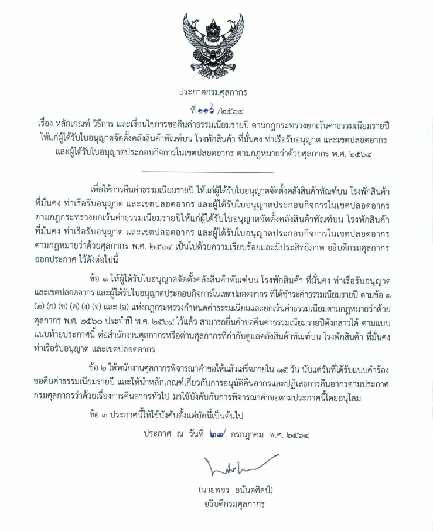
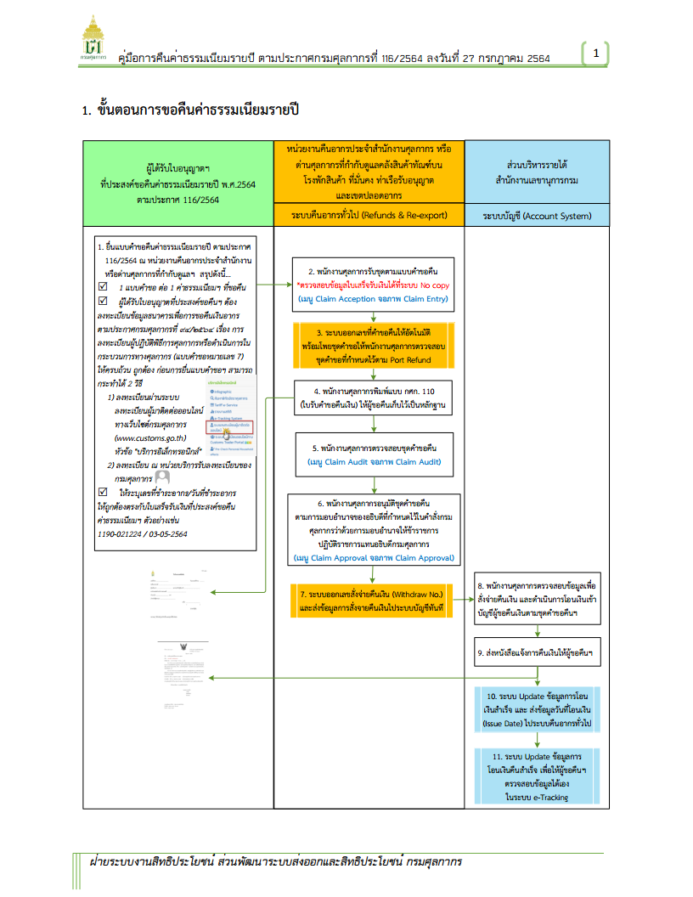
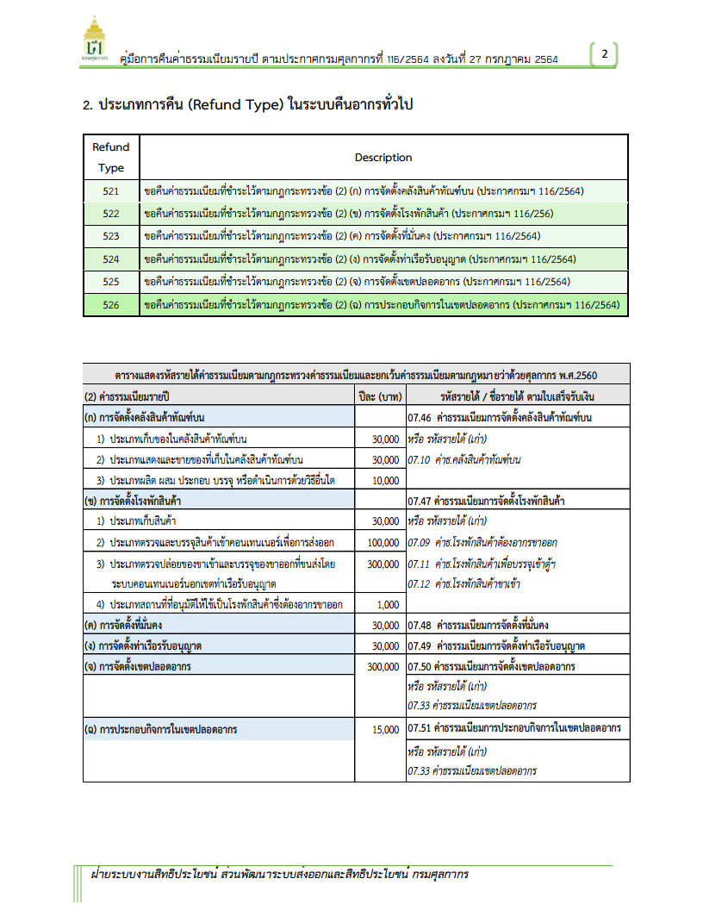

  

## หลักเกณฑ์ วิธีการ และเงื่อนไขการขอคืนค่าธรรมเนียมรายปี ตามกฎกระทรวงยกเว้นค่าธรรมเนียมรายปีให้แก่ผู้ได้รับใบอนุญาตจัดตั้งคลังสินค้าทัณฑ์บน โรงพักสินค้า ที่มั่นคง ท่าเรือรับอนุญาต และเขตปลอดอากร และผู้ได้รับอนุญาตประกอบกิจการในเขตปลอดอากร ตามกฎหมายว่าด้วยศุลกากร พ.ศ.2564

 


 

 

<a class="badge badge-danger" href="./docs.pdf" target="_blank" id="download_files_new">ดาวน์โหลดประกาศ</a> 
<a class="badge badge-danger" href="./guide.pdf" target="_blank" id="download_files_new">ดาวน์โหลดคู่มือ</a> 

 




สอบถามข้อมูลเพิ่มเติมได้ที่ : ผู้ดูแลระบบ  
ส่วนประมวลผลและคลังข้อมูล สำนักเทคโนโลยีสารสนเทศและการสื่อสาร   
หมายเลขโทรศัพท์ : +662-667-6000   
อีเมล์ : ict@customs.go.th  
วันที่ปรับปรุงล่าสุด : 2 สิงหาคม 2564


> ที่มา : [กรมศุลกากร](https://www.customs.go.th/cont_strc_simple_with_date.php?current_id=14232932404e505f4c464a4e464b4c)
