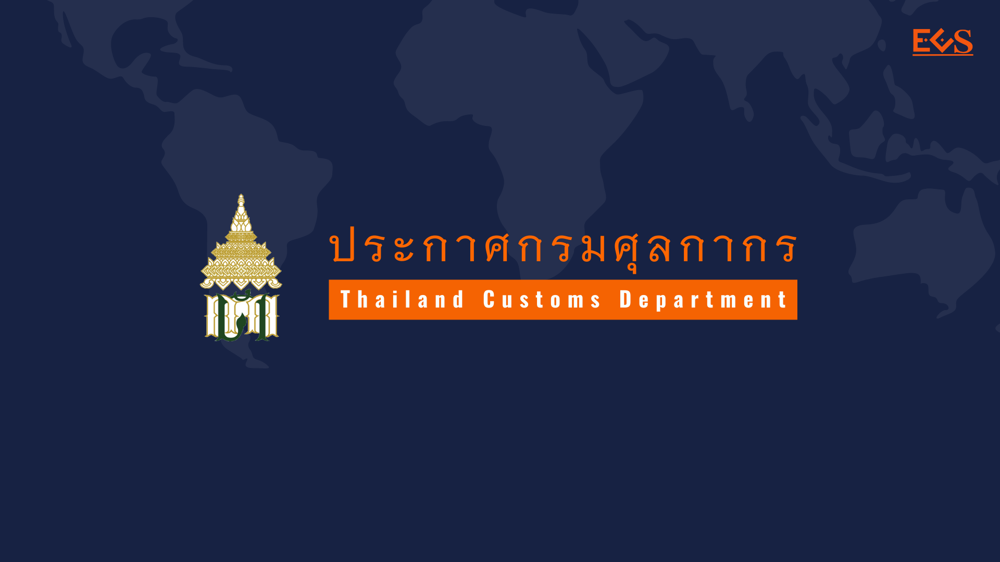

ประกาศกรมศุลกากรที่ 22/.2564 เรื่อง หลักเกณฑ์ วิธีการ และเงื่อนไขการปฏิบัติพิธีการศุลกากรในการยกเว้นอากรศุลกากร สำหรับของที่นำเข้ามาเพื่อใช้รักษา วินิจฉัย หรือป้องกันโรคติดเชื้อไวรัสโคโรนา 2019

 



 

<a class="badge badge-danger" href="./2564-22.pdf" target="_blank" id="download_files_new">Download </a>

 

> ที่มา : [กรมศุลกากร](http://www.customs.go.th/cont_strc_download_with_docno_date.php?lang=th&top_menu=menu_homepage&current_id=14232832414d505f46464b4c464a4e)

