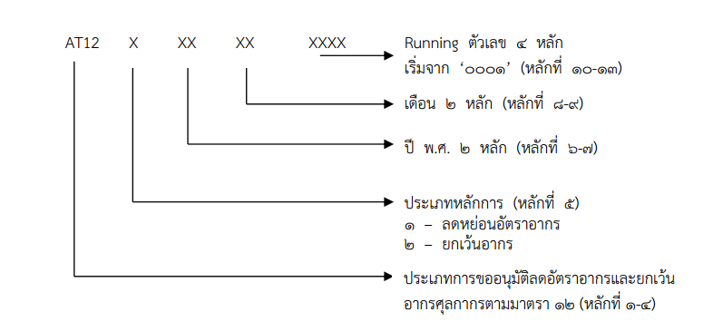



กรมศุลกากรเผยแพร่ประกาศกรมศุลกากร ที่ *246/2564* เรื่อง **หลักเกณฑ์และพิธีการสำหรับการลดอัตราอากรและยกเว้นอากรศุลกากร ตามมาตรา 12 แห่งพระราชกำหนดพิกัดอัตราศุลกากร พ.ศ.2530** จึงออกประกาศไว้ ดังต่อไปนี้

ข้อ 1 ประกาศนี้ให้ใช้บังคับ*ตั้งแต่วันที่ 1 มกราคม พ.ศ. 2565 เป็นต้นไป*

**ส่วนที่ 1 พิธีการทั่วไป**

**ข้อ 3** ให้ผู้นำของเข้าผู้ส่งของออกปฏิบัติพิธีการศุลกากร ในการลดอัตราอากรและยกเว้นอากรศุลกากรดังต่อไปนี้

**ก. จัดทำข้อมูลใบขนสินค้าขาเข้าและใบขนสินค้าขาออก** ตามมาตรฐานที่กรมศุลกากรกำหนดโดยให้บันทึกรหัสสิทธิพิเศษ ตามที่กำหนดเป็นการเฉพาะเรื่องในช่องสิทธิพิเศษ (Privilege Code) ของแต่ละรายการในใบขนสินค้า (Declaration Detail)  

**ข. การขออนุมัติให้ลดอัตราอากรและยกเว้นอากรศุลกากร**   
**“ระบบฐานข้อมูลการลดอัตราอากรและยกเว้นอากรตามมาตรา 12”** หมายความว่า ระบบคอมพิวเตอร์ของศุลกากรสำหรับใช้เป็นฐานข้อมูลการอนุมัติหลักการ และรายละเอียดที่เกี่ยวข้องกับการลด อัตราอากรและยกเว้นอากรศุลกากรตามมาตรา 12 แห่งพระราชกำหนดพิกัดอัตราศุลกากร พ.ศ. 2530  
**“ผู้ขอใช้สิทธิ”** หมายความว่า ผู้นำของเข้าหรือผู้ส่งของออกที่ได้ยื่นคำร้องในการขอ ลดอัตราอากรและยกเว้นอากรศุลกากรตามมาตรา 12 แห่งพระราชกำหนดพิกัดอัตราศุลกากร พ.ศ. 2530 โดยได้ลงทะเบียนเป็นผู้นำของเข้าหรือผู้ส่งของออก ในระบบทะเบียนผู้มาติดต่อ (Customs Registration) ของระบบคอมพิวเตอร์ของศุลกากรแล้ว  
**“คำร้อง”** หมายความว่า คำร้องขอลดอัตราอากรและยกเว้นอากรศุลกากร ตามมาตรา 12 แห่งพระราชกำาหนดพิกัดอัตราศุลกากร พ.ศ. 2530  
**“เอกสารรูปแบบอิเล็กทรอนิกส์”** หมายความว่า เอกสาร รูปภาพ หรือข้อความที่สร้าง ด้วยวิธีการทางอิเล็กทรอนิกส์ ซึ่งบันทึกในรูปแบบสื่อดิจิตอลประเภทแผ่น CD แผ่น DVD อุปกรณ์ เก็บข้อมูลแบบ USB หรือจดหมายอิเล็กทรอนิกส์ (Email) เกี่ยวกับการขอใช้สิทธิลดอัตราอากรหรือยกเว้นอากรศุลกากรตามมาตรา 12 แห่งพระราชกำหนดพิกัดอัตราศุลกากร พ.ศ. 2530 ทั้งนี้ต้อง จัดทำเอกสารและข้อมูลในรูปแบบไฟล์ข้อมูลตามข้อกำหนดท้ายประกาศนี้ และให้ถือว่าผู้ขอใช้สิทธิได้รับ รองความถูกต้องครบถ้วนของเอกสารและข้อมูลดังกล่าวแล้ว  
**“เลขที่อนุมัติหลักการ”** หมายความว่า เลขที่อนุมัติหลักการที่ออกโดยระบบคอมพิวเตอร์ ของศุลกากร เพื่อใช้อ้างอิงสำหรับการได้รับลดอัตราอากรและยกเว้นอากรศุลกากรตามมาตรา 12 แห่งพระราชกำหนดพิกัดอัตราศุลกากร พ.ศ. 2530 ซึ่งจะมีลักษณะดังนี้

**“วันเริ่มต้นการได้รับสิทธิ”** หมายความว่า วันที่สิทธิเกิดขึ้น โดยมีผลย้อนนับตั้งแต่วันที่ ผู้นำของเข้าหรือผู้ส่งของออกได้ยื่นคำร้องในการขอลดอัตราอากรและยกเว้นอากรศุลกากรตามมาตรา 12 แห่งพระราชกำหนดพิกัดอัตราศุลกากร พ.ศ. 2530 เมื่อคำร้องดังกล่าวได้ผ่านการอนุมัติหลักการแล้ว
**“วันที่ได้รับอนุมัติหลักการ”** หมายความว่า วันที่บันทึกผลการอนุมัติในระบบฐานข้อมูล การลดอัตราอากรและยกเว้นอากรตามมาตรา 12

1.	ให้ผู้นำของเข้าหรือผู้ส่งของออกยื่นคำร้องพร้อมเอกสารประกอบตามที่ระบุไว้ในเรื่อง การใช้สิทธินั้น ๆ ต่อสำนักงานศุลกากรหรือด่านศุลกากร ณ ท่า ที่ หรือสนามบิน ที่นำของเข้าหรือ ส่งของออก เพื่อประกอบการพิจารณาอนุมัติให้ได้สิทธิลดอัตราอากรและยกเว้นอากรศุลกากร กรณีผู้ขอใช้สิทธิยื่นคำร้องหรือเอกสารไม่ถูกต้อง หรือไม่ครบถ้วน กรมศุลกากร จะมีหนังสือแจ้งให้ผู้ขอใช้สิทธิทราบภายในเจ็ดวันนับแต่วันที่ได้รับคำร้อง และให้ผู้นำของเข้าหรือผู้ส่งของ ออกยื่นหนังสือหรือเอกสารเพิ่มเติมให้ถูกต้องครบถ้วนภายในเจ็ดวัน นับแต่วันที่ได้รับหนังสือแจ้ง  
1.	กรมศุลกากรจะมีหนังสือแจ้งเลขที่อนุมัติหลักการ (Permit Number) ให้ผู้ขอใช้ สิทธิทราบพร้อมแนบสำเนาเอกสารการอนุมัติหลักการซึ่งพิมพ์จากระบบฐานข้อมูลการลดอัตราอากรและยกเว้นอากรศุลกากรตามมาตรา 12 ภายในสิบห้าวันทำการนับแต่วันที่ได้รับคำร้องพร้อมเอกสารถูกต้อง ครบถ้วน หากไม่อนุมัติหลักการ กรมศุลกากรจะมีหนังสือแจ้งเหตุผลการไม่อนุมัติให้ทราบด้วย  
1.	กรณีผู้ได้รับอนุมัติหลักการยื่นคำร้องขอแก้ไขเพิ่มเติม หรือยกเลิกการได้รับอนุมัติ หลักการเดิม ให้ยื่นคำร้องพร้อมเอกสารประกอบตามที่ระบุไว้ในเรื่องนั้น ๆ เพื่อประกอบการพิจารณา ให้ครบถ้วน กรณีเป็นการเปลี่ยนแปลงเกี่ยวกับชนิดสินค้าที่นำเข้า ให้ยื่นล่วงหน้าก่อนการนำเข้า ที่สำนักงานศุลกากรหรือด่านศุลกากร ณ ท่า ที่ หรือสนามบินแห่งหนึ่งแห่งใดก็ได้ หากยังไม่ได้รับ อนุมัติให้แก้ไขเปลี่ยนแปลง ต้องดำเนินการตาม (ง) ไปก่อน กรณียื่นคำร้องหรือเอกสารไม่ถูกต้องหรือไม่ครบถ้วน กรมศุลกากรจะมีหนังสือแจ้งให้ผู้ได้รับอนุมัติหลักการทราบภายในเจ็ดวันนับแต่วันที่ได้รับคำร้อง  
1.	กรมศุลกากรจะมีหนังสือแจ้งผลการพิจารณาการขอยื่นแก้ไขเพิ่มเติมหลักการที่ได้รับ อนุมัติไว้เดิมให้ผู้ยื่นคำร้องทราบภายในสามสิบวันนับแต่วันที่ได้รับคำร้องและเอกสารถูกต้องครบถ้วน โดยการขอแก้ไขเพิ่มเติมดังกล่าว จะออกเลขที่อนุมัติหลักการใหม่ พร้อมแนบสำเนาเอกสารการอนุมัติ หลักการซึ่งพิมพ์จากระบบฐานข้อมูลการลดอัตราอากรและยกเว้นอากรตามมาตรา 12 หากเป็นการยื่นขอแก้ไขการคลาดเคลื่อนเกี่ยวกับข้อมูลอนุมัติวันเริ่มต้นการได้รับสิทธิและวันหมดอายุการใช้สิทธิ จะใช้เลขที่อนุมัติหลักการเดิม โดยมีการแก้ไขข้อมูลวันเริ่มต้นการได้รับสิทธิ และวันหมดอายุให้ถูกต้องเท่านั้น ดังนี้

**ค. ให้ผู้นำของเข้าหรือผู้ส่งของออกบันทึกข้อมูล (Import Declaration Detail (Permit))**

  1.	ระบุเลขที่ใบรับรองการนำของเข้าเพื่อการลดอัตราอากรหรือยกเว้นอากร หรือเลขที่ อนุมัติหลักการ ในช่องเลขที่ใบอนุญาต/หนังสือรับรอง (Permit No.)
  1.	ระบุวันที่ออกใบรับรองการนำของเข้า หรือวันที่ได้รับอนุมัติหลักการ ในช่องวันที่ ออกใบอนุญาต/หนังสือรับรอง (Issue Date)
  1.	ระบุเลขประจำตัวผู้เสียภาษีอากรของหน่วยงานผู้ออกใบรับรองการนำของเข้า หรือ ของกรมศุลกากร (1994000163011) ในช่องเลขประจำตัวผู้เสียภาษีอากรของหน่วยงานผู้ออก ใบอนุญาต/หนังสือรับรอง (Permit Issue Authority)

**ง. การขอรับของออกไปก่อนที่จะได้รับอนุมัติให้ลดอัตราอากรหรือยกเว้นอากร** ให้ผู้นำของเข้า

  1.	ชำระอากรในอัตราปกติ โดยในแต่ละรายการของข้อมูลใบขนสินค้าขาเข้าในช่องสิทธิ พิเศษให้ระบุเป็น *“000”* หรือ *“999”* แล้วแต่กรณี
  1.	ระบุการใช้สิทธิ โดยบันทึกข้อมูลในส่วนรายการของใบขนสินค้าขาเข้า (Import Declaration Detail (Detail)) ในช่อง Argumentative Reason Code เป็น *“P12”* (หมายถึง การยื่นขอใช้สิทธิลดอัตราอากรและยกเว้นอากรศุลกากรตามมาตรา 12 แห่งพระราชกำหนด พิกัดอัตราศุลกากร พ.ศ. 2530 แต่ยังไม่ได้รับอนุมัติ) และในช่อง Argumentative Privilege Code ที่ขอใช้สิทธิ เป็น *“XXX”* โดยใช้เลขรหัสสิทธิพิเศษตามที่กำหนดไว้เป็นการเฉพาะในแต่ละสิทธินั้น
  1.	แจ้งความประสงค์ขอตรวจสอบพิกัดและ/หรือราคา ในขณะส่งข้อมูลใบขนสินค้าขาเข้า เข้าสู่ระบบคอมพิวเตอร์ของศุลกากรดังนี้
  1.	ต้องยื่นคำร้องในการขอคืนเงินอากรภายในระยะเวลาที่กฎหมายกำหนด

**จ. ผู้นำของเข้าต้องปฏิบัติพิธีการศุลกากรให้ครบถ้วนก่อนการรับของออกจากอารักขาศุลกากร**

  1.	กรณีระบบคอมพิวเตอร์ของหน่วยงานผู้ออกหนังสือรับรองการนำของเข้าเพื่อใช้สิทธิ ในการลดอัตราอากรหรือยกเว้นอากร สามารถส่งผ่านข้อมูลเข้าสู่ระบบคอมพิวเตอร์ของศุลกากรโดยผ่านระบบ การให้บริการเบ็ดเสร็จ ณ จุดเดียว (Single Window) ผู้นำของเข้าไม่ต้องแสดงเอกสารรับรองการนำ ของเข้าเพื่อใช้สิทธิดังกล่าวในขณะปฏิบัติพิธีการศุลกากรอีก
  2.	กรณีที่ไม่สามารถส่งข้อมูลหนังสือรับรองการนำของเข้าเพื่อใช้สิทธิในการลดอัตรา อากรหรือยกเว้นอากร ผ่านระบบการให้บริการเบ็ดเสร็จ ณ จุดเดียว (Single Window) ให้ผู้นำของ เข้าแสดงเอกสารรับรองการนำของเข้าเพื่อใช้สิทธิดังกล่าวแก่หน่วยบริการศุลกากร ก่อนการนำของออกจากอารักขาศุลกากร
  3.	เมื่อหน่วยบริการศุลกากร สำนักงานศุลกากรหรือด่านศุลกากร ณ ท่า ที่ หรือสนามบิน ที่นำของเข้า ได้ตรวจสอบเอกสารตรงตามข้อมูลใบขนสินค้าขาเข้าแล้ว จะพิจารณาอนุมัติการให้ลดอัตราอากร หรือยกเว้นอากร หากตรวจพบว่าเอกสารไม่ตรงกับข้อมูลใบขนสินค้าขาเข้าจะพิจารณาดำเนินการ ตามระเบียบต่อไป

**ฉ. กรณีการจัดทำและยื่นใบขนสินค้าในรูปแบบเอกสาร** ให้ผู้นำของเข้าผู้ส่งของออกยื่น เอกสารรับรองการนำของเข้า การส่งของออกเพื่อใช้สิทธิลดอัตราอากรหรือยกเว้นอากรพร้อมกับการยื่นใบขนสินค้า โดยสำแดงเลขที่เอกสาร ชื่อหน่วยงานที่ออกเอกสาร และการใช้สิทธิตามประกาศกระทรวงการคลัง เรื่อง การลดอัตราอากรและยกเว้นอากรศุลกากรตามมาตรา 12 แห่งพระราชกำหนดพิกัดอัตราศุลกากร พ.ศ. 2530 ไว้ในใบขนสินค้า

**ช. การดำเนินการกับของที่ได้รับสิทธิลดอัตราอากรหรือยกเว้นอากร** ภายหลังจากที่ได้รับการตรวจปล่อย ไปจากอารักขาของศุลกากรแล้ว

  1.	สถานที่ยื่นคำร้องขอ ให้ผู้นำของเข้ายื่นคำร้องขออนุมัติการขยายเวลาการใช้วัตถุดิบ และการขอชำระภาษีอากรที่สำนักงานศุลกากรหรือด่านศุลกากรที่รับผิดชอบ เว้นแต่กรณีการขอส่งของกลับออกไปนอกราชอาณาจักร หรือการขออนุมัติทำลายของซึ่งเป็นวัตถุดิบ ที่ได้นำเข้าทางท่าหรือที่หลายแห่ง ให้สามารถยื่นขออนุมัติต่อ สำนักงานศุลกากร หรือด่านศุลกากร ณ ท่าหรือที่ใดที่หนึ่งที่มีการนำเข้าได้
  2.	การยื่นคำร้องขอ เมื่อผู้นำของเข้ามีความประสงค์จะขอดำเนินการ เช่น การขยายเวลาการใช้วัตถุดิบ การขอส่งของกลับออกไปนอกราชอาณาจักร การขอทำลาย หรือการขอชำระค่าภาษีอากร ให้ดำเนินการดังนี้

 - ผู้นำของเข้าสามารถยื่นคำร้องขอได้โดยตรงตามสถานที่ที่ระบุไว้ใน 1 ก่อนครบ กำหนด ระยะเวลาตามที่ระบุไว้ประกาศกระทรวงการคลัง เว้นแต่ของที่นำเข้ามาโดยใช้สิทธิลดอัตราอากร ตามประกาศกระทรวงการคลัง เรื่อง การลดอัตราอากรและยกเว้นอากรศุลกากรตามมาตรา 12 แห่งพระราชกำหนดพิกัดอัตราศุลกากร พ.ศ. 2530 ลงวันที่ 4 พฤศจิกายน พ.ศ. 2560 ข้อ 3 (28) ต้องมีหนังสือรับรองจากสถาบันไฟฟ้าและอิเล็กทรอนิกส์ ยื่นประกอบคำร้องขอด้วย  
 - ยื่นบัญชีแสดงรายการแห่งของที่ขอดำเนินการ เช่น รายละเอียดของวันที่นำเข้า เลขที่ใบขนสินค้าขาเข้า เลขที่บัญชีราคาสินค้า ปริมาณที่นำเข้า ปริมาณคงเหลือ เป็นต้น เพื่อให้พนักงานศุลกากรตรวจสอบ  
 - ในกรณีที่ขอทำลาย หรือขอส่งของออกไปนอกราชอาณาจักร ต้องรับคณะเจ้าหน้าที่ ของสำนักงานหรือด่านศุลกากรที่พิจารณาคำร้องขอ ไปทำการตรวจ และ/หรือ ควบคุมการทำลายของ และชำระค่าธรรมเนียมตามที่กำหนดไว้ เมื่อส่งของตามที่ได้รับอนุมัติออกนอกราชอาณาจักรแล้ว ให้แจ้งเลขที่ใบขนสินค้าขาออกให้พนักงานศุลกากรผู้ตรวจสอบทราบด้วย  
 - กรณีขอขยายเวลาการใช้วัตถุดิบ ให้ยื่นขอขยายก่อนครบกำหนดตามระยะเวลา ที่ระบุไว้ในแต่ละข้อตามประกาศกระทรวงการคลัง เรื่อง การลดอัตราอากรและยกเว้นอากรศุลกากร ตามมาตรา 12 แห่งพระราชกำหนดพิกัดอัตราศุลกากร พ.ศ. 2530 โดยกรมศุลกากรจะอนุญาต ให้ขยายเวลาออกไปได้ ตามระยะเวลาที่ระบุไว้ในแต่ละข้อดังกล่าว หากไม่มีการกำหนดไว้ ให้ขยายระยะเวลาได้ไม่เกินหนึ่งปี

**ซ. ให้ผู้นำของเข้าจัดเก็บและรักษาบัญชี**เอกสารหลักฐานและข้อมูลไม่ว่าในสื่อรูปแบบใด ๆ ที่เกี่ยวข้องกับการผ่านพิธีการศุลกากรไว้ เป็นเวลาไม่น้อยกว่าห้าปี นับแต่วันนำของเข้าหรือวันส่งของออก

**ฌ. กรณีมีการกำหนดพิธีการไว้เป็นการเฉพาะ**ในการใช้สิทธิลดอัตราอากรและยกเว้นอากรศุลกากร ในเรื่องใด ให้ปฏิบัติให้เป็นไปตามพิธีการเฉพาะในเรื่องนั้น ๆ

**ญ. กรณีที่ได้รับอนุมัติหรืออยู่ในระหว่างการพิจารณาอนุมัติหลักการ**ในการขอใช้สิทธิ หรือกรณีที่ได้รับหนังสือรับรองหรือสูตรการผลิตที่ได้รับอนุมัติไว้แล้ว หรืออยู่ระหว่างการพิจารณาจากหน่วยงานอื่น ก่อนประกาศฉบับนี้มีผลบังคับใช้ ให้สามารถใช้ต่อไปได้ โดยไม่ต้องดำเนินการใหม่







ดาวน์โหลดประกาศ

> ที่มา : [กรมศุลกากร](https://www.customs.go.th/cont_strc_download_with_docno_date.php?lang=th&top_menu=menu_homepage&current_id=142329324146505f46464b4d464b4a)
