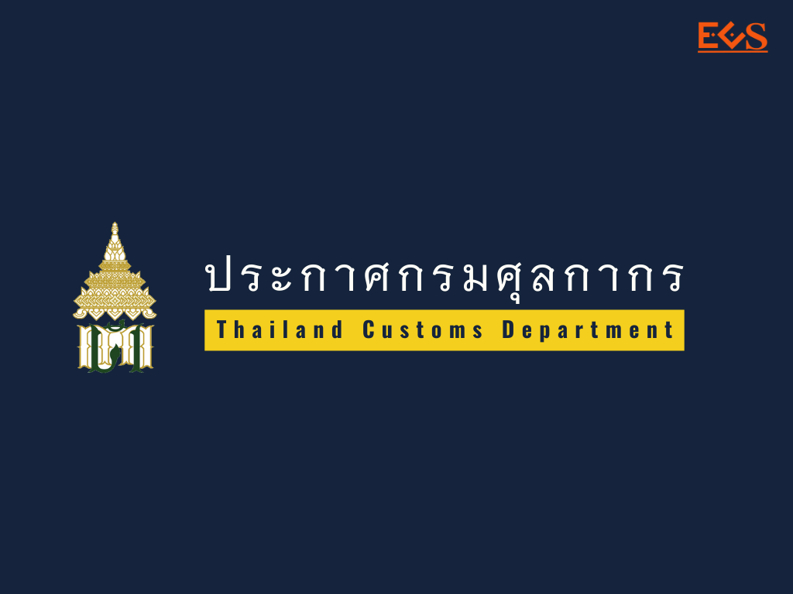
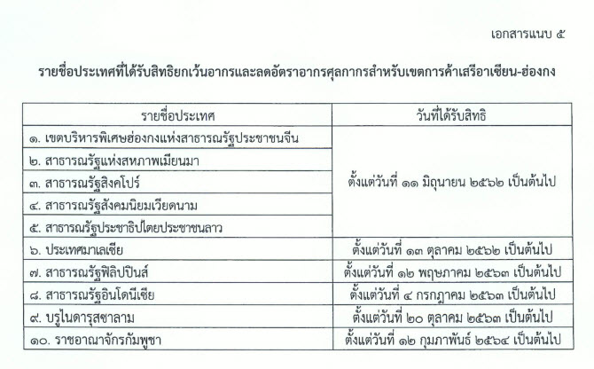

ประกาศกรมศุลกากรที่ 27/.2564 เรื่อง แก้ไขเพิ่มเติมประกาศกรมศุลกากรที่ 89/.2562 เพิ่มเติมรายชื่อประเทศที่ได้รับสิทธิยกเว้นอากรและลดอัตราอากรศุลกากรสำหรับเขตการค้าเสรี*อาเซียน-ฮ่องกง*

 

 


 

<a class="badge badge-danger" href="./2564-27.pdf" target="_blank" id="download_files_new">Download </a> 

 

> ที่มา : [กรมศุลกากร](http://www.customs.go.th/cont_strc_download_with_docno_date.php?lang=th&top_menu=menu_homepage&current_id=14232832414d505f48464b47464a4f)

