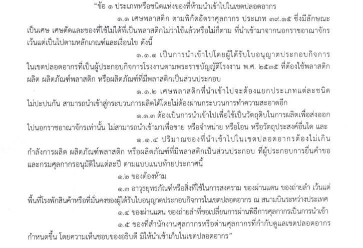

## ประกาศกรมศุลกากรที่ 59/.2564 เรื่อง แก้ไขเพิ่มเติมประกาศกรมศุลกากรที่ 114/.2561 (ของที่ห้ามนำเข้าไปเขตปลอดอากร) 

ประกาศนี้ให้ใช้บังคับ**เมื่อพ้นกำหนด 90 วัน** นับแต่วันประกาศในราชกิจจานุเบกษา

 

 


 

<a class="badge badge-danger" href="./2564-59.pdf" target="_blank" id="download_files_new">Download</a> 

 

> ที่มา : [กรมศุลกากร](http://www.customs.go.th/cont_strc_download_with_docno_date.php?lang=th&top_menu=menu_homepage&current_id=14232832414d505f4d464b4b464b46)

