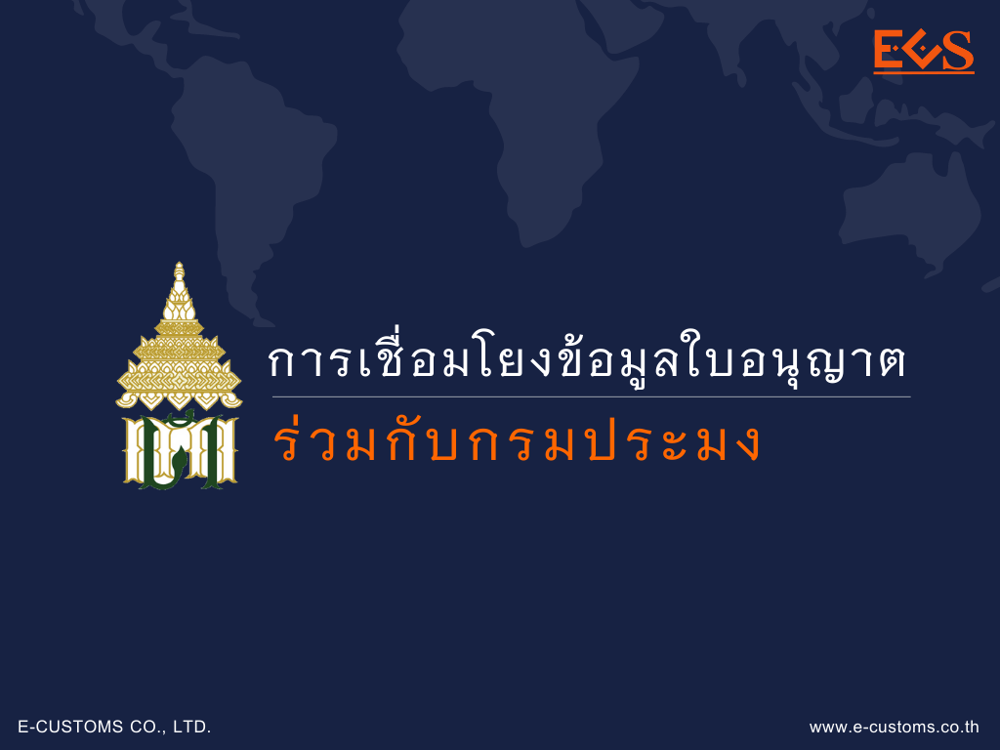
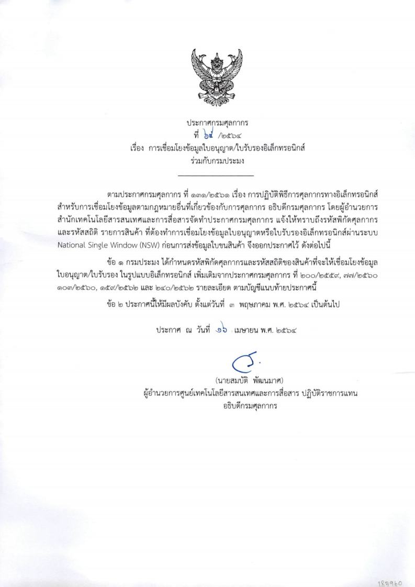
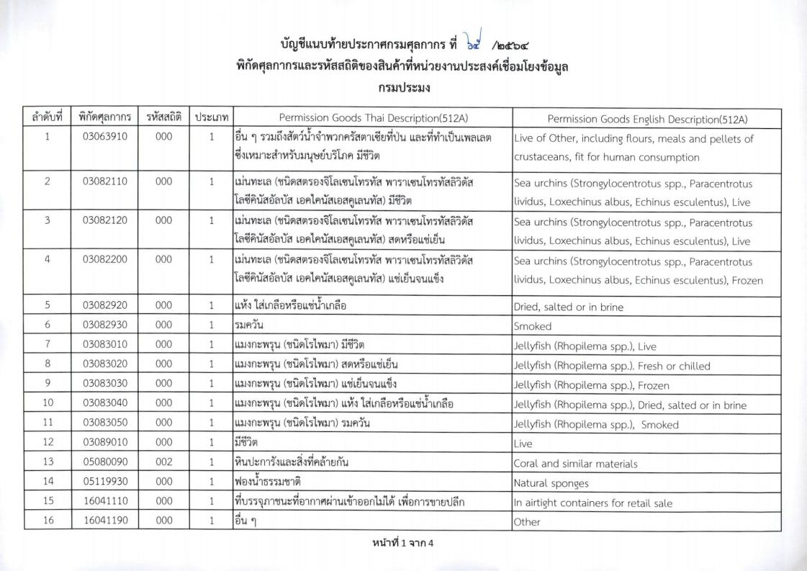
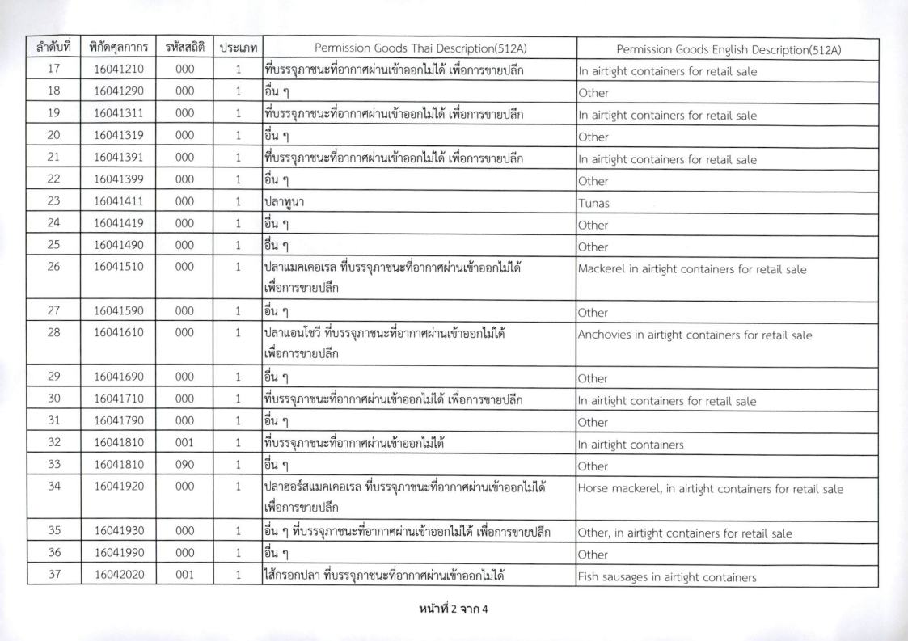
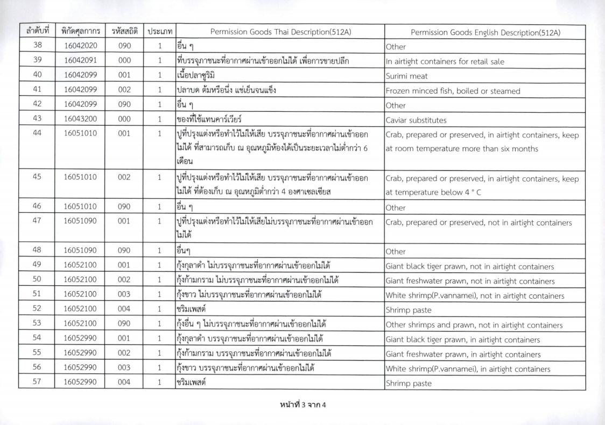
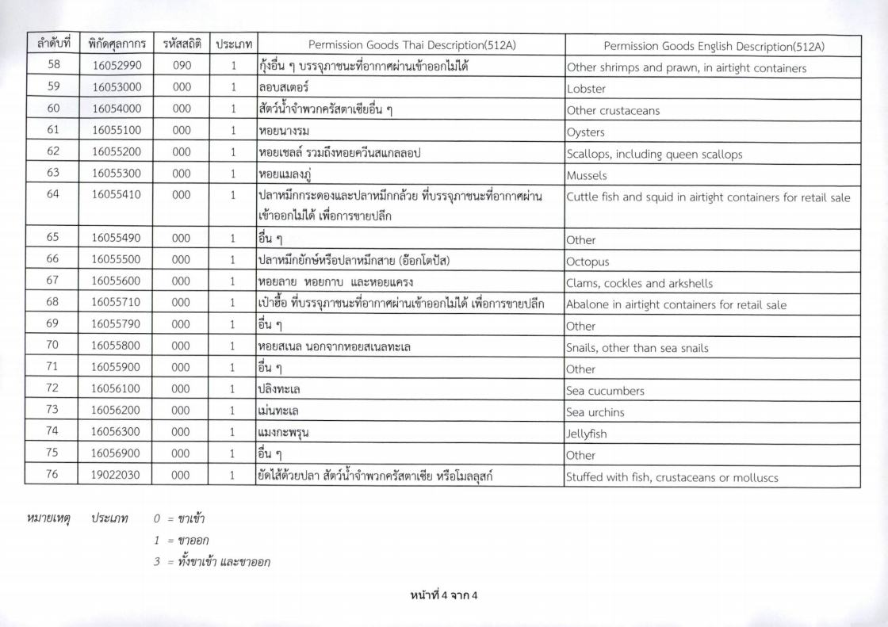

## ประกาศกรมศุลกากรที่ 65/.2564 เรื่อง การเชื่่อมโยงข้อมูลใบอนุญาต/ใบรับรองอิเล็กทรอนิกส์ร่วมกับกรมประมง

ประกาศนี้มีผลบังคับ*ตั้งแต่วันที่ 1 พฤษภาคม 2564 เป็นต้นไป*

 

 


 

<a class="badge badge-danger" href="./2564-65.pdf" target="_blank" id="download_files_new">Download</a> 

 

> ที่มา : [กรมศุลกากร](http://www.customs.go.th/cont_strc_download_with_docno_date.php?lang=th&top_menu=menu_homepage&current_id=14232832414d505f4d464b4b464b46)
