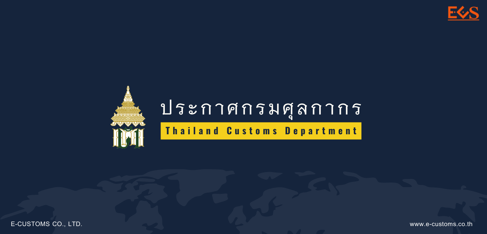
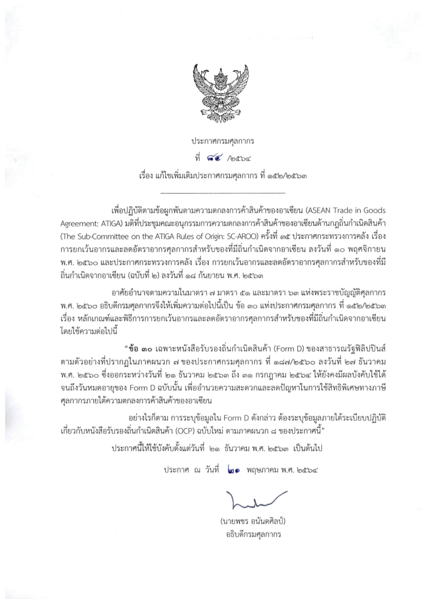

## ประกาศกรมศุลกากร ที่ 84./2564 เรื่อง แก้ไขเพิ่มเติมประกาศกรมศุลกากรที่ 152/.2563 (หลักเกณฑ์และพิธีการการยกเว้นอากรและลดอัตราอากรศุลกากรสำหรับของที่มีถิ่นกำเนิดจากอาเซียน)

 

 

<a class="badge badge-danger" href="./2564-84.pdf" target="_blank" id="download_files_new">Download</a> 

 

> ที่มา : [กรมศุลกากร](https://www.customs.go.th/cont_strc_simple_with_date.php?current_id=14232932404e505f47464b4b464b4d)
