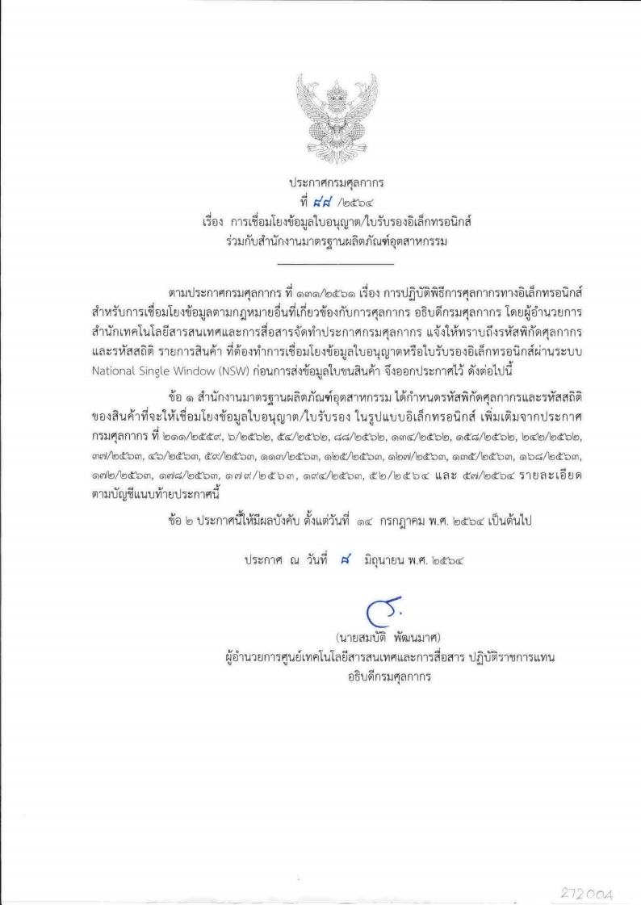
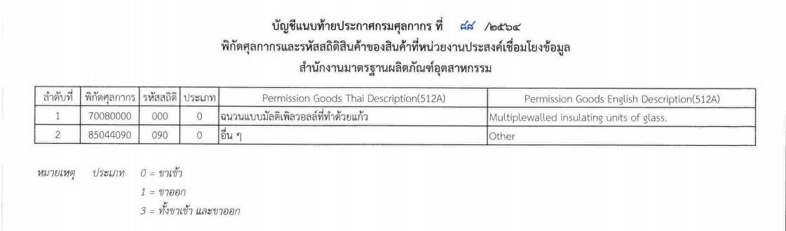

## ประกาศกรมศุลกากรที่ 88/.2564 เรื่อง การเชื่อมโยงข้อมูลใบอนุญาต/ใบรับรองอิเล็กทรอนิกส์ร่วมกับสำนักงานมาตรฐานผลิตภัณฑ์อุตสาหกรรม 

มีผลบังคับตั้งแต่*วันที่ 14 กรกฎาคม 2564* เป็นต้นไป

 

<a class="badge badge-danger" href="./docs.pdf" target="_blank" id="download_files_new">Download</a> 

 

> ที่มา : [กรมศุลกากร](http://www.customs.go.th/cont_strc_download_with_docno_date.php?lang=th&top_menu=menu_homepage&current_id=14232932404e505f48464b4d464a4f)

