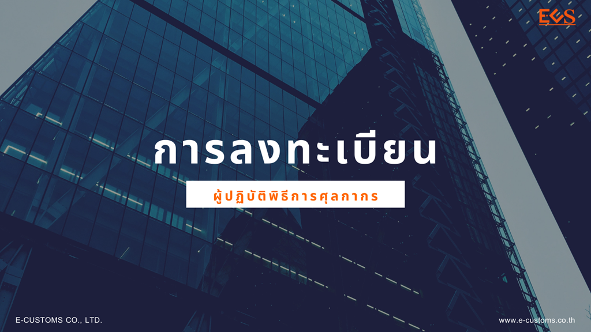

## ช่องทางการลงทะเบียน

ผู้ประสงค์จะเป็นผู้ปฏิบัติพิธีการศุลกากรหรือดําเนินการในกระบวนการทางศุลกากร ต้องลงทะเบียนโดยสามารถดําเนินการได้ 3 ช่องทาง ดังนี้

1. ลงทะเบียนผ่านระบบลงทะเบียนผู้มาติดต่อออนไลน์ทางเว็บไซต์กรมศุลกากร
2. ลงทะเบียนผ่านระบบลงทะเบียนผู้มาติดต่อออนไลน์ทาง *Customs Trader Portal*
3. ลงทะเบียน ณ หน่วยบริการรับลงทะเบียนของกรมศุลกากร

## การมอบอํานาจ

การมอบอํานาจกระทําการแทนในระบบทะเบียนผู้มาติดต่อของศุลกากรตามประกาศนี้ สามารถดําเนินการได้ในเรื่องการปฏิบัติพิธีการศุลกากร การรับผิดชอบการบรรจุ การรายงานยานพาหนะเข้า-ออก การชําระภาษีอากร การขอรับเงินชดเชยค่าภาษีอากร การติดต่อราชการกับกรมศุลกากร และการดําเนินการ ในกระบวนการทางศุลกากร เว้นแต่การลงลายมือชื่อแทนผู้มอบอํานาจในแบบคําขอ รวมถึงหลักฐานประกอบแบบคําขอ ทุกประเภทตามแนบท้ายประกาศนี้ การอุทธรณ์การประเมินอากร การดําเนินคดีและการระงับคดีในชั้นศุลกากร

## การระงับการใช้ข้อมูลทะเบียน

ระบบทะเบียนผู้มาติดต่อจะระงับการใช้ข้อมูลทะเบียนจากเหตุที่ไม่มีการปฏิบัติพิธีการ ศุลกากรหรือดําเนินการในกระบวนการทางศุลกากร ดังนี้  
1. *กรณีบุคคลธรรมดา* เมื่อไม่มีการปฏิบัติพิธีการศุลกากรหรือดําเนินการในกระบวนการ ทางศุลกากรติดต่อกันเป็นเวลา*หกเดือน*  
2. *กรณีนิติบุคคล* เมื่อไม่มีการปฏิบัติพิธีการศุลกากรหรือดําเนินการในกระบวนการ ทางศุลกากรติดต่อกันเป็นเวลา*สองปี*

เมื่อผู้ลงทะเบียนถูกระงับการใช้ข้อมูลทะเบียนตามวรรคหนึ่ง จะไม่สามารถปฏิบัติ พิธีการศุลกากรหรือดําเนินการในกระบวนการทางศุลกากรได้ จนกว่าจะแจ้งขอใช้ข้อมูลทะเบียนใหม่

## บทเฉพาะกาล

- ผู้ที่ลงทะเบียนเป็นผู้ปฏิบัติพิธีการศุลกากรหรือดําเนินการในกระบวนการทางศุลกากร ไว้แล้วก่อนประกาศนี้มีผลใช้บังคับ ให้ถือว่าเป็นผู้ที่ได้ลงทะเบียนเป็นผู้ปฏิบัติพิธีการศุลกากรหรือดําเนินการ ในกระบวนการทางศุลกากรตามประกาศนี้
- ผู้ลงทะเบียนที่ได้ยื่นแบบคําขอ และแบบแนบก่อนประกาศนี้มีผลใช้บังคับแต่ยังไม่ได้ รับอนุญาตเนื่องจากเอกสารไม่ครบถ้วนถูกต้อง สามารถดําเนินการโดยใช้แบบคําขอ และแบบแนบตามแบบแนบ ท้ายประกาศกรมศุลกากรที่ 64/.2561 เรื่อง การลงทะเบียนเป็นผู้ปฏิบัติพิธีการศุลกากรหรือดําเนินการ ในกระบวนการทางศุลกากร ลงวันที่ 27 กุมภาพันธ์ 2561 ได้จนกว่าจะแล้วเสร็จ

**ประกาศกรมศุลกากรที่ 94/.2564 เรื่อง การลงทะเบียนผู้ปฏิบัติพิธีการศุลกากรหรือดําเนินการในกระบวนการทางศุลกากร**




 

 

<a class="badge badge-danger" href="./docs.pdf" target="_blank" id="download_files_new">ดาวน์โหลดประกาศ</a> 
<a class="badge badge-danger" href="./attach_94-2564.zip" target="_blank" id="download_files_new">เอกสารแนบท้าย</a> 

 



> ที่มา : [กรมศุลกากร](http://www.customs.go.th/cont_strc_download_with_docno_date.php?lang=th&top_menu=menu_homepage&current_id=14232932404e505f49464b48464b4c)
