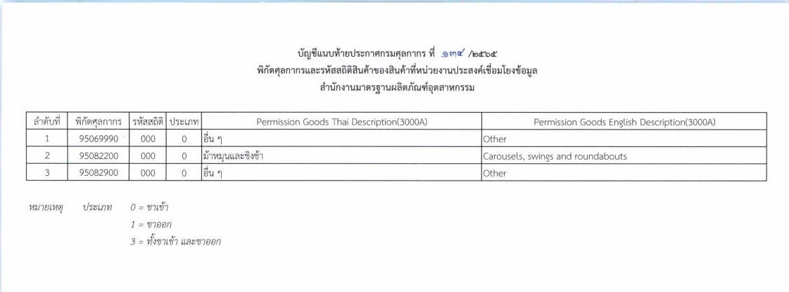


 
 



## ประกาศกรมศุลกากรที่ 134/.2565 เรื่อง การเชื่อมโยงข้อมูลใบอนุญาต ร่วมกับสำนักงานมาตรฐานผลิตภัณฑ์อุตสาหกรรม


 


กรมศุลกากรเผยแพร่ ประกาศกรมศุลกากรที่ 134/.2565 เรื่อง การเชื่อมโยงข้อมูลใบอนุญาต/ใบรับรองอิเล็กทรอนิกส์ ร่วมกับ*สำนักงานมาตรฐานผลิตภัณฑ์อุตสาหกรรม* ให้มีผลบังคับตั้งแต่*วันที่ 21 ธันวาคม พ.ศ. 2565* เป็นต้นไป




 

 

<a class="badge badge-danger" href="./docs.pdf" target="_blank" id="download_files_new">Download</a>

 



> ที่มา : [กรมศุลกากร](https://apc01.safelinks.protection.outlook.com/?url=https%3A%2F%2Fwww.customs.go.th%2Fcont_strc_download_with_docno_date.php%3Flang%3Dth%26top_menu%3Dmenu_homepage%26current_id%3D142329324148505f4d464b48464b46&data=05%7C01%7Csarawut.w%40ecs-team.com%7Cb77973d6514543cdd39808dab2500eb9%7C5e2938024811495589db40264ed84eb0%7C0%7C0%7C638018354552227801%7CUnknown%7CTWFpbGZsb3d8eyJWIjoiMC4wLjAwMDAiLCJQIjoiV2luMzIiLCJBTiI6Ik1haWwiLCJXVCI6Mn0%3D%7C3000%7C%7C%7C&sdata=TkgnqIityNRn0l5pnn%2F4acW4lhcRfaSZm9DdDWwgJhA%3D&reserved=0)