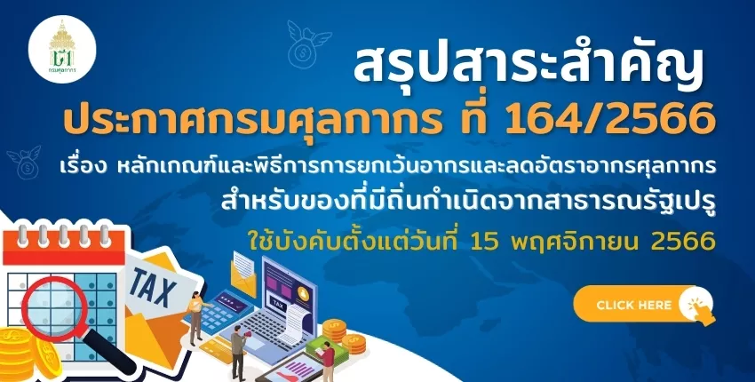
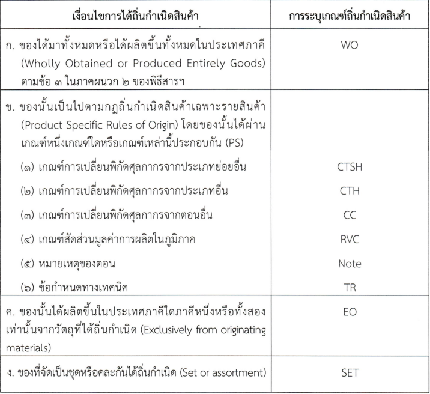





กรมศุลกากรเผยแพร่ ประกาศกรมศุลกากร ที่ 164/2566 เรื่อง **หลักเกณฑ์และพิธีการการยกเว้นอากรและลดอัตราอากรศุลกากรสำหรับของที่มีถิ่นกำเนิดจาก***สาธารณรัฐเปรู* มีรายละเอียดเบื้องต้นที่สำคัญดังนี้

เพื่อปฏิบัติตามข้อผูกพันตามพิธีสารระหว่างราชอาณาจักรไทยและสาธารณรัฐเปรู เพื่อเร่งเปิดเสรีการค้าสินค้าและอำนวยความสะดวกทางการค้า (Protocol between the Kingdom of Thailand and the Republic of Peru to Accelerate the Liberalization of Trade in Goods and Trade Facilitation) และเพื่อให้เป็นไปตามประกาศกระทรวงการคลัง เรื่อง การยกเว้นอากรและลดอัตราอากรศุลกากรสำหรับของ ที่มีถิ่นกำเนิดจากสาธารณรัฐเปรู ลงวันที่ 28 ธันวาคม 2564 ซึ่งให้ยกเว้นและลดอัตราอากรสำหรับของ ที่มีถิ่นกำเนิดจากสาธารณรัฐเปรู โดยให้ปฏิบัติพิธีการศุลกากรตามที่อธิบดีกรมศุลกากรกำหนด อาศัยอำนาจตามความในมาตรา 7 มาตรา 25 มาตรา 51 และมาตรา 63 แห่งพระราชบัญญัติศุลกากร พ.ศ. 2560 อธิบดีกรมศุลกากรจึงออกประกาศไว้ ดังต่อไปนี้

## **ข้อ 3 หลักเกณฑ์การได้ถิ่นกำเนิดสินค้า**
การได้ถิ่นกำเนิดสินค้าต้องเป็นไปตามภาคผนวก 2 กฎว่าด้วยถิ่นกำเนิดสินค้า ภายใต้พิธีสารระหว่างราชอาณาจักรไทยและสาธารณรัฐเปรู เพื่อเร่งเปิดเสรีการค้าสินค้าและอำนวยความสะดวกทางการค้า (ตามเอกสารแนบ 1 แนบท้ายประกาศนี้) โดยมีเงื่อนไขและการระบุเกณฑ์ถิ่นกำเนิดสินค้าในหนังสือรับรองถิ่นกำเนิดสินค้า เป็นไปดังต่อไปนี้

 

## ข้อ 7 การจัดทำข้อมูลใบขนสินค้าขาเข้า   กรณีใช้สิทธิพิเศษทางอากรศุลกากร ณ ขณะนำของเข้า  

ผู้นำของเข้าต้องจัดทำข้อมูลใบขนสินค้าขาเข้าตามมาตรฐานที่กรมศุลกากรกำหนด ดังนี้ 
1. ในแต่ละ *รายการของข้อมูลใบขนสินค้าขาเข้า (Import Declaration Detail)* 
- ช่องรหัสสิทธิพิเศษ (Privilege Code)  ให้ระบุ *“TPE”*
-  สินค้าที่แสดงในหนังสือรับรองถิ่นกำเนิดสินค้า ช่องเกณฑ์ถิ่นกำเนิดสินค้า (Origin Criteria) ให้ระบุ *เกณฑ์ถิ่นกำเนิดสินค้า ที่แสดงในหนังสือรับรองถิ่นกำเนิดสินค้า*
2. ในแต่ละรายการของข้อมูลใบขนสินค้าขาเข้า*ในส่วนใบอนุญาต (Import Declaration Detail Permit)* 
- ช่อง*เลขที่ใบอนุญาต (Permit Number)* ให้ระบุเลขที่หนังสือรับรองถิ่นกำเนิดสินค้า
- ช่อง*วันที่ออกใบอนุญาต (Issue Date)* ให้ระบุวันที่ออกหนังสือรับรองถิ่นกำเนิดสินค้า
- ช่อง*เลขประจำตัวของหน่วยงานผู้ออกใบอนุญาต (Permit Issue Authority)* ให้ระบุรหัสสาธารณรัฐเปรู ที่ขอรับสิทธิพิเศษทางอากรศุลกากร

## **ข้อ 8 กรณีผู้นำของเข้า***ไม่สามารถแสดงหนังสือรับรองถิ่นกำเนิดสินค้า ณ ขณะนำของเข้า* 
ในกรณีที่ผู้นำของเข้าไม่สามารถแสดงหนังสือรับรองถิ่นกำเนิดสินค้าต่อสำนักงานศุลกากร หรือด่านศุลกากรที่นำของเข้า แต่ประสงค์จะขอใช้สิทธิพิเศษทางอากรศุลกากรในการขอยกเว้นอากรหรือ ลดอัตราอากรศุลกากร ในการจัดทำข้อมูลใบขนสินค้าขาเข้า ให้ผู้นำของเข้าแจ้งความประสงค์และชำระค่าอากรในอัตราปกติ *ก่อนนำของออกจากอารักขาของศุลกากร* และจัดทำข้อมูลใบขนสินค้าขาเข้าตามมาตรฐานที่กรมศุลกากรกำหนด ดังนี้
-   ช่อง Argumentative Reason Code ให้ระบุรหัสเหตุผล *“P14”*
-  ช่อง Argumentative Privilege Code ให้ระบุรหัสสิทธิพิเศษ *“TPE”* ของแต่ละรายการในใบขนสินค้าขาเข้านั้น
- ส่งข้อมูลเข้าสู่ระบบคอมพิวเตอร์ของกรมศุลกากร

หากผู้นำของเข้าได้ส่งข้อมูลเข้าสู่ระบบคอมพิวเตอร์ของกรมศุลกากรแล้ว แต่ *ไม่ได้บันทึกข้อมูลแจ้งความประสงค์จะขอใช้สิทธิพิเศษทางอากร* ของแต่ละรายการในใบขนสินค้าขาเข้านั้น ให้ผู้นำของเข้ายื่นคำร้องขอแก้ไขใบขนสินค้า โดยคำร้องนั้นต้องมีคำชี้แจงเหตุผลประกอบ*ก่อนนำของออกจากอารักขาของศุลกากร*

การแสดงหนังสือรับรองถิ่นกำเนิดสินค้า เพื่อขอคืนอากรภายหลังการนำของเข้า ต่อสำนักงานศุลกากรหรือด่านศุลกากรที่นำของเข้า การขอคืนอากรจะต้อง*กระทำภายใน 1 ปีนับแต่วันนำเข้า*

## **ข้อ 14 การผ่อนผันให้ใช้หนังสือรับรองถิ่นกำเนิดสินค้า**
ผ่อนผันให้ใช้หนังสือรับรองถิ่นกำเนิดสินค้า ในกรณีที่มีข้อเท็จจริงสอดคล้องถูกต้องตรงกับ ของที่นำเข้าและต้องไม่มีข้อสงสัยในถิ่นกำเนิดของสินค้าได้ในกรณีดังต่อไปนี้
1.	กรณีตรวจพบความผิดพลาดเพียงเล็กน้อย เช่น ความคลาดเคลื่อนหรือการตกหล่น เพียงเล็กน้อย การพิมพ์ผิด หรือการใช้พื้นที่ช่องเกินขอบที่กำหนด เป็นต้น ของข้อความที่ระบุในหนังสือรับรองถิ่นกำเนิดสินค้ากับข้อความในเอกสารต่าง ๆ ที่ยื่นต่อสำนักงานศุลกากรหรือด่านศุลกากร
2.	กรณีที่ปริมาณของของที่นำเข้าน้อยกว่าที่ระบุไว้ในหนังสือรับรองถิ่นกำเนิดสินค้า ให้ผ่อนผันใช้หนังสือรับรองถิ่นกำเนิดสินค้าได้เท่ากับปริมาณที่นำเข้าจริง ในกรณีที่ปริมาณของของนำเข้าจริง เกินกว่าที่ระบุในหนังสือรับรองถิ่นกำเนิดสินค้า ปริมาณที่เกินให้ชำระค่าอากรในอัตราปกติ

## ข้อ 15 ประกาศนี้ให้ใช้บังคับ*ตั้งแต่วันที่ 15 พฤศจิกายน พ.ศ. 2566 เป็นต้นไป*

---



## ดาวน์โหลดประกาศ



ดาวน์โหลดประกาศ



## สรุปสาระสำคัญประกาศกรมศุลกากร ที่ 164/2566 (ไทย-เปรู) 



ดาวน์โหลดเอกสารสรุปสาระสำคัญ

ดาวน์โหลดเอกสารแนบและภาคผนวก

> ที่มา : [กรมศุลกากร](https://www.customs.go.th/cont_strc_download_with_docno_date.php?lang=th&top_menu=menu_homepage&current_id=14232932414d505e4e464b48464b49)

