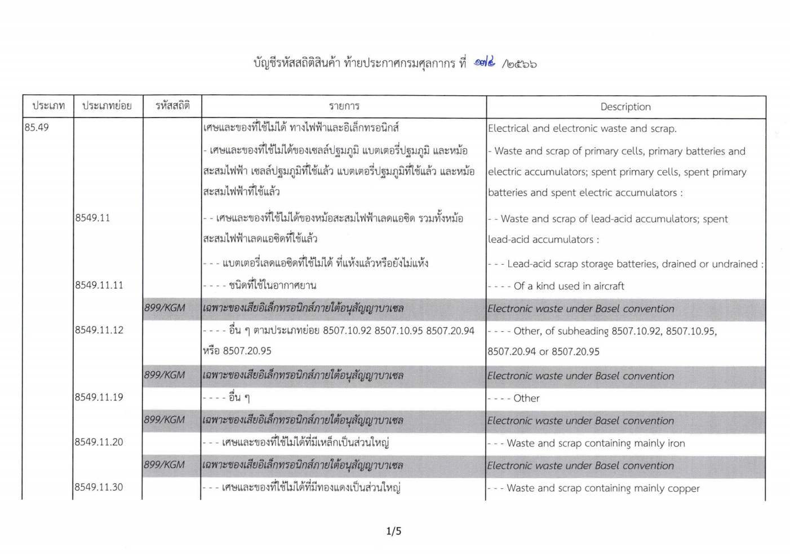
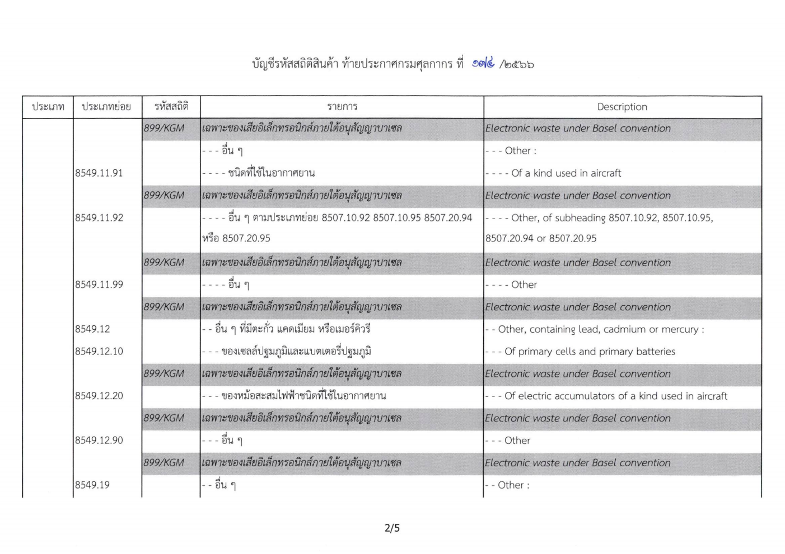
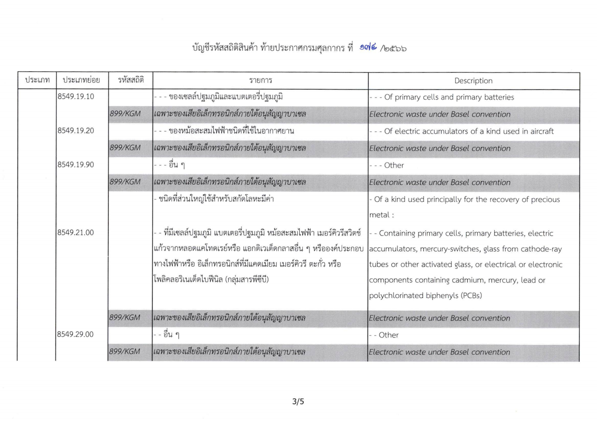
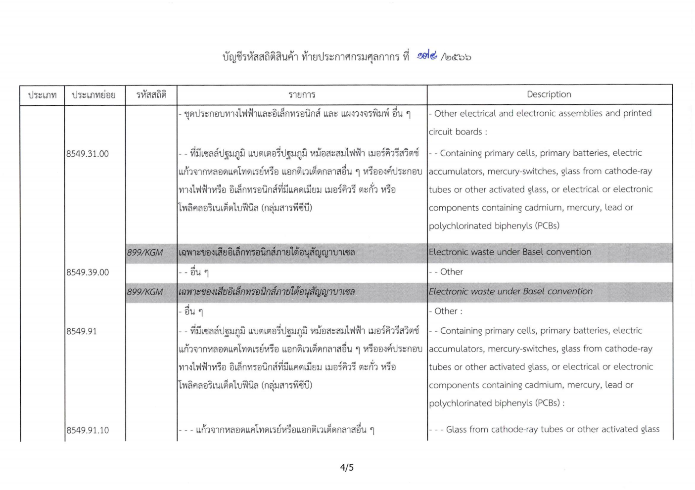
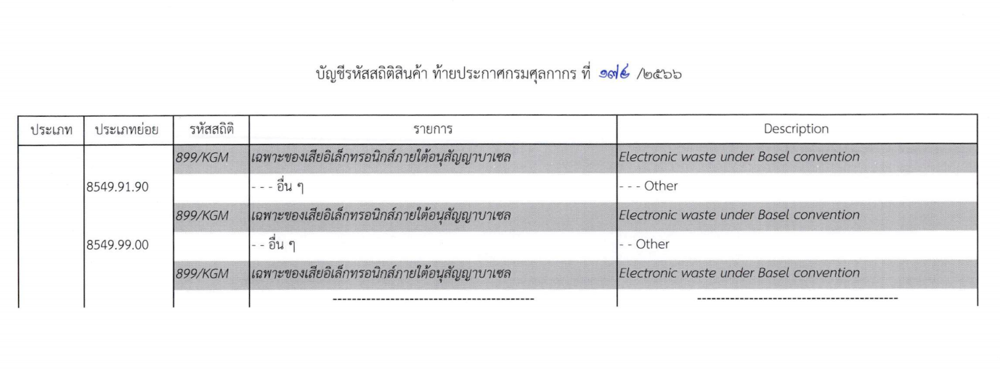

กรมศุลกากรเผยแพร่ ประกาศกรมศุลกากร ที่ 174 /2566 เรื่อง แก้ไขเพิ่มเติม*รหัสสถิติสินค้า* (ฉบับที่ 3) มีรายละเอียดดังนี้ 

โดยที่เป็นการดำเนินการตามพันธกรณีแห่งอนุสัญญาบาเซล ว่าด้วยการควบคุมการเคลื่อนย้ายข้ามแดนของของเสียอันตราย และการกำจัด จึงสมควรแก้ไขเพิ่มเติมรหัสสถิติสินค้า ตามบัญชีท้ายประกาศกรมศุลกากร ที่ 194/2564 เรื่อง แก้ไขเพิ่มเติมรหัสสถิติสินค้า ลงวันที่ 24 ธันวาคม พ.ศ. 2564 เพื่อควบคุมการเคลื่อนย้ายข้ามแดน และประโยชน์ในการจัดเก็บข้อมูลสถิติสินค้านำเข้าและส่งออก ตลอดจนอำนวยความสะดวกให้ผู้ประกอบการ ในการแสดงรหัสสถิติในใบขนสินค้า เพื่อผ่านพิธีการศุลกากรให้มีความชัดเจนยิ่งขึ้น อาศัยอำนาจตามความในมาตรา 51 แห่งพระราชบัญญัติศุลกากร พ.ศ. 2560 อธิบดีกรมศุลกากรออกประกาศไว้ ดังต่อไปนี้

ข้อ 1 ให้เพิ่มความตามบัญชีรหัสสถิติสินค้า ท้ายประกาศนี้ เป็นรหัสสถิติ รายการ และ Description ในบัญชีรหัสสถิติสินค้าที่แก้ไขปรับปรุงเพิ่มเติม ฉบับปี พ.ศ. 2565 ท้ายประกาศกรมศุลกากร ที่ 194/2564 เรื่อง แก้ไขเพิ่มเติมรหัสสถิติสินค้า ลงวันที่ 24 ธันวาคม พ.ศ. 2564 

ข้อ 2 ประกาศนี้ให้มีผลใช้บังคับ*ตั้งแต่วันที่ 1 มกราคม พ.ศ. 2567 เป็นต้นไป*

ดาวน์โหลดประกาศ

> ที่มา : [กรมศุลกากร](https://www.customs.go.th/cont_strc_download_with_docno_date.php?lang=th&top_menu=menu_homepage&current_id=14232932414d505f48464a4f464b4a)
