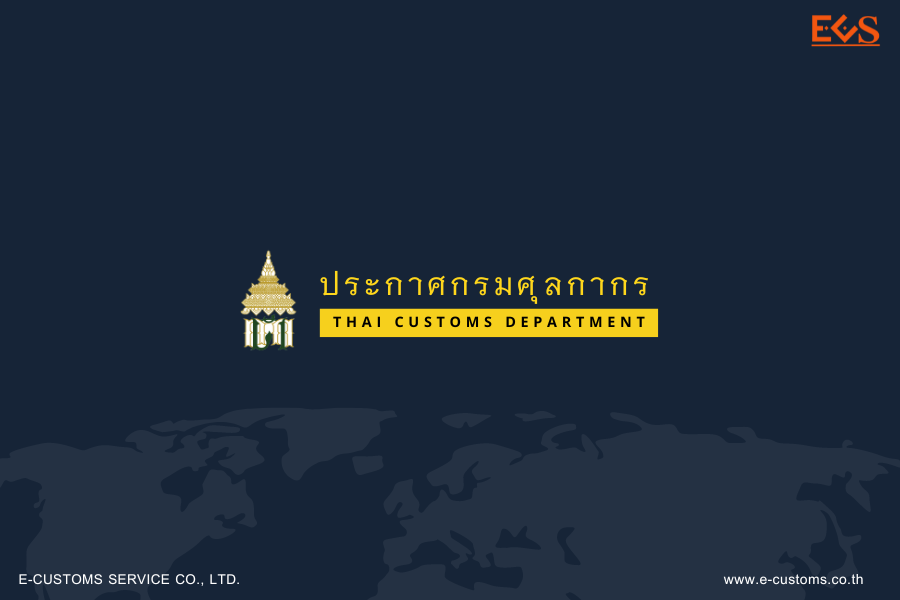
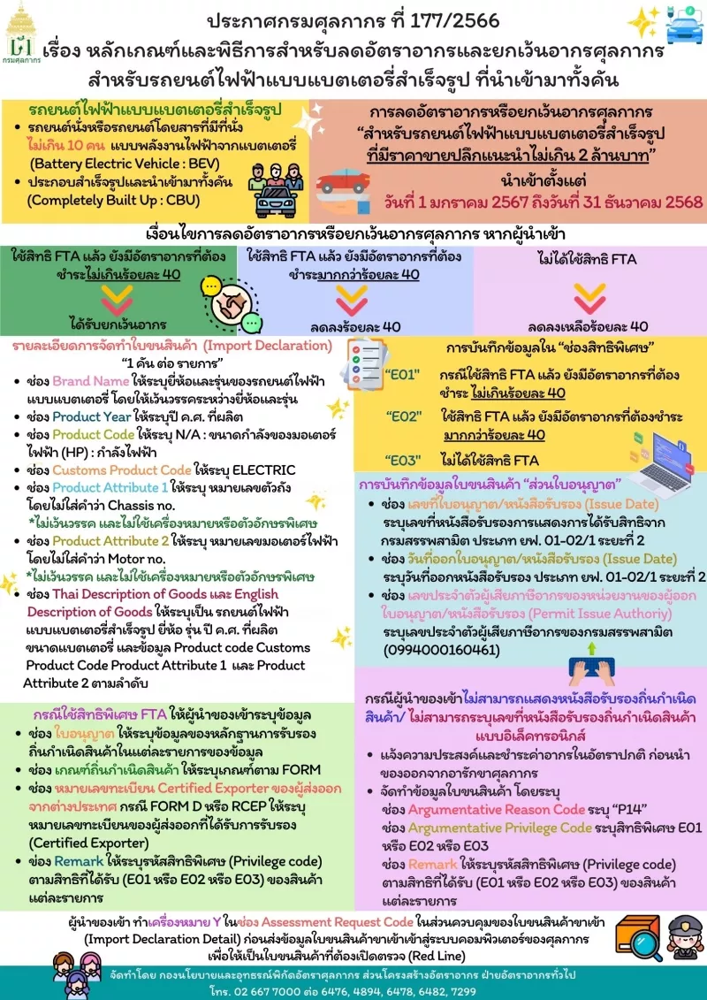







โดยที่เป็นการสมควรกำหนดหลักเกณฑ์และพิธีการสำหรับการลดอัตราอากรและยกเว้น
อากรศุลกากร ตามประกาศกระทรวงการคลัง เรื่อง การลดอัตราอากรและยกเว้นอากรศุลกากรสำหรับรถยนต์ ไฟฟ้าแบบแบตเตอรี่สำเร็จรูปที่นำเข้ามาทั้งคัน ลงวันที่ 28 ธันวาคม พ.ศ. 2566 อาศัยอำนาจตามความในมาตรา 51 และมาตรา 63 แห่งพระราชบัญญัติศุลกากร พ.ศ. 2560 ประกอบกับประกาศกระทรวงการคลัง เรื่อง การลดอัตราอากรและยกเว้นอากรศุลกากรสำหรับรถยนต์ไฟฟ้า แบบแบตเตอรี่สำเร็จรูปที่นำเข้ามาทั้งคัน ลงวันที่ 28 ธันวาคม พ.ศ. 2566 อธิบดีกรมศุลกากรออกประกาศไว้ดังต่อไปนี้

> ## ข้อ 1 ความหมายในประกาศนี้

*“รถยนต์ไฟฟ้าแบบแบตเตอรี่สำเร็จรูป”* หมายความว่า  รถยนต์นั่งหรือรถยนต์โดยสารที่มีที่นั่งไม่เกินสิบคน แบบพลังงานไฟฟ้าจากแบตเตอรี่ (Battery Electric Vehicle : BEV) ซึ่งประกอบสำเร็จรูปและ นำเข้ามาทั้งคัน (Completely Built Up : CBU)

*“หลักฐานการรับรองถิ่นกำเนิดสินค้า”* หมายความว่า หนังสือรับรองถิ่นกำเนิดสินค้า หนังสือรับรองถิ่นกำเนิดสินค้าแบบอิเล็กทรอนิกส์ หรือคำรับรองถิ่นกำเนิดสินค้า ตามประกาศกรมศุลกากร ว่าด้วยหลักเกณฑ์และพิธีการการยกเว้นอากร และลดอัตราอากรศุลกากรภายใต้ความตกลงการค้าเสรีที่เกี่ยวข้อง

> ## ข้อ 2 การลดอัตราอากร หรือยกเว้นอากร

ประกาศกระทรวงการคลัง เรื่อง การลดอัตราอากรและยกเว้นอากรศุลกากร สำหรับรถยนต์ไฟฟ้าแบบแบตเตอรี่สำเร็จรูปที่นำเข้ามาทั้งคัน ลงวันที่ 28 ธันวาคม พ.ศ. 2566 กำหนดให้ลดอัตราอากร หรือยกเว้นอากรสำหรับรถยนต์ไฟฟ้าแบบแบตเตอรี่สำเร็จรูป*ที่มีราคาขายปลีกแนะนำไม่เกินสองล้านบาท* ที่นำเข้าตั้งแต่วันที่ 9 มกราคม พ.ศ. 2567 ถึงวันที่ 31 ธันวาคม พ.ศ. 2568 ดังต่อไปนี้

1. ผู้นำของเข้าที่ใช้สิทธิพิเศษทางอากรศุลกากรภายใต้ความตกลงการค้าเสรีแล้ว **ยังมีอัตราอากรที่ต้องชำระ** *ไม่เกินร้อยละสี่สิบ* ให้ได้รับการยกเว้นอากร
2. ผู้นำของเข้าที่ใช้สิทธิพิเศษทางอากรศุลกากรภายใต้ความตกลงการค้าเสรีแล้ว **ยังมีอัตราอากรที่ต้องชำระ** *มากกว่าร้อยละสี่สิบ* ให้ได้รับการลดอัตราอากรลงอีกร้อยละสี่สิบ
3. ผู้นำของเข้าที่*ไม่ได้ใช้สิทธิ*พิเศษทางอากรศุลกากรภายใต้ความตกลงการค้าเสรี ให้ได้รับการลดอัตราอากรลงเหลือร้อยละสี่สิบ

> ## ข้อ 3 การแสดงหลักฐาน

ให้ผู้นำของเข้าแสดงหลักฐาน ดังต่อไปนี้

1. หนังสือรับรองการแสดงการได้รับสิทธิจากกรมสรรพสามิต ประเภท ยฟ. 00 - 02/1 ระยะที่ 2
2. หลักฐานการรับรองถิ่นกำเนิดสินค้าสำหรับผู้นำของเข้าที่ใช้สิทธิพิเศษทางอากรศุลกากรภายใต้ความตกลงการค้าเสรี

> ## ข้อ 4 การจัดทำใบขนสินค้าขาเข้า

ให้ผู้นำของเข้าจัดทำใบขนสินค้าขาเข้าสำหรับรถยนต์ไฟฟ้าแบบแบตเตอรี่สำเร็จรูป *1 คัน ต่อ 1 รายการ* ในส่วนรายละเอียดของใบขนสินค้าขาเข้า (Import Declaration)

> ## ข้อ 5 การบันทึกข้อมูลรายละเอียดของสินค้า

ให้ผู้นำของเข้าบันทึกข้อมูลรายละเอียดของสินค้าขาเข้าแต่ละรายการ (Import Declaration Detail) ดังต่อไปนี้ โดยใช้*ตัวอักษรภาษาอังกฤษตัวพิมพ์ใหญ่ และตัวเลขอารบิก*

1.  ในช่อง Brand Name (เครื่องหมายการค้า) ให้ระบุ*ยี่ห้อและรุ่น*ของรถยนต์ไฟฟ้าแบบแบตเตอรี่สำเร็จรูป โดย*ให้เว้นวรรคระหว่างยี่ห้อและรุ่น* เช่น **TESLA MODELS** เป็นต้น
2. ในช่อง Product Year (ปีของสินค้า) ให้ระบุ*ปี ค.ศ. ที่ผลิต* เช่น **2015** เป็นต้น 
3. ในช่อง Product Code (รหัสสินค้า) ให้ระบุ *N/A : ขนาดกำลังของมอเตอร์ไฟฟ้า (Horses Power : HP) : กำลังไฟฟ้า* เช่น **N/A:470HP:120KW**
4. ในช่อง Customs Product Code (รหัสสินค้า) ให้ระบุ*ประเภทพลังงาน*ที่ใช้กับยานยนต์ เป็น **ELECTRIC** 
5. ในช่อง Product Attribute 1 (ลักษณะของสินค้า 1) ให้ระบุ*หมายเลขตัวถัง (Chassis No.)* โดย*ไม่ใส่คำว่า Chassis No. ไม่เว้นวรรคและไม่ใช้เครื่องหมายหรือตัวอักษรพิเศษ* เช่น **5YJSB6H12EFP58823** เป็นต้น
6. ในช่อง Product Attribute 2 (ลักษณะของสินค้า 2) ให้ระบุ*หมายเลขมอเตอร์ไฟฟ้า (Motor No.)* โดย*ไม่ใส่คำว่า Motor No. ไม่เว้นวรรคและไม่ใช้เครื่องหมายหรือตัวอักษรพิเศษ* เช่น **T1410066110** เป็นต้น
7. ในช่อง Thai Description of Goods (ชนิดของภาษาไทย) และ English Description of Goods (ชนิดของภาษาอังกฤษ) ให้ระบุว่าเป็น *รถยนต์ไฟฟ้าแบบแบตเตอรี่สำเร็จรูป ตามด้วย ยี่ห้อ รุ่น ปี ค.ศ. ที่ผลิต ขนาดแบตเตอรี่ (KWH) และข้อมูลตาม (3) ถึง (6) ตามลำดับ* เช่น **รถยนต์ไฟฟ้าแบบแบตเตอรี่สำเร็จรูป TESLA MODEL S 2015 45KWH N/A:470HP:120KW ELECTRIC 5YJSB6H12EFP58823 T14J0066110** เป็นต้น

> ## ข้อ 6 การบันทึกข้อมูลในช่องสิทธิพิเศษ

ให้ผู้นำของเข้าบันทึกข้อมูลในช่องสิทธิพิเศษของแต่ละรายการดังต่อไปนี้

1.	การนำเข้ารถยนต์ไฟฟ้าแบบแบตเตอรี่สำเร็จรูปที่ใช้สิทธิพิเศษทางอากรศุลกากรภายใต้ความตกลงการค้าเสรีแล้วยังมีอัตราอากรที่ต้องชำระ *ไม่เกินร้อยละสี่สิบ*ให้ระบุรหัสสิทธิพิเศษ “E01” 
2.	การนำเข้ารถยนต์ไฟฟ้าแบบแบตเตอรี่สำเร็จรูปที่ใช้สิทธิพิเศษทางอากรศุลกากรภายใต้ความตกลงการค้าเสรีแล้วยังมีอัตราอากรที่ต้องชำระ *มากกว่าร้อยละสี่สิบ* ให้ระบุรหัสสิทธิพิเศษ “E02”
3.	การนำเข้ารถยนต์ไฟฟ้าแบบแบตเตอรี่สำเร็จรูปที่*ไม่ได้ใช้สิทธิ*พิเศษทางอากรศุลกากรภายใต้ความตกลงการค้าเสรี ให้ระบุรหัสสิทธิพิเศษ “E03”

> ## ข้อ 7 การบันทึกข้อมูลในส่วนใบอนุญาต

ให้ผู้นำของเข้าบันทึกข้อมูลใบขนสินค้าในส่วนใบอนุญาต (Import Declaration Detail (Permit)) ดังต่อไปนี้ 

1.	ระบุเลขที่หนังสือรับรองการแสดงการได้รับสิทธิจากกรมสรรพสามิต ประเภท ยฟ. 01 - 12/1 ระยะที่ 2 ในช่องเลขที่ใบอนุญาต/หนังสือรับรอง (Permit No.) 
2.	ระบุวันที่ออกหนังสือรับรองตามข้อ 7 (1) ในช่องวันที่ออกใบอนุญาต/หนังสือรับรอง (Issue Date)
3.	ระบุเลขประจำตัวผู้เสียภาษีอากรของกรมสรรพสามิต (1994000160461) ในช่องเลขประจำตัวผู้เสียภาษีอากรของหน่วยงานผู้ออกใบอนุญาต/หนังสือรับรอง (Permit Issue Authority) 

> ## ข้อ 8 การใช้สิทธิพิเศษทางอากรศุลกากรภายใต้ความตกลงการค้าเสรี

กรณีผู้นำของเข้าใช้สิทธิพิเศษทางอากรศุลกากรภายใต้ความตกลงการค้าเสรี ให้ผู้นำของเข้าระบุข้อมูล ดังต่อไปนี้

1.	ระบุข้อมูลของหลักฐานการรับรองถิ่นกำเนิดสินค้า ในแต่ละรายการของข้อมูลใบขนสินค้าขาเข้า*ในส่วนใบอนุญาต (Import Declaration Permit)*
2.	ระบุเกณฑ์ถิ่นกำเนิดสินค้าที่แสดงในหลักฐานการรับรองถิ่นกำเนิดสินค้า ในช่อง*เกณฑ์ถิ่นกำเนิดสินค้า (Origin Criteria)*
3.	กรณีผู้นำของเข้าใช้คำรับรองถิ่นกำเนิดสินค้าสำหรับความตกลงการค้าสินค้าของอาเซียน (ATIGA) หรือความตกลงหุ้นส่วนทางเศรษฐกิจระดับภูมิภาค (RCEP) ให้ระบุหมายเลขทะเบียนของผู้ส่งออกที่ได้รับการรับรอง (Certified Exporter) ในช่อง*หมายเลขทะเบียน Certified Exporter ของผู้ส่งออกจากต่างประเทศ (Certified Exporter Number)*
4.	ระบุรหัสสิทธิพิเศษสำหรับการลดอัตราอากรหรือยกเว้นอากรภายใต้ความตกลงการค้าเสรีที่ได้รับสิทธิ ตามประกาศกรมศุลกากร ว่าด้วยหลักเกณฑ์และพิธีการการยกเว้นอากร และลดอัตราอากรศุลกากรภายใต้ความตกลงการค้าเสรีที่เกี่ยวข้องไว้ในช่อง *Remark ของสินค้าแต่ละรายการ*

> ## ข้อ 9 กรณีไม่สามารถแสดงหนังสือรับรองถิ่นกำเนิดสินค้า ณ ขณะนำของเข้า

*กรณีผู้นำของเข้าไม่สามารถแสดงหนังสือรับรองถิ่นกำเนิดสินค้า*ต่อสำนักงานศุลกากร หรือด่านศุลกากรที่นำของเข้า หรือไม่สามารถระบุ เลขที่หนังสือรับรองถิ่นกำเนิดสินค้าแบบอิเล็กทรอนิกส์ในใบขนสินค้าขาเข้า *แต่ประสงค์จะขอใช้สิทธิ*ลดอัตราอากรหรือยกเว้นอากรตามประกาศกระทรวงการคลัง เรื่อง การลดอัตราอากรและยกเว้นอากรศุลกากรสำหรับรถยนต์ไฟฟ้าแบบแบตเตอรี่สำเร็จรูปที่นำเข้ามาทั้งคัน ลงวันที่ 28 ธันวาคม พ.ศ. 2566 ให้ผู้นำของเข้าแจ้งความประสงค์และชำระค่าอากรในอัตราปกติก่อนนำของออกจากอารักขาของศุลกากร และให้จัดทำข้อมูลใบขนสินค้าขาเข้าตามมาตรฐานที่กรมศุลกากรกำหนด และระบุข้อมูล ดังต่อไปนี้

1.	ช่อง Argumentative Reason Code ให้ระบุรหัสเหตุผล *“P14”*
2.	ช่อง Argumentative Privilege  ให้ระบุ*รหัสสิทธิพิเศษที่ได้รับสิทธิตาม ข้อ 5* 
3.	ระบุรหัสสิทธิพิเศษสำหรับการยกเว้นอากรและลดอัตราอากรภายใต้ความตกลงการค้าเสรี ที่ได้รับสิทธิไว้ในช่อง *Remark ของสินค้าแต่ละรายการ*

> ## ข้อ 10 Assessment Request Code

ให้ผู้นำของเข้าทำเครื่องหมาย *Y*ในช่อง *Assessment Request Code* ในส่วนควบคุม ของใบขนสินค้าขาเข้า (Import Declaration Detail) ก่อนส่งข้อมูลใบขนสินค้าขาเข้าเข้าสู่ระบบคอมพิวเตอร์ เพื่อให้เป็น*ใบขนสินค้าที่ต้องเปิดตรวจ (Red Line)* ของศุลกากร

> ## ข้อ 11 แบบรับรองรายละเอียดของรถยนต์ไฟฟ้าแบบแบตเตอรี่

ให้ผู้นำของเข้าจัดทำและลงนามในแบบรับรองของรถยนต์ไฟฟ้าแบบแบตเตอรี่สำเร็จรูป *1 ฉบับ ต่อ 1 รายการ* ตามแบบแนบท้ายประกาศนี้

> ## ข้อ 12 การตรวจสอบตามกระบวนการทางศุลกากร

การตรวจสอบรถยนต์ไฟฟ้าแบบแบตเตอรี่สำเร็จรูปตามกระบวนการทางศุลกากร ให้ดำเนินการ ดังต่อไปนี้

1.	ให้ผู้นำของเข้าติดต่อโรงพักสินค้าเพื่อเตรียมของให้พนักงานศุลกากรตรวจสอบ 
2.	ให้ผู้นำของเข้ายื่นเอกสารดังต่อไปนี้ ต่อพนักงานศุลกากรที่มีอำนาจหน้าที่ หรือที่ได้รับมอบหมาย เพื่อใช้ประกอบการตรวจปล่อยรถยนต์ไฟฟ้าแบบแบตเตอรี่สำเร็จรูป  

  **ก.**	หนังสือรับรองการแสดงการได้รับสิทธิจากกรมสรรพสามิต ประเภท ยฟ. 01 - 02/1 ระยะที่ 2  
  **ข.**	หลักฐานการรับรองถิ่นกำเนิดสินค้ากรณีผู้นำของเข้าใช้สิทธิพิเศษทางอากรศุลกากรภายใต้ความตกลงการค้าเสรี  
  **ค.**	แบบรับรองรายละเอียดของรถยนต์ไฟฟ้าแบบแบตเตอรี่สำเร็จรูป และเอกสาร ที่เกี่ยวข้องกับรถยนต์ไฟฟ้าแบบแบตเตอรี่สำเร็จรูป เช่น บัญชีราคาสินค้า (Invoice) หรือแคตตาล็อค (Catalogue) เป็นต้น   
  
3.	พนักงานศุลกากรจะตรวจสอบพิกัด ราคา และชนิดของ ให้เป็นไปตามหลักเกณฑ์ ในเรื่องการกำหนดพิกัดอัตราศุลกากร และการกำหนดราคาศุลกากรสำหรับการนำเข้า
4.	พนักงานศุลกากรจะตรวจสอบรายละเอียดของรถยนต์ไฟฟ้าแบบแบตเตอรี่สำเร็จรูปรวมถึงอุปกรณ์เสริมต่าง ๆ กับข้อมูลในใบขนสินค้าขาเข้า หนังสือรับรองการแสดงการได้รับสิทธิชำระภาษีจาก กรมสรรพสามิต และแบบรับรองรายละเอียดของรถยนต์ไฟฟ้าแบบแบตเตอรี่สำเร็จรูป หากพบว่า ไม่ถูกต้องครบถ้วน จะดำเนินการพิจารณาความผิด และแก้ไขข้อมูลให้ถูกต้อง 
5.	พนักงานศุลกากรจะตรวจสอบหลักฐานการรับรองถิ่นกำเนิดสินค้า ให้เป็นไปตามหลักเกณฑ์การได้ถิ่นกำเนิดสินค้า และหลักเกณฑ์เกี่ยวกับหลักฐานการรับรองถิ่นกำเนิดสินค้าตามประกาศ กรมศุลกากรว่าด้วยหลักเกณฑ์และพิธีการการยกเว้นอากรและลดอัตราอากรศุลกากร ภายใต้ความตกลงการค้าเสรีและระเบียบที่เกี่ยวข้อง กรมศุลกากรอาจปฏิเสธหลักฐานการรับรองถิ่นกำเนิดสินค้า หากตรวจพบว่า ไม่เป็นไป ตามหลักเกณฑ์ตามวรรคหนึ่ง
6.	กรณีข้อมูลในใบขนสินค้าขาเข้า หนังสือรับรองการแสดงการได้รับสิทธิจากกรมสรรพสามิต หลักฐานการรับรองถิ่นกำเนิดสินค้า หรือเอกสารประกอบอื่น ๆ ไม่ถูกต้องตรงกัน และมีเหตุอันควรสงสัย หรือจำเป็นต้องสอบถามไปยังกรมสรรพสามิตหรือหน่วยงานที่ออกหนังสือรับรองถิ่นกำเนิดสินค้า พนักงาน ศุลกากรที่มีอำนาจหน้าที่ หรือที่ได้รับมอบหมายจะสั่งการให้ปล่อยของนั้นไปก่อน และให้ผู้นำของเข้าดำเนินการวางประกันให้คุ้มค่าอากรในอัตราปกติ

> ## ข้อ 13 การเชื่อมโยงข้อมูลใบขนสินค้าขาเข้ากับกรมการขนส่งทางบก

1.	พนักงานศุลกากรผู้ตรวจปล่อย หรือผู้ที่ได้รับมอบหมาย จะส่งข้อมูลใบขนสินค้าขาเข้า ทางอิเล็กทรอนิกส์ ให้กรมการขนส่งทางบก ผ่านระบบ National Single Window (NSW) เมื่อใบขนสินค้าขาเข้า มีสถานะส่งมอบสินค้าแล้ว ในกรณีที่ของยังอยู่ในอารักขาของศุลกากร และตรวจสอบพบว่ารายการที่ต้อง สำแดงในใบขนสินค้าขาเข้าไม่ถูกต้องครบถ้วน พนักงานศุลกากรจะดำเนินการพิจารณาความผิด และแก้ไขข้อมูล ให้ถูกต้อง ตามระเบียบปฏิบัติศุลกากรที่เกี่ยวข้อง ก่อนส่งข้อมูลใบขนสินค้าขาเข้าทางอิเล็กทรอนิกส์ ให้กรมการขนส่งทางบก ผ่านระบบ National Single Window (NSW) 
2.	หากผู้นำของเข้าประสงค์จะขอแก้ไขข้อมูลในใบขนสินค้าขาเข้าในภายหลังให้ดำเนินการ ดังต่อไปนี้  

  **ก.**	ให้ผู้นำของเข้า หรือผู้รับมอบอำนาจกระทำการแทนผู้นำของเข้า ซึ่งได้ยื่นใบมอบอำนาจเป็นการทั่วไปไว้ตามคำขอลงทะเบียนเป็นผู้ผ่านพิธีการศุลกากร และปรากฏในฐานข้อมูล ในระบบทะเบียนผู้มาติดต่อของกรมศุลกากร ยื่นคำร้องขอแก้ไขข้อมูลใบขนสินค้าขาเข้า พร้อมเอกสารหลักฐาน ประกอบการพิจารณาแก้ไขต่อหน่วยงานตรวจปล่อย  
  **ข.**	พนักงานศุลกากรจะดำเนินการพิจารณาความผิด และแก้ไขข้อมูลให้ถูกต้อง ตามระเบียบปฏิบัติศุลกากรที่เกี่ยวข้อง แล้วจึงส่งข้อมูลใบขนสินค้าขาเข้าทางอิเล็กทรอนิกส์ที่ได้แก้ไขแล้ว ให้กรมการขนส่งทางบก ผ่านระบบ National Single Window (NSW)

  
> ## ข้อ 14 กรณีที่ตรวจสอบพบว่าไม่สามารถใช้สิทธิได้

ในกรณีที่ตรวจสอบพบว่าหลักฐานการรับรองถิ่นกำเนิดสินค้าที่ผู้นำของเข้ายื่นไว้ไม่สามารถใช้สิทธิได้ พนักงานศุลกากรที่มีอำนาจหน้าที่ หรือที่ได้รับมอบหมายจะดำเนินการแจ้งให้กรมสรรพสามิต และ ผู้นำของเข้าทราบ และให้ผู้นำของเข้าดำเนินการ ดังนี้
1.	กรณีที่กรมสรรพสามิตออกหนังสือรับรองการแสดงการได้รับสิทธิ ประเภท ยฟ. 01 - 12/1 ระยะที่ 2 ฉบับใหม่ โดยไม่เปลี่ยนแปลงประเภทของหนังสือรับรอง หรือโดยมีการเปลี่ยนแปลง ประเภทของหนังสือรับรอง ให้ผู้นำของเข้ายื่นคำร้องขอแก้ไขข้อมูลใบขนสินค้าขาเข้าในช่องสิทธิพิเศษตามสิทธิที่ได้รับ ในข้อ 5 พร้อมหนังสือรับรองการแสดงการได้รับสิทธิฉบับใหม่จากกรมสรรพสามิต เพื่อประกอบการพิจารณาแก้ไข ต่อหน่วยงานตรวจปล่อย 
2.	กรณีที่กรมสรรพสามิตเพิกถอนหนังสือรับรองการแสดงการได้รับสิทธิ ให้ผู้นำของเข้า ยื่นคำร้องขอแก้ไขข้อมูลใบขนสินค้าขาเข้าในช่องสิทธิพิเศษให้เป็น *“000”* พร้อมหนังสือแจ้งจากกรมสรรพสามิต ประกอบการพิจารณาแก้ไขต่อหน่วยงานตรวจปล่อย
3.	พนักงานศุลกากรจะดำเนินการพิจารณาความผิด
4.	ให้ผู้นำของเข้าชำระอากรในส่วนที่ขาดและภาษีอื่น ๆ พร้อมชำระเงินเพิ่มและเบี้ยปรับ (ถ้ามี) ให้ครบถ้วน
5.	พนักงานศุลกากรจะดำเนินการแก้ไขข้อมูลให้ถูกต้อง ตามระเบียบปฏิบัติศุลกากร ที่เกี่ยวข้อง แล้วจึงส่งข้อมูลใบขนสินค้าขาเข้าทางอิเล็กทรอนิกส์ที่ได้แก้ไขแล้ว ให้กรมการขนส่งทางบกผ่านระบบ National Single Window (NSW)

> ## ข้อ 15 กรณีที่กรมสรรพสามิตแจ้งเพิกถอนการได้รับสิทธิ

ในกรณีที่กรมสรรพสามิตได้แจ้งเพิกถอนหนังสือรับรองการแสดงการได้รับสิทธิ สำหรับของใดกับกรมศุลกากร ของนั้นจะไม่ได้รับสิทธิลดอัตราอากรหรือยกเว้นอากรตามประกาศกระทรวงการคลัง เรื่อง การลดอัตราอากรและยกเว้นอากรศุลกากรสำหรับรถยนต์ไฟฟ้าแบบแบตเตอรี่สำเร็จรูปที่นำเข้ามาทั้งคัน ลงวันที่ 28 ธันวาคม พ.ศ. 2566 ตั้งแต่วันนำของเข้าและผู้นำของเข้ามีหน้าที่ต้องแจ้งต่อกรมศุลกากร เพื่อขอชำระค่าภาษีอากรให้ครบถ้วน *ภายใน 30 วัน* นับแต่วันที่ถูกเพิกถอนสิทธิ โดยให้ผู้นำของเข้าดำเนินการดังต่อไปนี้
1.	กรณีที่ผู้นำของเข้าใช้สิทธิพิเศษทางอากรศุลกากรภายใต้ความตกลงการค้าเสรี และได้แสดงหลักฐานการรับรองถิ่นกำเนิดสินค้าไว้แล้ว ให้ผู้นำของเข้ายื่นคำร้องขอแก้ไขข้อมูลใบขนสินค้าขาเข้าในช่องสิทธิพิเศษให้เป็นไปตามประกาศกรมศุลกากรว่าด้วยหลักเกณฑ์และพิธีการการยกเว้นอากร และลดอัตราอากรศุลกากรภายใต้ความตกลงการค้าเสรีที่เกี่ยวข้อง พร้อมหนังสือแจ้งจากกรมสรรพสามิตประกอบการพิจารณาแก้ไขต่อหน่วยงานตรวจปล่อย
2.	กรณีอื่น ๆ นอกจาก (1) ให้ผู้นำของเข้ายื่นคำร้องขอแก้ไขข้อมูลใบขนสินค้าขาเข้า ในช่องสิทธิพิเศษให้เป็น *“000”* พร้อมหนังสือแจ้งจากกรมสรรพสามิตประกอบการพิจารณาแก้ไขต่อหน่วยงานตรวจปล่อย 
3.	พนักงานศุลกากรจะดำเนินการพิจารณาความผิดเบี้ยปรับ (ถ้ามี) ให้ครบถ้วน
4.	ให้ผู้นำของเข้าชำระอากรในส่วนที่ขาดและภาษีอื่น ๆ พร้อมชำระเงินเพิ่มและ
5.	พนักงานศุลกากรจะดำเนินการแก้ไขข้อมูลให้ถูกต้อง ตามระเบียบปฏิบัติศุลกากรที่เกี่ยวข้อง แล้วจึงส่งข้อมูลใบขนสินค้าขาเข้าทางอิเล็กทรอนิกส์ที่ได้แก้ไขแล้ว ให้กรมการขนส่งทางบก ผ่านระบบ National Single Window (NSW)

> ## ข้อ 16 การจัดเก็บข้อมูล

ให้ผู้นำของเข้าจัดเก็บข้อมูลที่เกี่ยวกับการนำของเข้าที่ใช้สิทธิลดอัตราอากรหรือ ยกเว้นอากรตามประกาศนี้ หนังสือรับรองการแสดงการได้รับสิทธิจากกรมสรรพสามิต และสำเนาหลักฐาน การรับรองถิ่นกำเนิดสินค้า ในสื่อรูปแบบใด ๆ หรือเอกสารไว้เพื่อให้ตรวจสอบ เป็นระยะเวลา *5 ปี นับแต่วันที่นำของเข้า*

> ## ข้อ 17 การใช้บังคับ

ประกาศนี้ให้ใช้บังคับ *ตั้งแต่วันที่ 1 มกราคม พ.ศ. 2567 เป็นต้นไป*

----






ดาวน์โหลดประกาศ



> ที่มา : [กรมศุลกากร](https://www.customs.go.th/cont_strc_download_with_docno_date.php?lang=th&top_menu=menu_homepage&current_id=14232932414d505f49464b46464b47)

