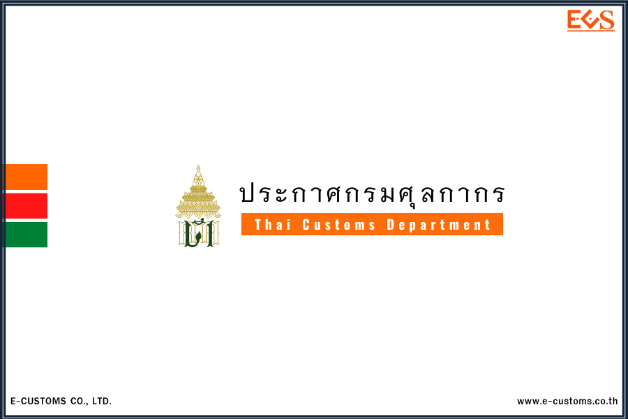
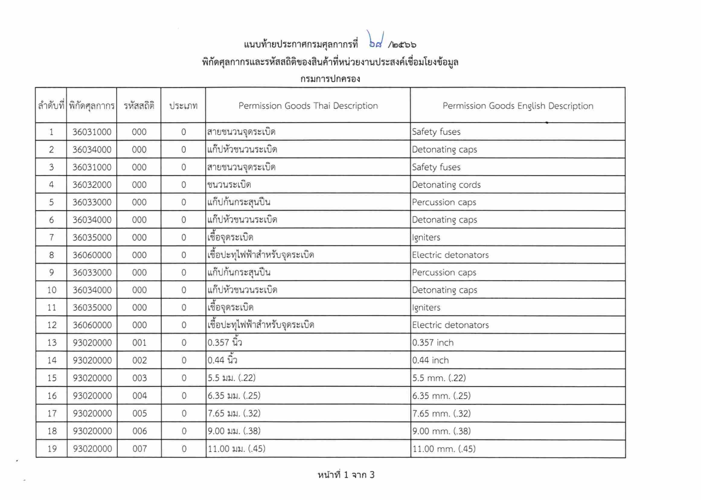
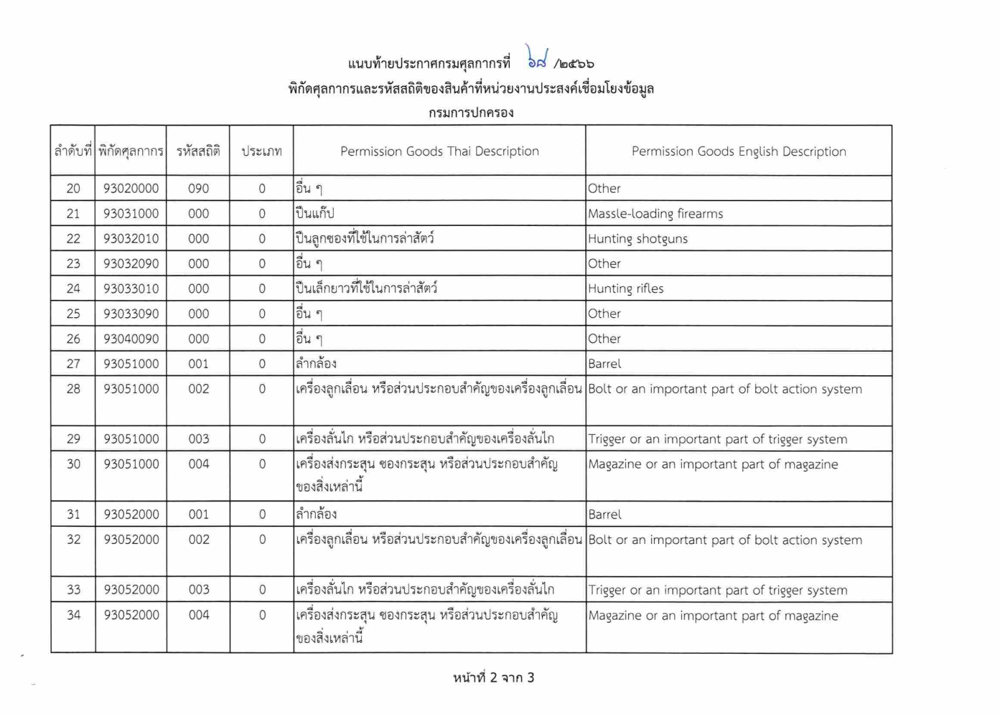
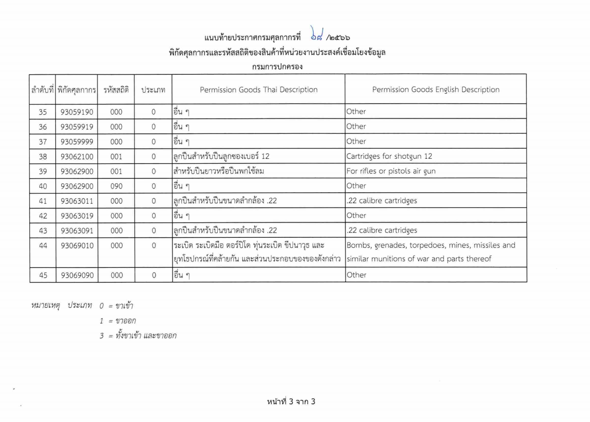



**ประกาศกรมศุลกากร ที่ 68/2566 เรื่อง การเชื่อมโยงข้อมูลใบอนุญาต/ใบรับรองอิเล็กทรอนิกส์ ร่วมกับกรมการปกครอง** 

อธิบดีกรมศุลกากร โดยผู้อํานวยการสํานักเทคโนโลยีสารสนเทศและการสื่อสารจัดทําประกาศกรมศุลกากร แจ้งให้ทราบถึง รหัสพิกัดศุลกากรและรหัสสถิติ รายการสินค้า*ที่ต้องทําการเชื่อมโยงข้อมูลใบอนุญาตหรือใบรับรอง*อิเล็กทรอนิกส์ผ่านระบบ National Single Window (NSW) *ก่อนการส่งข้อมูลใบขนสินค้า* จึงออกประกาศไว้ดังต่อไปนี้

**ข้อ 1** กรมการปกครอง ได้กําหนดรหัสพิกัดศุลกากรและรหัสสถิติของสินค้าที่จะให้เชื่อมโยงข้อมูลใบอนุญาต/ใบรับรองในรูปแบบอิเล็กทรอนิกส์ เพิ่มเติมจากประกาศกรมศุลกากรที่ 210/2564 และ 37/2565 ราย

**ข้อ 2** กรมการปกครองได้กําหนดรหัส EXEMPT กรณีได้รับยกเว้นไม่ต้องมีใบอนุญาต ดังนี้  
    2.1 *EXEMPT 99* ไม่ต้องมีใบอนุญาต/ใบรับรอง เนื่องจากกรณีอื่น ๆ 

**ข้อ 3** ประกาศนี้ให้ใช้บังคับ *ตั้งแต่วันที่ 18 เมษายน พ.ศ. 2566 เป็นต้นไป*




Download

> ที่มา : [กรมศุลกากร](https://www.customs.go.th/cont_strc_download_with_docno_date.php?lang=th&top_menu=menu_homepage&current_id=14232932414a505f4a464b4b464a4e)
