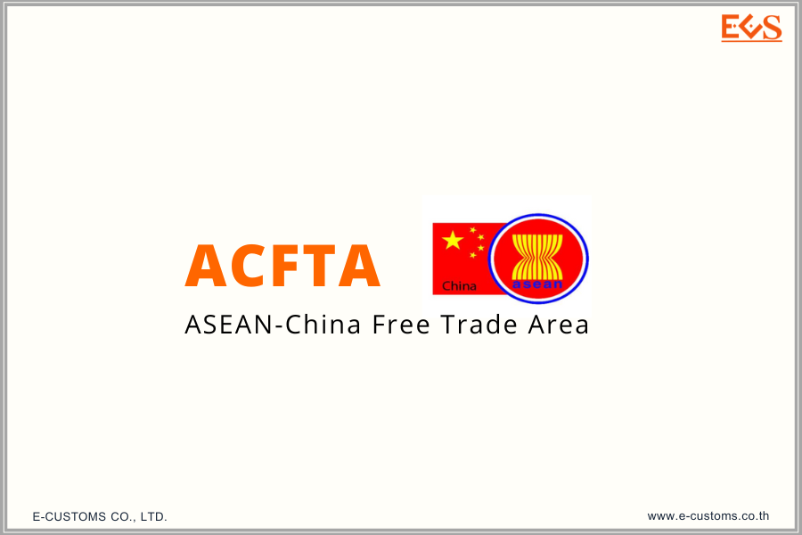



**ประกาศกรมศุลกากร ที่ 82/2566 เรื่อง หลักเกณฑ์และพิธีการการยกเว้นอากรและลดอัตราอากรศุลกากรสำหรับเขตการค้าเสรีอาเซียน - จีน (ฉบับที่ 2)** 

เพื่อปฏิบัติตามข้อผูกพันตามกรอบความตกลง ว่าด้วยความร่วมมือทางเศรษฐกิจ ระหว่าง*สมาคมประชาชาติแห่งเอเชียตะวันออกเฉียงใต้และสาธารณรัฐประชาชนจีน* (Framework Agreement on Comprehensive Economic Co-operation between the Association of Southeast Asian Nations and the People's Republic of China) และความตกลงว่าด้วยการค้าสินค้าภายใต้กรอบความตกลง ว่าด้วยความร่วมมือทางเศรษฐกิจ ระหว่างสมาคมประชาชาติแห่งเอเชียตะวันออกเฉียงใต้และสาธารณรัฐประชาชนจีน  อธิบดีกรมศุลกากรจึงออกประกาศไว้ ดังต่อไปนี้

**ข้อ 1** ให้ยกเลิกความใน (1.1) ของข้อ 5 แห่งประกาศกรมศุลกากร ที่ 218/2564 เรื่อง หลักเกณฑ์และพิธีการการยกเว้นอากรและลดอัตราอากรศุลกากรสําหรับเขตการค้าเสรีอาเซียน - จีน ลงวันที่ 29 ธันวาคม พ.ศ. 2564 และให้ใช้ความต่อไปนี้แทน



“(1.1) รูปแบบหนังสือรับรองถิ่นกําเนิดสินค้า (Form E) จะต้องเป็นไปตาม เอกสารแนบ 4-1 เอกสารแนบ 4-2 เอกสารแนบ 4-3 และเอกสารแนบ 4-4 แนบท้ายประกาศนี้ ทั้งนี้ หนังสือรับรองถิ่นกําเนิดสินค้า (Form E) จะต้องออกโดยหน่วยงานผู้มีอํานาจในการออกหนังสือรับรอง ถิ่นกําเนิดสินค้า (Form E) ของประเทศภาคีผู้ส่งของออก และต้องมีตราประทับพร้อมกับลงลายมือชื่อ ด้วยตนเองโดยผู้มีอํานาจของหน่วยงานดังกล่าว ซึ่งได้มีการแจ้งบัญชีรายชื่อและที่อยู่ และบัญชีของตัวอย่างลายมือชื่อ และตัวอย่างตราประทับที่เป็นทางการ หรือตราประทับสําหรับการแก้ไขที่ใช้ในสํานักงานของหน่วยงานผู้มีอํานาจในการออกหนังสือรับรองถิ่นกําเนิดสินค้าไว้ต่อกรมศุลกากรแล้ว

หนังสือรับรองถิ่นกําเนิดสินค้า (Form E) ที่ออกโดย*สาธารณรัฐประชาชนจีน* ตามเอกสารแนบ 4-2 และเอกสารแนบ 4-3 สามารถใช้ตราประทับและลายมือชื่อในรูปแบบอิเล็กทรอนิกส์ได้ โดยต้องจัดพิมพ์เป็นสี โดยหน่วยงานผู้มีอํานาจในการออกหนังสือรับรองถิ่นกําเนิดสินค้าหรือผู้ส่งของออก ของสาธารณรัฐประชาชนจีนเท่านั้น และต้องมี *Overleaf Notes* อยู่ด้านหลังของกระดาษแผ่นเดียวกัน ทั้งนี้ ผู้ส่งของออกจะต้องส่งต้นฉบับ (Original) ของหนังสือรับรองถิ่นกําเนิดสินค้า (Form E) ดังกล่าวไปยัง ผู้นําของเข้าเพื่อแสดงต่อ สํานักงานศุลกากรหรือด่านศุลกากรที่นําของเข้า

หนังสือรับรองถิ่นกําเนิดสินค้า (Form E) ที่ออกโดย*ประเทศมาเลเซีย* ตามเอกสารแนบ 4-4 สามารถใช้ตราประทับและลายมือชื่อในรูปแบบอิเล็กทรอนิกส์ได้ โดยต้องจัดพิมพ์เป็นสี หรือขาว-ดํา โดยหน่วยงานผู้มีอํานาจในการออกหนังสือรับรองถิ่นกําเนิดสินค้าหรือผู้ส่งของออกของประเทศ มาเลเซียเท่านั้น และต้องมี *Overleaf Notes* อยู่ด้านหลังของกระดาษแผ่นเดียวกัน ทั้งนี้ ผู้ส่งของออกจะต้อง ส่งต้นฉบับ (Original) ของหนังสือรับรองถิ่นกําเนิดสินค้า (Form E) ดังกล่าวไปยังผู้นําของเข้า เพื่อแสดงต่อ สํานักงานศุลกากรหรือด่านศุลกากรที่นําของเข้า



*ในกรณีที่ไม่ปรากฏลายมือชื่อหรือตราประทับ* หรือปรากฏลายมือชื่อ และ/หรือ ตราประทับของเจ้าหน้าที่ หรือหน่วยงานที่ไม่ได้อยู่ในบัญชีที่อ้างถึงในวรรคหนึ่ง *จะไม่ได้รับการยอมรับจากกรมศุลกากร*”



**ข้อ 2** ประกาศนี้ให้ใช้บังคับ *ตั้งแต่วันที่ 1 มิถุนายน พ.ศ. 2566 เป็นต้นไป*





ดาวน์โหลดประกาศ

ดาวน์โหลดภาคผนวก

> ที่มา : [กรมศุลกากร](https://www.customs.go.th/cont_strc_download_with_docno_date.php?lang=th&top_menu=menu_homepage&current_id=14232932414b505e4f464b4b464b47)
