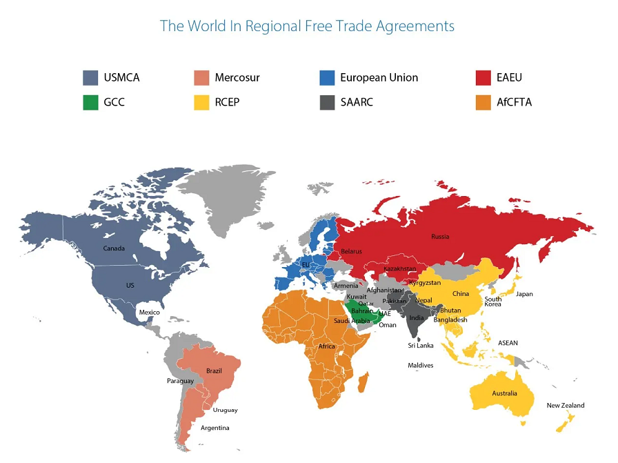



**กรมศุลกากรเผยแพร่ ประกาศกรมศุลกากรที่ 84/2566 เรื่อง หลักเกณฑ์และพิธีการการยกเว้นอากรและลดอัตราอากรศุลกากร ตามข้อผูกพันตามความตกลงหุ้นส่วนทางเศรษฐกิจระดับภูมิภาค (ฉบับที่ 7)** โดยมีการยกเลิกรายชื่อภาคีที่ได้รับการยกเว้นอากร และลดอัตราอากรศุลกากรตามข้อผูกพันตามความตกลง RCEP เดิม และให้ใช้ความต่อไปนี้แทน

**ข้อ 2 รายชื่อภาคีที่ได้รับการยกเว้นอากรและลดอัตราอากรศุลกากรตามข้อผูกพันตามความตกลง RCEP**

1. เนการาบรูไน ดารุซซาลาม
2. ประเทศออสเตรเลีย
3. ประเทศนิวซีแลนด์
4. ประเทศญี่ปุ่น
5. ราชอาณาจักรกัมพูชา
6. สาธารณรัฐสิงคโปร์
7. สาธารณรัฐประชาชนจีน
8. สาธารณรัฐประชาธิปไตยประชาชนลาว
9. สาธารณรัฐสังคมนิยมเวียดนาม
10. สาธารณรัฐแห่งสหภาพเมียนมา
11. สาธารณรัฐเกาหลี
12. ประเทศมาเลเซีย
13. ประเทศอินโดนีเซีย
14. สาธารณรัฐฟิลิปปินส์





ดาวน์โหลดประกาศ

> ที่มา : [กรมศุลกากร](https://www.customs.go.th/cont_strc_download_with_docno_date.php?lang=th&top_menu=menu_homepage&current_id=14232932414b505e4f464b4c464b4a)
