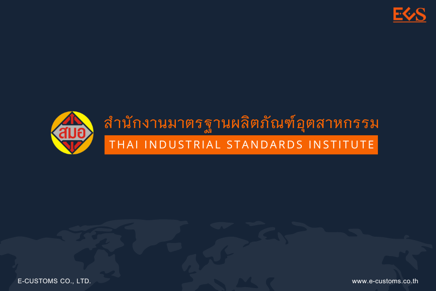


 
 



## ประกาศกรมศุลกากรที่ 92/2566 เรื่อง การเชื่อมโยงข้อมูลใบอนุญาต ร่วมกับสำนักงานมาตรฐานผลิตภัณฑ์อุตสาหกรรม


 


กรมศุลกากรเผยแพร่ ประกาศกรมศุลกากรที่ 92/2566 เรื่อง การเชื่อมโยงข้อมูลใบอนุญาต/ใบรับรองอิเล็กทรอนิกส์ ร่วมกับ*สำนักงานมาตรฐานผลิตภัณฑ์อุตสาหกรรม* ให้มีผลบังคับตั้งแต่*วันที่ 2 สิงหาคม พ.ศ. 2566* เป็นต้นไป




 

 

<a class="badge badge-danger" href="./docs.pdf" target="_blank" id="download_files_new">Download</a>

 



> ที่มา : [กรมศุลกากร](https://www.customs.go.th/cont_strc_download_with_docno_date.php?lang=th&top_menu=menu_homepage&current_id=14232932414b505f47464b4d464b49)
