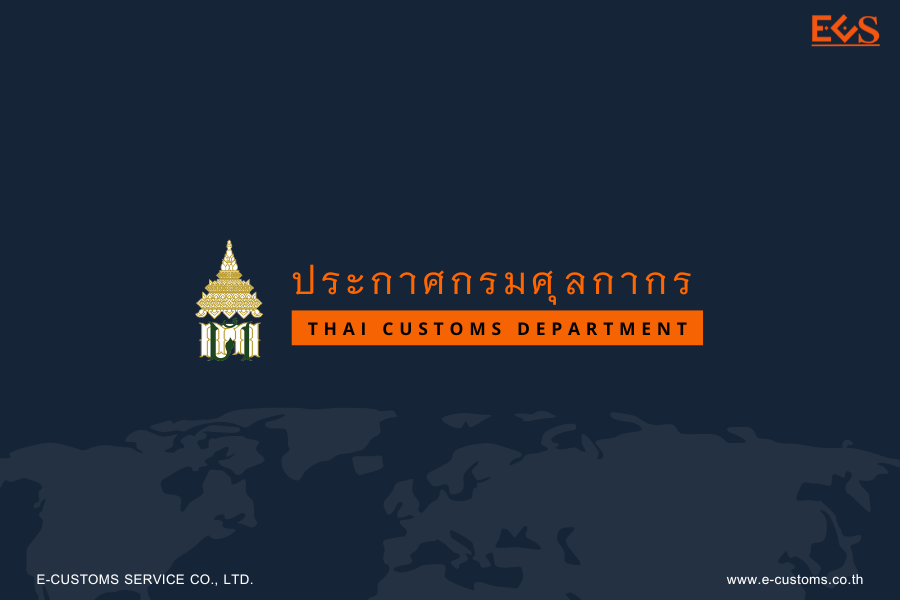

กรมศุลกากรเผยแพร่ ประกาศกรมศุลกากรที่ 94/2566 เรื่อง *พิธีการศุลกากรว่าด้วยการถ่ายลำทางอากาศยานโดยวิธีการทางอิเล็กทรอนิกส์*





ดาวน์โหลดประกาศ

> ที่มา : [กรมศุลกากร](https://www.customs.go.th/cont_strc_download_with_docno_date.php?lang=th&top_menu=menu_homepage&current_id=14232932414b505f48464b49464a4e)
