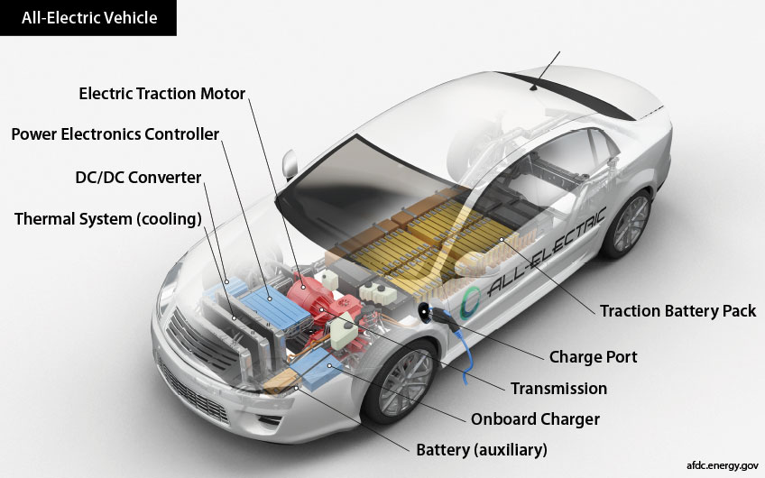
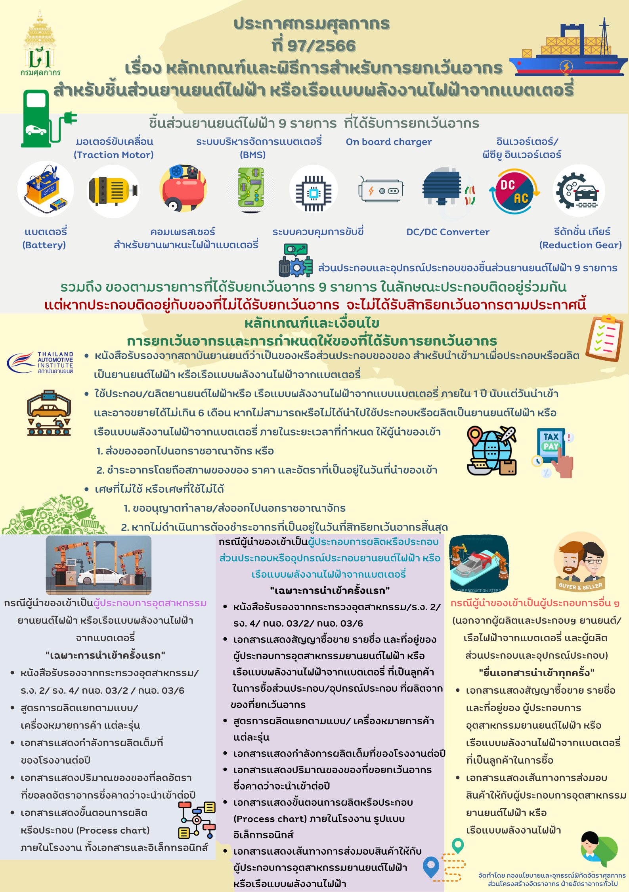
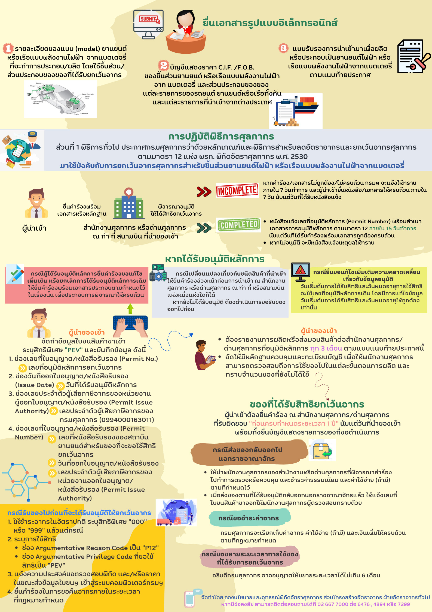



กรมศุลกากรเผยแพร่ ประกาศกรมศุลกากร ที่ 97/2566 เรื่อง **หลักเกณฑ์และพิธีการสำหรับการยกเว้นอากรศุลกากรสำหรับชิ้นส่วนยานยนต์ไฟฟ้า หรือเรือแบบพลังงานไฟฟ้าจากแบตเตอรี่**  มีรายละเอียดที่สำคัญและเกี่ยวข้องกับการบันทึกข้อมูลในใบขนสินค้าขาเข้าดังนี้


 
 



โดยที่เป็นการสมควรกำหนดหลักเกณฑ์และพิธีการสำหรับการยกเว้นอากรศุลกากร ตามประกาศกระทรวงการคลัง เรื่อง การยกเว้นอากรศุลกากรสำหรับชิ้นส่วนยานยนต์ไฟฟ้า หรือเรือแบบ พลังงานไฟฟ้าจากแบตเตอรี่ ลงวันที่ 16 พฤษภาคม พ.ศ. 2566 (**[ดาวน์โหลดประกาศ](https://www.customs.go.th/cont_strc_download_with_docno_date.php?lang=th&top_menu=menu_homepage&current_id=14232932414b505e4f464b4d464b48)**)

อาศัยอำนาจตามความในมาตรา 51 และ 63 แห่งพระราชบัญญัติศุลกากร พ.ศ. 2560 ประกอบกับประกาศกระทรวงการคลัง เรื่อง การยกเว้นอากรศุลกากรสำหรับชิ้นส่วนยานยนต์ไฟฟ้า หรือเรือแบบพลังงานไฟฟ้าจากแบตเตอรี่ ลงวันที่ 16 พฤษภาคม พ.ศ. 2566 อธิบดีกรมศุลกากรออกประกาศไว้ดังต่อไปนี้

**ข้อ** **1** ในประกาศนี้

**“ยานยนต์ไฟฟ้า”** หมายความว่า *รถยนต์ รถกระบะ รถจักรยานยนต์ รถสามล้อ รถโดยสาร หรือรถบรรทุก แบบพลังงานไฟฟ้าจากแบตเตอรี่ (Battery Electric Vehicle : BEV)*

**“เศษ”** หมายความว่า *ส่วนที่เหลือจากการผลิตซึ่งไม่สามารถนําไปใช้ประโยชน์ตามวัตถุประสงค์เดิมที่นําเข้าได้*

**ข้อ** **2** ประกาศกระทรวงการคลัง เรื่อง การยกเว้นอากรศุลกากรสำหรับชิ้นส่วนยานยนต์ไฟฟ้า หรือเรือแบบพลังงานไฟฟ้าจากแบตเตอรี่ ลงวันที่ 16 พฤษภาคม พ.ศ. 2566 กำหนดให้ยกเว้นอากร สำหรับของและส่วนประกอบของของดังต่อไปนี้ *ไม่ว่าจะจัดอยู่ในพิกัดประเภทใด* ที่นําเข้ามา**ตั้งแต่วันที่** *26 พฤษภาคม พ.ศ. 2566 ถึงวันที่ 31 ธันวาคม พ.ศ. 2568* เพื่อประกอบหรือผลิตเป็นยานยนต์ไฟฟ้า หรือเรือแบบพลังงานไฟฟ้าจากแบตเตอรี่ *ขึ้นใหม่* โดย**ไม่รวม**ถึงยานยนต์ไฟฟ้า หรือเรือแบบพลังงานไฟฟ้าจากแบตเตอรี่*ดัดแปลง*

1. แบตเตอรี่ (battery)
2. มอเตอร์ขับเคลื่อนยานยนต์ไฟฟ้า (traction motor)
3. คอมเพรสเซอร์สำหรับยานยนต์ไฟฟ้า
4. ระบบบริหารจัดการแบตเตอรี่ (BMS)
5. ระบบควบคุมการขับขี่
6. ออนบอร์ดชาร์จเจอร์ (on-board charger)
7. ดีซี/ดีซี คอนเวอร์เตอร์ (DC/DC Converter)
8. อินเวอร์เตอร์ (inverter) รวมถึง พีซียู อินเวอร์เตอร์ (PCU inverter)
9. รีดักชั่น เกียร์ (reduction gear)

ของตามวรรคหนึ่งที่นําเข้าในลักษณะที่ประกอบติดอยู่ร่วมกัน ตั้งแต่ 2 ชิ้นขึ้นไปให้ได้รับยกเว้นอากรตามประกาศนี้ แต่ของตามวรรคหนึ่งที่นําเข้าในลักษณะที่ประกอบติดอยู่ร่วมกันกับของที่ไม่ได้รับยกเว้นอากรตามประกาศนี้จะไม่ได้รับสิทธิยกเว้นอากรและเงื่อนไข ดังต่อไปนี้

**การยกเว้นอากรและการกำหนดให้ของที่ได้รับการยกเว้นอากร ให้เป็นไปตามหลักเกณฑ์**

1.  ของที่จะได้รับการยกเว้นอากร ต้องมีหนังสือรับรองจากสถาบันยานยนต์ว่าเป็นของ หรือส่วนประกอบของของสำหรับนํามาเพื่อประกอบหรือผลิตเป็นยานยนต์ไฟฟ้า หรือเรือแบบพลังงานไฟฟ้าจากแบตเตอรี่
2.  ของที่ได้รับยกเว้นอากรต้องนําไปใช้ประกอบหรือผลิตเป็นยานยนต์ไฟฟ้า หรือเรือแบบ พลังงานไฟฟ้าจากแบตเตอรี่ ให้แล้วเสร็จภายในกำหนดเวลาหนึ่งปีนับแต่วันที่นําของเข้า หากมีเหตุขัดข้อง ให้ขอขยายระยะเวลาต่ออธิบดีกรมศุลกากรก่อนครบกำหนดเวลาดังกล่าว และอธิบดีกรมศุลกากรอาจขยายระยะเวลาได้ตามสมควรแต่ต้องไม่เกินหกเดือน หากปรากฏในภายหลังว่าของที่ได้รับยกเว้นอากรไม่สามารถหรือไม่ได้นําไปใช้ประกอบหรือผลิตเป็นยานยนต์ไฟฟ้า หรือเรือแบบพลังงานไฟฟ้าจากแบตเตอรี่ ภายในกำหนดเวลาตามวรรคหนึ่ง ให้ผู้นําของเข้าส่งของนั้นออกไปนอกราชอาณาจักรหรือชําระอากรโดยถือสภาพของของ ราคา และอัตราอากรที่เป็นอยู่ในวันที่นําของเข้า
3.  เศษที่ไม่ใช้ หรือเศษที่ใช้ไม่ได้ของของที่ได้รับยกเว้นอากรตามประกาศ กระทรวงการคลัง เรื่อง การยกเว้นอากรศุลกากรสำหรับชิ้นส่วนยานยนต์ไฟฟ้า หรือเรือแบบพลังงานไฟฟ้า จากแบตเตอรี่ ลงวันที่ 16 พฤษภาคม พ.ศ. 2566 ให้ผู้นําของเข้าขออนุญาตทำลาย ส่งออกไปนอกราชอาณาจักร หรือดำเนินการอย่างอื่นตามที่อธิบดีกรมศุลกากรประกาศกำหนด หากไม่ดำเนินการดังกล่าวให้ถือว่าสิทธิ ที่ได้รับยกเว้นอากรสิ้นสุดลงในวันที่ครบกำหนดเวลาตาม (2) และต้องชําระอากรโดยถือสภาพของของ ราคา และอัตราอากรที่เป็นอยู่ในวันที่สิทธิที่ได้รับยกเว้นอากรสิ้นสุดลงเป็นเกณฑ์ในการคํานวณอากร
4.  ผู้นําของเข้าต้องยื่นขออนุมัติก่อนการนําเข้า และจะได้รับการยกเว้นอากรเมื่อได้รับการอนุมัติ

**ข้อ 5** ให้ผู้นําของเข้าจัดทำ**ข้อมูลใบขนสินค้าขาเข้า**ตามมาตรฐานที่กรมศุลกากรกำหนด โดยบันทึกใน**ช่องสิทธิพิเศษของแต่ละรายการ**ระบุเป็น **“PEV”** และบันทึกข้อมูล **Import Declaration Detail (Permit)** ดังนี้

1.  ระบุ**เลขที่อนุมัติหลักการ**ยกเว้นอากรในช่องเลขที่ใบอนุญาต/หนังสือรับรอง (Permit No.)
2.  ระบุ**วันที่ได้รับอนุมัติหลักการ** ในช่องวันที่ออกใบอนุญาต/หนังสือรับรอง (Issue Date)
3.  ระบุ**เลขประจำตัวผู้เสียภาษีอากรของกรมศุลกากร (1994000163011)** ในช่องเลขประจำตัวผู้เสียภาษีอากรของหน่วยงานผู้ออกใบอนุญาต/หนังสือรับรอง (Permit Issue Authority)
4.  ระบุ**เลขที่หนังสือรับรองของสถาบันยานยนต์**สำหรับของที่จะขอใช้สิทธิ ยกเว้นอากรในช่องเลขที่ใบอนุญาต/หนังสือรับรอง (Permit Number) วันที่ออกใบอนุญาต/หนังสือรับรอง ในช่องวันที่ใบอนุญาต/หนังสือรับรอง (Issue Date) และระบุเลขประจำตัวผู้เสียภาษีของสถาบันยานยนต์ ในช่องเลขประจำตัวผู้เสียภาษีอากรของหน่วยงานออกใบอนุญาต/หนังสือรับรอง (Permit Issue Authority)

**ข้อ 6** *การขอรับของออกไปก่อนที่จะได้รับอนุมัติให้ยกเว้นอากร* ให้ผู้นําของเข้าดำเนินการ ดังนี้

1.  ให้ชําระอากรในอัตราปกติ โดยในแต่ละรายการของข้อมูลใบขนสินค้าขาเข้า ในช่องสิทธิพิเศษให้ระบุเป็น **“000”** หรือ **“999”** แล้วแต่กรณี
2.  ระบุการใช้สิทธิ โดยบันทึกข้อมูลในส่วนรายการของใบขนสินค้าขาเข้า (Import Declaration Detail (Detail)) ในช่อง **Argumentative Reason Code** เป็น *“P12”* (หมายถึง การยื่น ขอใช้สิทธิลดอัตราอากรและยกเว้นอากรศุลกากรตามมาตรา 12 แห่งพระราชกำหนดพิกัดอัตราศุลกากร พ.ศ. 2530 แต่ยังไม่ได้รับอนุมัติ) และในช่อง **Argumentative Privilege Code** ที่ขอใช้สิทธิ เป็น *“PEV”*
3.  ให้แจ้งความประสงค์**ขอตรวจสอบพิกัดและ/หรือราคา** ในขณะส่งข้อมูลใบขนสินค้าขาเข้า เข้าสู่ระบบคอมพิวเตอร์ของศุลกากร
4.  ต้องยื่นคําร้องในการขอคืนอากรภายในระยะเวลาที่กฎหมายกำหนด

**ข้อ 7** *ผู้นําของเข้าต้องปฏิบัติพิธีการศุลกากรให้ครบถ้วนก่อนการรับของออกจากอารักขา*

1.  กรณีระบบคอมพิวเตอร์ของหน่วยงานผู้ออกหนังสือรับรองการนําของเข้าเพื่อใช้สิทธิ ในการยกเว้นอากร สามารถส่งผ่านข้อมูลเข้าสู่ระบบคอมพิวเตอร์ของศุลกากรโดยผ่านระบบการให้บริการ เบ็ดเสร็จ ณ จุดเดียว (Single Window) ผู้นําของเข้าไม่ต้องแสดงเอกสารรับรองการนําของเข้าเพื่อใช้สิทธิ ดังกล่าวในขณะปฏิบัติพิธีการศุลกากรอีก
2.  กรณีที่ไม่สามารถส่งข้อมูลหนังสือรับรองการนําของเข้าเพื่อใช้สิทธิในการยกเว้นอากร ผ่านระบบการให้บริการเบ็ดเสร็จ ณ จุดเดียว (Single Window) ให้ผู้นําของเข้าแสดงเอกสารรับรอง การนําของเข้าเพื่อใช้สิทธิดังกล่าวแก่หน่วยบริการศุลกากร **ก่อนการนําของออกจากอารักขาของศุลกากร**
3.  เมื่อหน่วยบริการศุลกากร สำนักงานศุลกากรหรือด่านศุลกากร ณ ท่า ที่ หรือสนามบิน ที่นําของเข้า ได้ตรวจสอบเอกสารตรงตามข้อมูลใบขนสินค้าขาเข้าแล้ว จะพิจารณา**อนุมัติการให้ยกเว้นอากร** หากตรวจพบว่าเอกสารไม่ตรงกับข้อมูลใบขนสินค้าขาเข้าจะพิจารณาดำเนินการตามระเบียบต่อไป

**ข้อ 8** กรณีการจัดทำและยื่นใบขนสินค้าในรูปแบบเอกสาร ให้ผู้นําของเข้ายื่นเอกสารให้ครบถ้วน เพื่อขอใช้สิทธิยกเว้นอากรพร้อมกับการยื่นใบขนสินค้า โดยสำแดงเลขที่เอกสารชื่อหน่วยงานที่ออกเอกสาร และการขอใช้สิทธิตามประกาศกระทรวงการคลัง เรื่อง การยกเว้นอากรศุลกากรสำหรับชิ้นส่วนยานยนต์ไฟฟ้า หรือเรือแบบพลังงานไฟฟ้าจากแบตเตอรี่ ลงวันที่ 16 พฤษภาคม พ.ศ. 2566 ไว้ในใบขนสินค้า

**ข้อ 9** เมื่อหน่วยบริการศุลกากร สำนักงานศุลกากร หรือด่านศุลกากร ณ ท่า ที่ หรือสนามบิน ที่นําของเข้า ได้ตรวจสอบความถูกต้องครบถ้วนของเอกสารและตรงตามข้อมูลใบขนสินค้าขาเข้าแล้ว จะพิจารณาอนุมัติการให้ยกเว้นอากร แต่ถ้าตรวจพบว่าเอกสารไม่ตรงกับข้อมูลใบขนสินค้าขาเข้าจะพิจารณา ดำเนินการตามกฎหมายต่อไป

**ข้อ 10** ผู้นําของเข้าต้อง**รายงานการผลิตหรือการส่งมอบสินค้า**ต่อสำนักงานศุลกากร หรือด่านศุลกากรที่อนุมัติหลักการ**ทุก 3 เดือน** ตามแบบแนบท้ายประกาศนี้

**ข้อ 11** การดำเนินการกับของที่ได้รับสิทธิยกเว้นอากรตามประกาศกระทรวงการคลัง เรื่อง การยกเว้นอากรศุลกากรสำหรับชิ้นส่วนยานยนต์ไฟฟ้า หรือเรือแบบพลังงานไฟฟ้าจากแบตเตอรี่ ลงวันที่ 16 พฤษภาคม พ.ศ. 2566 ภายหลังจากที่ได้รับการตรวจปล่อยไปจากอารักขาของศุลกากรแล้ว เช่น การขอขยายระยะเวลาการใช้วัตถุดิบ การขอส่งของกลับออกไปนอกราชอาณาจักร หรือการขอชําระค่าอากร ให้ผู้นําของเข้ายื่นคําร้อง ณ สำนักงานศุลกากรหรือด่านศุลกากรที่รับผิดชอบก่อนครบกำหนดระยะเวลาหนึ่งปี นับแต่วันที่นําของเข้าพร้อมทั้งยื่นบัญชีแสดงรายการแห่งของที่ขอดำเนินการ เช่น รายละเอียดวันที่นําของเข้า เลขที่ใบขนสินค้าขาเข้า เลขที่บัญชีราคาสินค้า ปริมาณที่นําเข้า ปริมาณคงเหลือ และเอกสารหรือหลักฐานต่าง ๆ เพื่อให้พนักงานศุลกากรตรวจสอบ

1.  **กรณีส่งของกลับออกไปนอกราชอาณาจักร** ให้นําพนักงานศุลกากรของสำนักงานหรือด่านศุลกากรที่พิจารณาคําร้องไปทำการตรวจหรือควบคุม และชําระค่าธรรมเนียม และค่าใช้จ่าย (ถ้ามี) ตามที่กำหนดไว้ **เมื่อส่งของตามที่ได้รับอนุมัติกลับออกนอกราชอาณาจักรแล้ว** **ให้แจ้งเลขที่ใบขนสินค้าขาออกให้พนักงานศุลกากรผู้ตรวจสอบทราบด้วย**
2.  กรณีขอชําระค่าอากร กรมศุลกากรจะเรียกเก็บค่าอากร ค่าใช้จ่าย (ถ้ามี) และเงินเพิ่มให้ครบถ้วน ตามที่กฎหมายกำหนด
3.  กรณีขอขยายระยะเวลาการใช้ของที่ได้รับการยกเว้นอากร อธิบดีกรมศุลกากรอาจอนุญาตให้ขยายระยะเวลาได้**ไม่เกินหกเดือน**

**ข้อ 12** ผู้นําของเข้าต้องจัดให้มีหลักฐานควบคุมและทะเบียนบัญชี เพื่อให้พนักงานศุลกากร สามารถตรวจสอบถึงการใช้ของไปในแต่ละขั้นตอนของการผลิต และทราบจำนวนของที่ยังไม่ได้ใช้

**ข้อ 13** พนักงานศุลกากรอาจเข้าไปตรวจสอบบัญชีและการดำเนินงานตลอดจนหลักฐาน เกี่ยวกับการใช้ส่วนประกอบและอุปกรณ์ประกอบต่าง ๆ ตามควรแก่กรณี

**ข้อ 14** ประกาศนี้ให้ใช้บังคับ*ตั้งแต่วันที่ 26 พฤษภาคม พ.ศ. 2566 เป็นต้นไป*





ดาวน์โหลดประกาศ  ดาวน์โหลดภาคผนวก

> ที่มา : [กรมศุลกากร](https://www.customs.go.th/cont_strc_download_with_docno_date.php?lang=th&top_menu=menu_homepage&current_id=14232932414b505f48464b4a464b4c)
