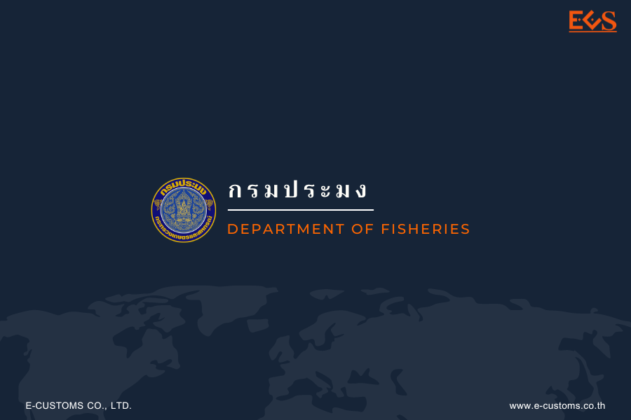



## ประกาศกรมศุลกากรที่ 99/2566 เรื่อง แก้ไขประกาศกรมศุลกากร ที่ 206/2564 (การเชื่อมโยงข้อมูลใบอนุญาต ร่วมกับกรมประมง)

กรมศุลกากรเผยแพร่ ประกาศกรมศุลกากร ที่ 99/2566 เรื่อง แก้ไขประกาศกรมศุลกากร ที่ 206/2564   ให้ยกเลิกพิกัดศุลกากรและรหัสสถิติ ในบัญชีแนบท้ายประกาศการเชื่อมโยงข้อมูลใบอนุญาต/ใบรับรองอิเล็กทรอนิกส์ร่วมกับกรมประมง พิกัด *9705.10.00* รหัสสถิติ *001* รายการ *ซากดึกดำบรรพ์* มีผลบังคับ*ตั้งแต่วันที่ 27 มิถุนายน พ.ศ. 2566 เป็นต้นไป*





ดาวน์โหลดประกาศ

> ที่มา : [กรมศุลกากร](https://www.customs.go.th/cont_strc_download_with_docno_date.php?lang=th&top_menu=menu_homepage&current_id=14232932414b505f48464b49464b49)
