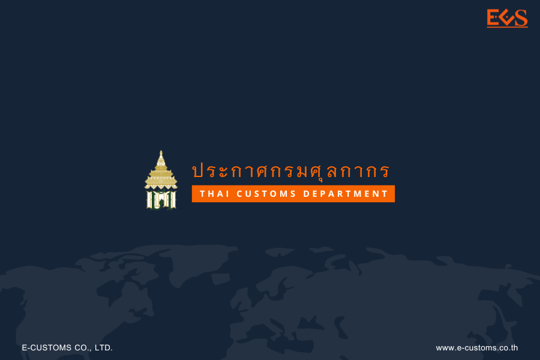



**ประกาศกรมศุลกากรที่ 69/2566 เรื่อง การชำระค่าภาษีอากร ค่าธรรมเนียมศุลกากร รายได้อื่น และเงินประกัน ผ่านช่องทางการให้บริการของธนาคารหรือตัวแทนรับชําระ (Bill Payment) และ การพิมพ์ใบเสร็จรับเงิน กศก. 123 ที่ชําระผ่านระบบอิเล็กทรอนิกส์** 

ตามที่กรมศุลกากรได้มีการเพิ่มช่องทางการรับชําระเงินค่าภาษีอากร ค่าธรรมเนียมศุลกากรรายได้อื่น และเงินประกันผ่านระบบอิเล็กทรอนิกส์ผ่านช่องทางการให้บริการของธนาคารหรือตัวแทนรับชําระ (Bill Payment) และการชําาระค่าภาษีอากรด้วยบัตรภาษีอิเล็กทรอนิกส์พร้อมการส่งข้อมูลใบขนสินค้า เพื่อให้การพิมพ์ใบสั่งเก็บเงิน ใบแจ้งหนี้ค่าธรรมเนียมการดําเนินพิธีการศุลกากรหรือเอกสารอื่น และการพิมพ์ ใบเสร็จรับเงิน กศก. 123 ที่ชําระผ่านระบบอิเล็กทรอนิกส์ เป็นไปอย่างเหมาะสมและอํานวยความสะดวก ให้แก่ผู้ประกอบการ อาศัยอำนาจตามความในมาตรา 30 และมาตรา 53 แห่งพระราชบัญญัติศุลกากร พ.ศ. 2560 อธิบดีกรมศุลกากร จึงออกประกาศดังต่อไปนี้

**ข้อ 2** การชำระเงินค่าภาษีอากร ค่าธรรมเนียมศุลกากร รายได้อื่น หรือเงินประกัน ให้สามารถชําระผ่านช่องทางการให้บริการ ของธนาคารหรือตัวแทนรับชําระ (Bill Payment) ได้ โดยให้ปฏิบัติ ดังนี้
1.	ผู้มีหน้าที่ชําระค่าภาษีอากร ค่าธรรมเนียมศุลกากร รายได้อื่น หรือเงินประกัน สามารถ ชำระผ่านช่องทางการให้บริการของธนาคารหรือตัวแทนรับชําระ เช่น ระบบ Internet Banking เคาน์เตอร์ธนาคาร เครื่องรับจ่ายเงินอัตโนมัติของธนาคาร (Automatic Teller Machine : ATM) Mobile Banking หรือ ช่องทางการชาระเงินอื่น ๆ ของธนาคาร และตัวแทนรับชําระ (Bill Payment) ที่ทำความตกลงไว้กับกรมศุลกากรแล้ว รายชื่อธนาคารและตัวแทนรับชําระที่ท่าความตกลงไว้กับกรมศุลกากร สามารถตรวจสอบได้ที่ www.customs.co.th
2.	การชำระเงินตาม (1) ให้ใช้เอกสารใบขนสินค้า ใบสั่งเก็บเงิน ใบแจ้งหนี้ค่าธรรมเนียม การดำเนินพิธีการศุลกากร หรือเอกสารอื่น ทีมี QR Code Barcode และเลขอ้างอิง 1 (Reference 1) และเลขอ้างอิง 2 (Reference 2) ที่รองรับการชำระเงินผ่านช่องทางการให้บริการของธนาคารหรือตัวแทนรับชําาระ (Bill Payment) ของกรมศุลกากรเท่านั้น
3.	การชำระค่าภาษีอากร ค่าธรรมเนียมศุลกากร รายได้อื่น หรือเงินประกัน สามารถพิมพ์ใบสั่งเก็บเงิน ใบแจ้งหนี้ค่าธรรมเนียมการดําเนินพิธีการศุลกากร หรือเอกสารอื่นที่รองรับการชำระผ่านช่องทางการให้บริการของธนาคารหรือ ตัวแทนรับชําาระ (Bill Payment) ผ่านระบบพิมพ์ใบเสร็จรับเงินและเอกสารทางการเงิน (https://e-tracking.customs.go.th ของกรมศุลกากร

**ข้อ 3** การชําระเงินค่าภาษีอากร ค่าธรรมเนียมศุลกากร รายได้อื่น หรือเงินประกัน ในระบบศุลกากร อิเล็กทรอนิกส์โดยวิธีตัดบัญชีผู้ประกอบการ (Direct Debit) วิธีชําระผ่านช่องทางการให้บริการของธนาคารหรือ ตัวแทนรับชําระ (Bill Payment) และวิธีชําระค่าภาษีอากรด้วยบัตรภาษีอิเล็กทรอนิกส์พร้อมการส่งข้อมูลใบขนสินค้า ให้ใช้แบบใบเสร็จรับเงิน กศก. 123 ตามแนบท้ายประกาศนี้

**ข้อ 4** เมื่อผู้ประกอบการชําระค่าภาษีอากร ค่าธรรมเนียมศุลกากร รายได้อื่น และ/หรือเงินประกัน โดยวิธีตัดบัญชีผู้ประกอบการ (Direct Debit) หรือชําระผ่านช่องทางการให้บริการของธนาคารหรือตัวแทน รับชําระ (Bill Payment) หรือชําระด้วยบัตรภาษีอิเล็กทรอนิกส์พร้อมการส่งข้อมูลใบขนสินค้า และระบบ อิเล็กทรอนิกส์ของกรมศุลกากรให้เลขรับชําระอากรแล้ว ให้ผู้ประกอบการพิมพ์ใบเสร็จรับเงิน จากระบบอิเล็กทรอนิกส์ของกรมศุลกากร โดยผ่านระบบพิมพ์ใบเสร็จรับเงินและเอกสารทางการเงิน (https://e-tracking.customs.go.th/) ของกรมศุลกากร โดยมีเงื่อนไขดังนี้
1.	ผู้ประกอบการสามารถ*พิมพ์ใบเสร็จรับเงินต้นฉบับได้เพียงครั้งเดียว* หากใบเสร็จรับเงิน ต้นฉบับสูญหาย หรือสั่งพิมพ์แล้วชํารุดหรือเครื่องพิมพ์ขัดข้องหรือกรณีอื่นใด ผู้ประกอบการสามารถพิมพ์สําเนาใบเสร็จรับเงิน จากระบบอิเล็กทรอนิกส์ของกรมศุลกากรดังกล่าวได้ โดยใบเสร็จรับเงินฉบับสําเนาจะมีช่องหมายเหตุ ระบุว่าเป็นการพิมพ์สําเนาครั้งที่.... โดย...(ชื่อผู้พิมพ์)... วัน/เวลาที่พิมพ์...
2. การพิมพ์ใบเสร็จรับเงิน สามารถพิมพ์ได้*ภายในระยะเวลา 5 ปี* หากเกินกําหนดดังกล่าว ผู้ประกอบการต้องยื่นคําร้องที่หน่วยงานรับชําระเงิน ของกรมศุลกากรเพื่อเป็นผู้จัดพิมพ์ใบเสร็จรับเงินให้
3.	กรณีแก้ไขใบเสร็จรับเงิน อาทิ เลขประจําตัวผู้เสียภาษีอากร ชื่อผู้ชําระเงิน หรือประเภท รายได้ ผู้ประกอบการจะไม่สามารถพิมพ์ใบเสร็จรับเงินตาม (1) ดังกล่าวได้ ทั้งนี้ ผู้ประกอบการต้องยื่นคําร้องที่ หน่วยบริการศุลกากรของสํานักงานศุลกากรหรือด่านศุลกากรที่ตรวจปล่อยสินค้า หรือหน่วยงานรับชําระเงินของ สํานักงานเลขานุการกรม กรมศุลกากร แล้วแต่กรณี โดยให้ถือปฏิบัติเช่นเดียวกับการแก้ไขใบเสร็จรับเงิน กศก. 122 ตามที่อธิบดีกรมศุลกากรประกาศกําหนดโดยอนุโลม
4. กรณีการพิมพ์ใบเสร็จรับเงินตาม (2) และ (3) ให้ผู้ยื่นคําร้องเสียค่าใช้จ่ายตามอัตราที่อธิบดีกรมศุลกากรประกาศกําหนด

**ข้อ 5** กรมศุลกากรจะดําเนินการเก็บรวบรวมข้อมูลส่วนบุคคลของผู้ทํารายการระบบพิมพ์ ใบเสร็จรับเงินและเอกสารทางการเงิน ดังมีรายละเอียดต่อไปนี้
1.	เพื่อวัตถุประสงค์ในการนําข้อมูลส่วนบุคคลไปใช้เพื่อการตรวจสอบสิทธิในการพิมพ์ ใบสั่งเก็บเงิน ใบแจ้งหนี้ค่าธรรมเนียมการดําเนินพิธีการศุลกากร หรือพิมพ์ใบเสร็จรับเงิน กศก. 123 หรือเอกสารอื่น ที่เกี่ยวข้องกับการรับชําระค่าภาษีอากร ค่าธรรมเนียม รายได้อื่น และ/หรือเงินประกัน 
2.	ข้อมูลส่วนบุคคลที่จะมีการเก็บรวบรวม ได้แก่  
(ก) ชื่อ นามสกุล  
(ข) หมายเลขบัตรประจําตัวประชาชน  
(ค) วัน เดือน ปี พ.ศ. เกิด  
(ง) หมายเลขโทรศัพท์  
(จ) ประวัติการพิมพ์ใบสั่งเก็บเงิน ใบแจ้งหนี้ค่าธรรมเนียมการดําเนินพิธีการศุลกากร หรือพิมพ์ใบเสร็จรับเงิน กศก.123 หรือการพิมพ์เอกสารอื่น ที่เกี่ยวข้องกับการรับชําระค่าภาษีอากร ค่าธรรมเนียม รายได้อื่น และเงินประกัน  
3. ข้อมูลส่วนบุคคลที่ได้มีการเก็บรวบรวมดังกล่าวอาจเปิดเผยต่อหน่วยงานดังต่อไปนี้   
(ก) หน่วยงานของรัฐซึ่งมีอํานาจหน้าที่ตามกฎหมาย  
(ข) บริษัทที่เป็นคู่สัญญาในการพัฒนาและบํารุงรักษาระบบพิมพ์ใบเสร็จรับเงินและเอกสารทางการเงิน   
4. ข้อมูลส่วนบุคคลที่ได้มีการเก็บรวบรวมจะถูกลบหรือทําลาย เมื่อพ้นกําหนดระยะเวลาสิบปีนับแต่วันที่เข้าใช้ระบบ  
5.	เจ้าของข้อมูลส่วนบุคคลมีสิทธิในการขอเข้าถึงข้อมูลบุคคลที่เกี่ยวกับตนหรือผู้มีส่วนได้เสีย ในใบสั่งเก็บเงิน ใบแจ้งหนี้ค่าธรรมเนียมการดําเนินพิธีการศุลกากร ใบเสร็จรับเงิน กศก. 123 หรือเอกสารอื่น ที่เกี่ยวข้องกับการรับชําระค่าภาษีอากร ค่าธรรมเนียม รายได้อื่น และเงินประกัน โดยสามารถติดต่อได้ที่ส่วนบริหารรายได้ สํานักงานเลขานุการกรม กรมศุลกากร

**ข้อ 6** ประกาศนี้ให้ใช้บังคับ *ตั้งแต่วันที่ 24 พฤษภาคม พ.ศ. 2566 เป็นต้นไป*




Download

> ที่มา : [กรมศุลกากร](https://www.customs.go.th/cont_strc_download_with_docno_date.php?lang=th&top_menu=menu_homepage&current_id=14232932414a505f4a464b4b464b49)
