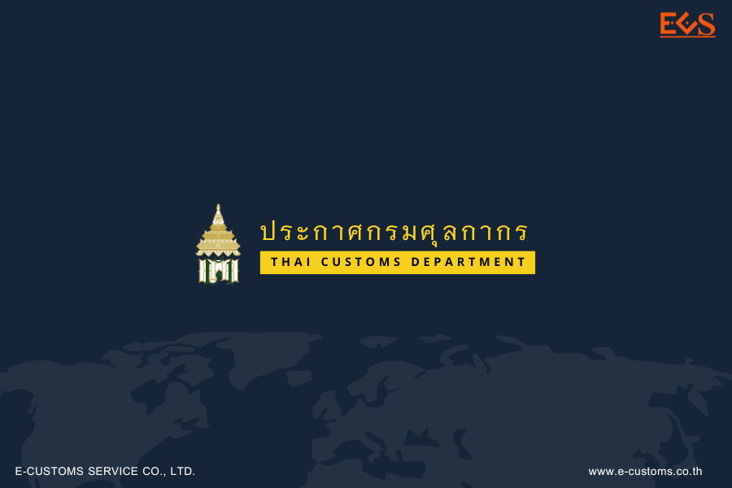



กรมศุลกากรเผยแพร่ประกาศกรมศุลกากร ที่ 111 /2567 เรื่อง **การขอรับเงินชดเชยค่าภาษีอากร
ตามพระราชบัญญัติชดเชยค่าภาษีอากรสินค้าส่งออกที่ผลิตในราชอาณาจักร** พ.ศ. 2524 (ฉบับที่ 2)  เพื่อให้การขอรับเงินชดเชยค่าภาษีอากรตามพระราชบัญญัติชดเชยค่าภาษีอากรสินค้าส่งออก ที่ผลิตในราชอาณาจักร พ.ศ. 2524 เป็นไปด้วยความสะดวก รวดเร็ว เหมาะสมยิ่งขึ้น และสอดคล้องกับ การปฏิบัติงานศุลกากรในปัจจุบัน อธิบดีกรมศุลกากรออกประกาศไว้ ดังต่อไปนี้

**ข้อ 1** ให้ยกเลิกความในข้อ 5 แห่งประกาศกรมศุลกากร ที่ 148/2564 เรื่อง การขอรับเงินชดเชย ค่าภาษีอากรตามพระราชบัญญัติชดเชยค่าภาษีอากรสินค้าส่งออกที่ผลิตในราชอาณาจักร พ.ศ. 2524 ลงวันที่ 15 กันยายน 2564 และให้ใช้ความต่อไปนี้แทน


**“ข้อ 5 การคำนวณเงินชดเชย**  
**กรมศุลกากรจะใช้ราคา FOB สำหรับการส่งออกตามกฎหมายว่าด้วยศุลกากร เปรียบเทียบราคา FOB กับมูลค่าการชำระค่าสินค้าจากหลักฐานแสดงการได้รับชำระเงินค่าสินค้า จำนวนเงินใดต่ำกว่าให้ใช้จำนวนเงินนั้นเป็นฐานในการคำนวณเงินชดเชย**  

กรณีกรมศุลกากรตรวจพบในภายหลังว่า การขอรับเงินชดเชยไม่ถูกต้อง ผู้มีสิทธิได้รับเงินชดเชย
ต้องนำเงินชดเชยส่วนที่ได้รับเงินคืนให้กรมศุลกากร พร้อมดอกเบี้ยร้อยละสามต่อปีนับแต่วันที่ได้รับเงินชดเชยไปจนกว่า จะชำระคืนครบถ้วน ทั้งนี้ กรมศุลกากรจะพิจารณาดำเนินการตามกฎหมายศุลกากรและกฎหมายอื่นที่เกี่ยวข้องด้วย”


**ข้อ 2** ประกาศนี้ให้ใช้บังคับ*ตั้งแต่วันที่ 12 มิถุนายน พ.ศ. 2567 เป็นต้นไป*







ดาวน์โหลดประกาศ  

> ที่มา : [กรมศุลกากร](https://www.customs.go.th/cont_strc_download_with_docno_date.php?lang=th&top_menu=menu_homepage&current_id=14232a324146505f4b464b46464a4f)
