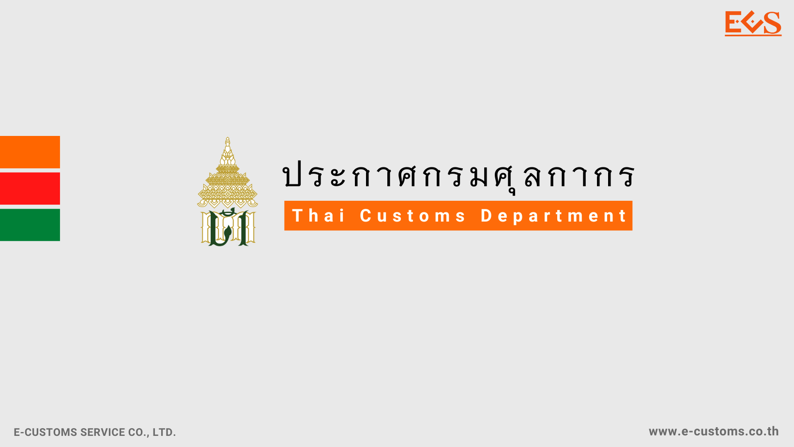



กรมศุลกากรเผยแพร่**ประกาศกรมศุลกากร ที่ 116/2567 เรื่อง กำหนดราคาของที่นำเข้า ซึ่งได้รับยกเว้นอากรตาม** *ประเภท 12 ภาค 4* **แห่งพระราชกำหนดพิกัดอัตราศุลกากร พ.ศ. 2530**  โดยที่รัฐบาลมีนโยบายที่จะแก้ไขปัญหาความไม่เป็นธรรม ในการขายสินค้าให้แก่ผู้บริโภค ระหว่างผู้ขายในต่างประเทศซึ่งไม่ต้องเสียภาษีมูลค่าเพิ่ม กับผู้ขายในประเทศไทยซึ่งต้องเสียภาษีมูลค่าเพิ่ม และเพื่อให้การยกเว้นอากรสำหรับของที่นำเข้า ซึ่งแต่ละรายมีราคาไม่เกินที่อธิบดีกรมศุลกากรประกาศกำหนด ด้วยความเห็นชอบของรัฐมนตรีว่าการกระทรวงการคลัง ตามประเภท 12 ภาค 4 แห่งพระราชกำหนดพิกัด อัตราศุลกากร พ.ศ. 2530 เป็นการชั่วคราวให้เหมาะสมและสอดคล้องกับนโยบายของรัฐบาล อธิบดีกรมศุลกากรด้วยความเห็นชอบของรัฐมนตรีว่าการ กระทรวงการคลัง จึงออกประกาศไว้ ดังต่อไปนี้

**ข้อ 1** ของที่นำเข้า ซึ่งแต่ละรายมี*ราคาไม่เกินหนึ่งบาท* ได้รับยกเว้นอากร  

**ข้อ 2** ราคา หมายถึง ราคาศุลกากร  

**ข้อ 3** ประกาศนี้ให้ใช้บังคับเมื่อ*พ้นกำหนดสิบห้าวัน*นับแต่วันประกาศในราชกิจจานุเบกษา *จนถึงวันที่ 31 ธันวาคม พ.ศ. 2567*  

**ข้อ 4** มิให้นำประกาศกรมศุลกากร ที่ 191/2561 เรื่อง หลักเกณฑ์ของนำเข้าที่ได้รับยกเว้น อากรตาม*ประเภท 12 ของภาค 4* แห่งพระราชกำหนดพิกัดอัตราศุลกากร พ.ศ. 2530 ลงวันที่ 31 กรกฎาคม พ.ศ. 2561 มาใช้บังคับกับของที่นำเข้าในระหว่างที่ประกาศนี้ใช้บังคับ  

**ข้อ 5** บรรดาประกาศอื่นใดของกรมศุลกากรในส่วนที่มีกำหนดไว้แล้วในประกาศนี้ หรือแย้งกับประกาศนี้ ให้ใช้ประกาศนี้แทน  

ประกาศ ณ *วันที่ 19 มิถุนายน พ.ศ. 2567*







ดาวน์โหลดประกาศ  

> ที่มา : [กรมศุลกากร](https://www.customs.go.th/cont_strc_download_with_docno_date.php?lang=th&top_menu=menu_homepage&current_id=14232a324146505f4b464b48464b4b)
