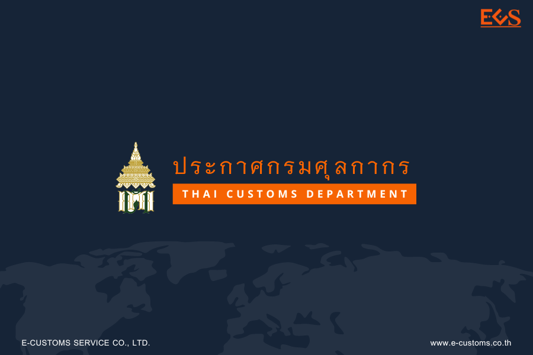



กรมศุลกากรเผยแพร่ ประกาศกรมศุลกากร ที่ 128/2567 เรื่อง **หลักเกณฑ์และการปฏิบัติพิธีการศุลกากรสำหรับการยกเว้นอากรศุลกากร สำหรับการนำเข้าของที่มีมูลค่าไม่เกิน 1,500 บาท**  เพื่อกำหนดหลักเกณฑ์และพิธีการศุลกากรสำหรับการนำเข้าของที่มีมูลค่าไม่เกิน 1,500 บาท ตามที่รัฐบาลมีนโยบายที่จะแก้ไขปัญหาความไม่เป็นธรรมในการขายสินค้าให้แก่ผู้บริโภคระหว่างผู้ขาย ในต่างประเทศซึ่งไม่ต้องเสียภาษีมูลค่าเพิ่มกับผู้ขายในประเทศซึ่งต้องเสียภาษีมูลค่าเพิ่ม ประกอบกับประเทศไทย ต้องปฏิบัติตามความตกลงระหว่างประเทศซึ่งให้กำหนดราคาขั้นต่ำของของที่นำเข้าแต่ละรายเพื่อให้คุ้มค่ากับการจัดเก็บอากรศุลกากร อธิบดีกรมศุลกากร ออกประกาศไว้ ดังต่อไปนี้

**ข้อ 1** ประกาศนี้ให้ใช้บังคับกับการนำเข้าของ ซึ่งแต่ละรายผู้รับในประเทศที่มี*ราคารวม ค่าขนส่งและค่าประกันภัย (CIF) ที่มีมูลค่ามากกว่าหนึ่งบาทแต่ไม่เกินหนึ่งพันห้าร้อยบาท* *ตั้งแต่วันที่ 5 กรกฎาคม พ.ศ. 2567 จนถึงวันที่ 31 ธันวาคม พ.ศ. 2567*

**ข้อ 2** บรรดาประกาศอื่นใดของกรมศุลกากรในส่วนที่มีกำหนดไว้แล้วในประกาศนี้ หรือซึ่ง ขัดหรือแย้งกับประกาศนี้ ให้ใช้ประกาศนี้แทน

**ข้อ 3 ราคา** หมายถึง ราคาศุลกากร

## ส่วนที่ 1

**การปฏิบัติพิธีการศุลกากรนำเข้าทั่วไปและการปฏิบัติพิธีการศุลกากรเกี่ยวกับของเร่งด่วนขาเข้า ที่มีผู้โดยสารนำพาในลักษณะถุงเมล์ด่วน (Courier) บนท่าอากาศยาน**

**ข้อ 4** ให้ผู้นำของเข้าปฏิบัติพิธีการศุลกากรตามประกาศกรมศุลกากรว่าด้วยการปฏิบัติ พิธีการศุลกากรทางอิเล็กทรอนิกส์  

**ข้อ 5** ผู้นำของเข้าซึ่งแต่ละรายผู้รับในประเทศมีราคารวมค่าขนส่งและค่าประกันภัย (CIF) ที่มีมูลค่ามากกว่าหนึ่งบาท แต่ไม่เกินหนึ่งพันห้าร้อยบาท ที่ประสงค์จะใช้สิทธิยกเว้นอากรตามประกาศ กระทรวงการคลัง เรื่อง การยกเว้นอากรศุลกากรสำหรับของที่มีมูลค่าไม่เกิน 1,500 บาท ลงวันที่ 19 มิถุนายน พ.ศ. 2567 ให้จัดทำใบขนสินค้าตามมาตรฐานที่กรมศุลกากรกำหนด โดยบันทึกใน**ช่องสิทธิพิเศษของแต่ละรายการระบุเป็น** *“LVG”* ให้นำความในวรรคหนึ่ง มาใช้กับการปฏิบัติพิธีการศุลกากรเกี่ยวกับของเร่งด่วนขาเข้า ที่มีผู้โดยสารนำพาในลักษณะถุงเมล์ด่วน (Courier) บนท่าอากาศยาน โดยอนุโลม  

-----

## ส่วนที่ 2
**การปฏิบัติพิธีการศุลกากรนำเข้าของเร่งด่วนทางอากาศยาน**

**ข้อ 6** ของนำเข้าซึ่งแต่ละรายผู้รับในประเทศมีราคารวมค่าขนส่งและค่าประกันภัย (CIF) ที่มีมูลค่ามากกว่าหนึ่งบาท แต่ไม่เกินหนึ่งพันห้าร้อยบาท และไม่เป็นของต้องห้ามของต้องกำกัด ให้ผู้ประกอบการ ของเร่งด่วนนำพิธีการศุลกากรสำหรับของเร่งด่วนขาเข้าประเภทที่ 2 ของประกาศกรมศุลกากร ที่ 130/2561 เรื่อง การปฏิบัติพิธีการศุลกากรทางอิเล็กทรอนิกส์ว่าด้วยกระบวนการทางศุลกากรเกี่ยวกับของเร่งด่วน ลงวันที่ 4 พฤษภาคม พ.ศ. 2561 และประกาศกรมศุลกากร ที่ 66/2561 เรื่อง การปฏิบัติพิธีการศุลกากร ณ เขตปลอดอากรท่าอากาศยานสุวรรณภูมิ ลงวันที่ 27 กุมภาพันธ์ พ.ศ. 2561 มาปฏิบัติโดยอนุโลม โดยบันทึกใน**ช่องสิทธิพิเศษของแต่ละรายการระบุเป็น** *“LVG”* เว้นแต่ขั้นตอนการชำระค่าภาษี ให้ดำเนินการตามของเร่งด่วนขาเข้าประเภทที่ 3 

**ข้อ 7 ใบเสร็จรับเงินตามใบขนสินค้าขาเข้าของเร่งด่วนทางอากาศยาน** ให้ใช้ใบเสร็จรับเงินตามแบบที่กรมศุลกากรกำหนด (กศก. 122) กรณีการชำระค่าภาษีอากร ค่าธรรมเนียมศุลกากร รายได้อื่น และเงินประกัน ผ่านช่องทาง การให้บริการของธนาคารหรือตัวแทนรับชำระ (Bill Payment) ผู้ประกอบการสามารถพิมพ์ใบเสร็จรับเงิน กศก. 123 ที่ชำระผ่านระบบอิเล็กทรอนิกส์ ตามที่ประกาศกรมศุลกากรกำหนด  

-----

## ส่วนที่ 3
**การปฏิบัติพิธีการศุลกากรนำเข้าของเร่งด่วนทางบก**

**ข้อ 8** ของนำเข้าซึ่งแต่ละรายผู้รับในประเทศมีราคารวมค่าขนส่งและค่าประกันภัย (CIF) ที่มีมูลค่ามากกว่าหนึ่งบาทแต่ไม่เกินหนึ่งพันห้าร้อยบาท และไม่เป็นของต้องห้ามของต้องกำกัด ให้ผู้ประกอบการ ของเร่งด่วนทางบกนำพิธีการศุลกากรสำหรับของเร่งด่วนขาเข้าประเภทที่ 2 ของประกาศกรมศุลกากร ที่ 130/2563 เรื่อง การปฏิบัติพิธีการศุลกากรว่าด้วยกระบวนการทางศุลกากรสำหรับของเร่งด่วนทางบก ลงวันที่ 10 สิงหาคม พ.ศ. 2563 มาปฏิบัติโดยอนุโลม โดยบันทึกใน**ช่องสิทธิพิเศษของแต่ละรายการระบุเป็น** *“LVG”* เว้นแต่ขั้นตอนการชำระค่าภาษี ให้ดำเนินการตามของเร่งด่วนขาเข้าประเภทที่ 3 

**ข้อ 9 ใบเสร็จรับเงินตามใบขนสินค้าขาเข้าของเร่งด่วนทางบก** ให้ใช้ใบเสร็จรับเงินตามแบบที่กรมศุลกากรกำหนด (กศก. 122) กรณีการชำระค่าภาษีอากร ค่าธรรมเนียมศุลกากร รายได้อื่น และเงินประกัน ผ่านช่องทาง การให้บริการของธนาคารหรือตัวแทนรับชำระ (Bill Payment) ผู้ประกอบการสามารถพิมพ์ใบเสร็จรับเงิน กศก. 123 ที่ชำระผ่านระบบอิเล็กทรอนิกส์ ตามที่ประกาศกรมศุลกากรกำหนด

-----

## ส่วนที่ 4
**การปฏิบัติพิธีการศุลกากรนำของออกจากเขตปลอดอากรกิจการพาณิชย์อิเล็กทรอนิกส์ภายในเขตส่งเสริมเศรษฐกิจพิเศษในพื้นที่เขตพัฒนาพิเศษภาคตะวันออก เพื่อใช้หรือจำหน่ายภายในประเทศ**

**ข้อ 10 ของนำเข้าซึ่งแต่ละรายผู้รับในประเทศมีราคารวมค่าขนส่งและค่าประกันภัย (CIF) ที่มีมูลค่ามากกว่าหนึ่งบาทแต่ไม่เกินหนึ่งพันห้าร้อยบาท** และไม่เป็นของต้องห้ามของต้องกำกัด ให้ผู้ประกอบ กิจการพาณิชย์อิเล็กทรอนิกส์นำพิธีการศุลกากรสำหรับของประเภทที่ 2 ของประกาศกรมศุลกากร ที่ 204/2562 เรื่อง การปฏิบัติพิธีการศุลกากร ณ เขตปลอดอากรกิจการพาณิชย์อิเล็กทรอนิกส์ภายใน เขตส่งเสริมเศรษฐกิจพิเศษในพื้นที่เขตพัฒนาพิเศษภาคตะวันออก ลงวันที่ 24 กันยายน พ.ศ. 2562 มาปฏิบัติโดยอนุโลม โดยบันทึกในช่องสิทธิพิเศษของแต่ละรายการระบุเป็น “LVG”

**ข้อ 11 ใบเสร็จรับเงินตามใบขนสินค้าพาณิชย์อิเล็กทรอนิกส์** ให้ใช้ใบเสร็จรับเงินตามแบบที่กรมศุลกากรกำหนด (กศก. 122) กรณีการชำระค่าภาษีอากร ค่าธรรมเนียมศุลกากร รายได้อื่น และเงินประกัน ผ่านช่องทาง การให้บริการของธนาคารหรือตัวแทนรับชำระ (Bill Payment) ผู้ประกอบการสามารถพิมพ์ใบเสร็จรับเงิน กศก. 123 ที่ชำระผ่านระบบอิเล็กทรอนิกส์ ตามที่ประกาศกรมศุลกากรกำหนด

-----

## ส่วนที่ 5
**การปฏิบัติพิธีการศุลกากรการนำเข้าทางไปรษณีย์ระหว่างประเทศ**

**ข้อ 12 การตรวจคัดและการปฏิบัติกับสิ่งของส่งทางไปรษณีย์ระหว่างประเทศที่มีมูลค่า ไม่เกิน 1,500 บาท** ไม่ว่าผู้รับจะเป็นบุคคลหรือบริษัทห้างร้าน และอยู่ ณ จังหวัดใด ซึ่งกรมศุลกากรมีอำนาจ ในการจัดเก็บภาษีมูลค่าเพิ่มแทนกรมสรรพากร ให้ดำเนินการดังนี้

  (12.1) ของรายใดซึ่งพิจารณาแล้วเห็นว่า เป็นของที่ต้องเสียภาษีมูลค่าเพิ่ม ตามหลักเกณฑ์ข้างต้น พนักงานศุลกากร หน่วยงานตรวจคัดสิ่งของทางไปรษณีย์ระหว่างประเทศ จะตรวจสอบ โดยการเอ็กซเรย์ (X-ray) และเปิดตรวจเพื่อประเมินภาษีมูลค่าเพิ่มต่อหน้าพนักงานของบริษัท ไปรษณีย์ไทย จำกัด และบันทึกจำนวนเงินค่าภาษีมูลค่าเพิ่มไว้บนหีบห่อของ เว้นแต่กรณีที่ใบปฏิญญา (CN 22/CN 23) มีข้อมูล รายละเอียดเกี่ยวกับของครบถ้วน ได้แก่ ชนิด ปริมาณ น้ำหนัก ราคา ค่าไปรษณียากร (POSTAGE) รวมทั้ง รายละเอียดอย่างอื่นที่สามารถประเมินภาษีมูลค่าเพิ่มได้ และไม่มีเหตุอันควรสงสัย พนักงานศุลกากรจะประเมิน ภาษีมูลค่าเพิ่มตามข้อมูลที่สำแดงในใบปฏิญญา (CN 22/CN 23) โดยไม่ต้องเปิดตรวจก็ได้

  (12.2) หีบห่อของที่เปิดตรวจและประเมินภาษีมูลค่าเพิ่มแล้ว ให้พนักงาน บริษัท ไปรษณีย์ไทย จำกัด คาดเทปกาวพลาสติกปิดรอยเปิด หรือรอยฉีกขาดให้เรียบร้อย และประทับข้อความ ไว้ที่หีบห่อว่า **“เปิดตรวจ/ปิดผนึก โดยพนักงานศุลกากร ร่วมกับเจ้าหน้าที่ไปรษณีย์ EXAMINED / SEALED BY CUSTOMS AND POSTAL OFFICERS”** ต่อจากนั้น พนักงานศุลกากรจะบันทึกข้อมูลลงในระบบใบสั่งเก็บเงิน (Order Form) ตามที่ปรากฏบนจ่าหน้าหีบห่อ คือ หมายเลขติดตามพัสดุ (tracking number) หน้าหีบห่อ ชื่อ-นามสกุล ผู้รับ รวมทั้งรายละเอียดของที่ได้เปิดตรวจและประเมิน ซึ่งได้แก่ ชนิดของที่ตรวจพบ ปริมาณ น้ำหนัก ราคาประเมิน ประเภทพิกัดฯ รหัสรายได้ ค่าภาษีมูลค่าเพิ่ม รวมทั้งชื่อพนักงานศุลกากรผู้ประเมิน และ วัน เดือน ปี ที่นำเข้า เข้าสู่ระบบคอมพิวเตอร์ของกรมศุลกากร และพิมพ์ใบสั่งเก็บเงิน (Order form) จำนวน 2 ฉบับ ผนึกติดไปกับหีบห่อและส่งมอบให้บริษัท ไปรษณีย์ไทย จำกัด นำจ่ายให้ผู้รับต่อไป 

**ข้อ 13 การชำระเงินค่าภาษีมูลค่าเพิ่ม**
ก่อนที่ผู้รับจะได้รับของจากบริษัท ไปรษณีย์ไทย จำกัด ไม่ว่ากรณีใด ๆ ผู้รับมีหน้าที่ ตามประมวลรัษฎากรที่จะต้องชำระภาษีมูลค่าเพิ่มก่อนเสมอ โดยรูปแบบและวิธีการที่เกี่ยวข้อง มีดังนี้ 

  (13.1) พนักงานของบริษัท ไปรษณีย์ไทย จำกัด จะเป็นผู้นำส่งของให้กับผู้รับ โดยหีบห่อของจะมี **“เอกสารใบสั่งเก็บเงิน (Order Form) พร้อมคิวอาร์โค้ด (QR Code)”** ผนึกไว้กับหีบห่อของ ที่ระบุถึงภาษีมูลค่าเพิ่มที่ผู้รับมีหน้าที่ต้องเสีย เพื่ออำนวยความสะดวกในการชำระค่าภาษีมูลค่าเพิ่มดังกล่าว และคำแนะนำต่าง ๆ ที่เกี่ยวข้อง โดยเมื่อผู้รับชำระภาษีมูลค่าเพิ่มเรียบร้อยแล้ว พนักงานของบริษัท ไปรษณีย์ไทย จำกัด จะส่งมอบหีบห่อของให้กับผู้รับ

  (13.2) กรณีผู้รับไม่สามารถชำระภาษีมูลค่าเพิ่มผ่านคิวอาร์โค้ด (QR Code) ที่ปรากฏ บนใบสั่งเก็บเงิน (Order Form) ที่ผนึกไปกับหีบห่อได้ พนักงานของบริษัท ไปรษณีย์ไทย จำกัด จะนำหีบห่อ ไปเก็บรักษา ณ ที่ทำการไปรษณีย์ปลายทาง และผู้รับสามารถนำใบสั่งเก็บเงิน (Order Form) ที่ผนึกไปกับหีบห่อ ไปติดต่อธนาคารที่กำหนดเพื่อชำระภาษีมูลค่าเพิ่ม และนำหลักฐานการชำระเงิน อาทิ ใบเสร็จรับเงิน สำเนาใบนำฝากของธนาคาร ไปติดต่อรับของ ณ ที่ทำการไปรษณีย์ปลายทาง ภายใน 15 วัน นับตั้งแต่ วันที่ได้รับใบสั่งเก็บเงิน (Order Form) จากพนักงานของบริษัท ไปรษณีย์ไทย จำกัด หากผู้รับไม่ติดต่อรับของ ภายในระยะเวลาที่กำหนดไว้ ของจะถูกส่งคืนต้นทางต่างประเทศ โดยผู้รับสามารถขอรับเงินค่าภาษีมูลค่าเพิ่มที่ชำระไว้คืนได้ตามกฎหมายและระเบียบที่เกี่ยวข้อง 

  (13.3) กรณีไม่มีผู้รับพนักงานของบริษัท ไปรษณีย์ไทย จำกัด จะออกใบนัดนำจ่าย พร้อมใบสั่งเก็บเงิน (Order Form) ไว้ ณ ที่อยู่ผู้รับ และนำหีบห่อไปเก็บรักษา ณ ที่ทำการไปรษณีย์ปลายทาง โดยผู้รับสามารถชำระภาษีมูลค่าเพิ่มตามวิธีการที่กำหนดไว้ และรับของได้ภายใน 15 วัน นับแต่วันที่บริษัท ไปรษณีย์ไทย จำกัด ออกใบนัดนำจ่าย หากผู้รับไม่ติดต่อรับของ ภายใน 15 วัน ของจะถูกส่งคืนต้นทาง ต่างประเทศ

**ข้อ 14 สิทธิโต้แย้งการประเมินภาษีมูลค่าเพิ่ม**
กรณีผู้รับไม่เห็นด้วยกับการประเมินภาษีมูลค่าเพิ่มตามเอกสารใบสั่งเก็บเงิน (Order Form) ผู้รับมีสิทธิโต้แย้งการประเมินภายใน 7 วัน นับแต่วันที่ได้รับใบสั่งเก็บเงิน (Order form) โดยปฏิบัติตามขั้นตอน ดังนี้

(14.1) ผู้รับยื่นคำร้องขอโต้แย้งการประเมินภาษีมูลค่าเพิ่ม ตามแบบแนบท้าย ประกาศนี้ หรือที่เว็บไซต์ http://www.postal.customs.go.th พร้อมเอกสารใบสั่งเก็บเงิน (Order form) ที่ผนึกติดไปกับหีบห่อ โดยสามารถยื่นด้วยตนเอง ณ ส่วนบริการศุลกากรไปรษณีย์ หรือทางไปรษณีย์ อิเล็กทรอนิกส์ postal.re@customs.go.th

(14.2) กรณีให้ลดหย่อน ให้พนักงานศุลกากรพิจารณาข้อโต้แย้งและแจ้งผล การพิจารณาให้ผู้รับ โดยปฏิบัติตามข้อ (12.2) และส่งมอบเฉพาะใบสั่งเก็บเงิน (Order form) จำนวน 2 ฉบับ ให้บริษัท ไปรษณีย์ไทย จำกัด นำจ่ายให้ผู้รับต่อไป

(14.3) กรณีไม่ลดหย่อน ให้พนักงานศุลกากรแจ้งผลการพิจารณาไปยังผู้รับ

**ข้อ 15 วิธีการพิมพ์ใบเสร็จรับเงิน (กศก. 123)**
ผู้รับสามารถพิมพ์ใบเสร็จรับเงินได้ที่ https://e-tracking.customs.go.th หรือ ติดต่อขอใบเสร็จรับเงินได้ที่สำนักงานหรือด่านศุลกากรทุกแห่ง โดยเป็นไปตามเงื่อนไขที่กรมศุลกากรกำหนด 

**ข้อ 16 กรณีผู้รับที่มีชื่อปรากฎบนจ่าหน้าหีบห่อปฏิเสธการรับของโดยชัดแจ้ง** บริษัท ไปรษณีย์ไทย จำกัด จะส่งของคืนต้นทางต่างประเทศ

**ข้อ 17 การส่งคืนสิ่งของส่งทางไปรษณีย์ระหว่างประเทศ**

  (17.1) กรณีตามข้อ (13.2) (13.3) และ ข้อ 16 ให้บริษัท ไปรษณีย์ไทย จำกัด จัดทำรายงานหีบห่อของที่ส่งคืนต้นทางต่างประเทศให้ส่วนบริการศุลกากรไปรษณีย์ทราบเป็นรายเดือน
  
  (17.2) กรณีที่ไม่สามารถส่งคืนต้นทางต่างประเทศได้ ให้บริษัท ไปรษณีย์ไทย จำกัด ส่งของคืนส่วนบริการศุลกากรไปรษณีย์เพื่อดำเนินการตามกฎหมายที่เกี่ยวข้องต่อไป

**ข้อ 18 สิ่งของส่งทางไปรษณีย์ระหว่างประเทศที่มีผู้มาขอรับภายหลังที่ส่งคืนไปแล้ว** กรณีตามข้อ (17.2) หากของยังมิได้ส่งคืนต้นทางต่างประเทศและถ้ามีผู้มาขอรับ ให้ติดต่อส่วนบริการศุลกากรไปรษณีย์ เพื่อชำระค่าภาษีมูลค่าเพิ่มและรับของด้วยตนเอง

**ข้อ 19** หากผู้รับได้รับหีบห่อไปจากบริษัท ไปรษณีย์ไทย จำกัด โดยยังมิได้ชำระภาษีมูลค่าเพิ่ม ให้ครบถ้วน ถือเป็นความผิดตามกฎหมาย ซึ่งส่วนบริการศุลกากรไปรษณีย์ กรมศุลกากรจะตรวจสอบข้อมูลค้างชำระ กับข้อมูลสถานะสิ่งของของบริษัท ไปรษณีย์ไทย จำกัด หากพบการกระทำความผิด กรมศุลกากรจะดำเนินการ ตามกฎหมายและระเบียบที่เกี่ยวข้องต่อไป

**ข้อ 20 ของประเภทที่ 3 ที่ต้องจัดทำใบขนสินค้า** ผู้นำเข้าที่ประสงค์จะใช้สิทธิยกเว้นอากร ตามประกาศกระทรวงการคลัง เรื่อง การยกเว้นอากรศุลกากรสำหรับของที่มีมูลค่าไม่เกิน 1,500 บาท ลงวันที่ 19 มิถุนายน พ.ศ. 2567 ให้จัดทำตามมาตรฐานที่กรมศุลกากรกำหนด โดยบันทึกใน**ช่องสิทธิพิเศษของแต่ละรายการระบุเป็น** *“LVG”*

ประกาศ ณ *วันที่ 4 กรกฎาคม พ.ศ. 2567*







ดาวน์โหลดประกาศ  

> ที่มา : [กรมศุลกากร](https://www.customs.go.th/cont_strc_download_with_docno_date.php?lang=th&top_menu=menu_homepage&current_id=14232a324146505f4d464b48464b4b)
