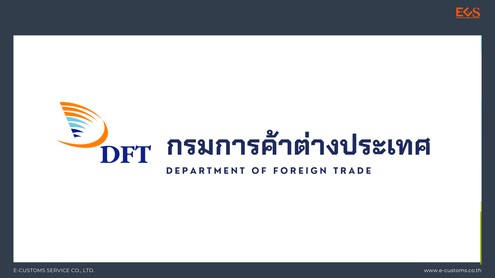
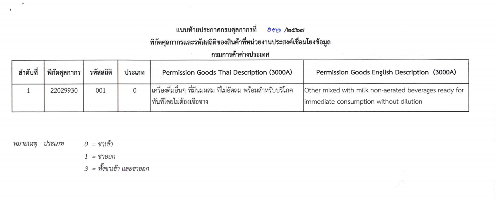



กรมศุลกากรเผยแพร่ ประกาศกรมศุลกากร ที่ 131/2567 เรื่อง การเชื่อมโยงข้อมูลใบอนุญาต/ใบรับรองอิเล็กทรอนิกส์ ร่วมกับ*กรมการค้าต่างประเทศ* มีรายละเอียดดังนี้

      ตามประกาศกรมศุลกากร ที่ 131/2561 เรื่อง การปฏิบัติพิธีการศุลกากรทาง อิเล็กทรอนิกส์สำหรับการเชื่อมโยงข้อมูลตามกฎหมายอื่น ที่เกี่ยวข้องกับการศุลกากร อธิบดีกรมศุลกากร โดยผู้อำนวยการสำนักเทคโนโลยีสารสนเทศและการสื่อสารจัดทำประกาศกรมศุลกากร แจ้งให้ทราบถึง รหัสพิกัดศุลกากรและรหัสสถิติ รายการสินค้า ที่ต้องทำการเชื่อมโยงข้อมูลใบอนุญาตหรือใบรับรอง อิเล็กทรอนิกส์ผ่านระบบ National Single Window (NSW) ก่อนการส่งข้อมูลใบขนสินค้า จึงออกประกาศไว้ ดังต่อไปนี้

ประกาศนี้ให้มีผลบังคับ *ตั้งแต่วันที่ 1 สิงหาคม พ.ศ. 2567 เป็นต้นไป*

> ที่มา : [กรมศุลกากร](https://www.customs.go.th/cont_strc_download_with_docno_date.php?lang=th&top_menu=menu_homepage&current_id=14232a324146505f4d464b4d464b4d)





ดาวน์โหลดประกาศ

> ที่มา : [กรมศุลกากร](https://www.customs.go.th/cont_strc_download_with_docno_date.php?lang=th&top_menu=menu_homepage&current_id=14232932414b505f48464b49464b49)
