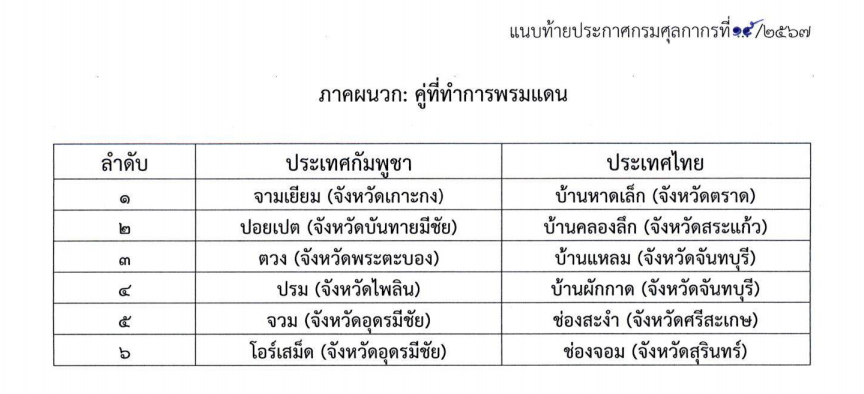



กรมศุลกากรเผยแพร่ ประกาศกรมศุลกากร ที่ 15/2567 เรื่อง *พิธีการศุลกากรว่าด้วยการผ่านแดน* ตามบันทึกความเข้าใจว่าด้วยการผ่านแดนสินค้าระหว่าง กรมศุลกากรแห่งราชอาณาจักรไทยและ *กรมศุลกากรและสรรพสามิตแห่งราชอาณาจักรกัมพูชา* (รายละเอียดตามเอกสารแนบ) อธิบดีกรมศุลกากรจึงออกประกาศไว้ ดังต่อไปนี้

**ข้อ 1** ประกาศนี้ให้ใช้บังคับกับการผ่านแดนตามบันทึกความเข้าใจว่าด้วยการผ่านแดนสินค้า ระหว่างกรมศุลกากรแห่งราชอาณาจักรไทย และกรมศุลกากรและสรรพสามิตแห่งราชอาณาจักรกัมพูชา ซึ่งไม่รวมถึงการปฏิบัติพิธีการศุลกากรผ่านแดนภายใต้บทบังคับแห่งบรรดาสัญญาและความตกลงระหว่างประเทศอื่นใด ที่มีกฎหมายและระเบียบภายในประเทศซึ่งได้กำหนดหลักเกณฑ์ วิธีการ และเงื่อนไขไว้เป็นการเฉพาะ ทั้งนี้ ผู้ขอผ่านแดน ที่ได้ปฏิบัติพิธีการผ่านแดนตามประกาศนี้แล้ว ไม่สามารถเปลี่ยนพิธีการศุลกากรเป็นพิธีการผ่านแดนตาม ประกาศที่ออกตามความตกลงระหว่างประเทศอื่นได้

**ข้อ 2** ให้ผู้ขอผ่านแดนปฏิบัติตามประกาศกรมศุลกากรว่าด้วยพิธีการศุลกากรว่าด้วยการผ่านแดนทางอิเล็กทรอนิกส์โดยอนุโลม ทั้งนี้ให้ดำเนินการผ่านเข้าและผ่านออกได้ ณ ที่ทำการพรมแดน ที่มีการกำหนดไว้ในภาคผนวกตามบันทึกความเข้าใจว่าด้วยการผ่านแดนสินค้าระหว่างกรมศุลกากรแห่งราชอาณาจักรไทย และ กรมศุลกากรและสรรพสามิตแห่งราชอาณาจักรกัมพูชา แนบท้ายประกาศนี้

**ข้อ 3** ประกาศนี้ให้ใช้บังคับตั้งแต่ *วันที่ 7 กุมภาพันธ์ พ.ศ. 2567 เป็นต้นไป*





ดาวน์โหลดประกาศ

> ที่มา : [กรมศุลกากร](https://www.customs.go.th/cont_strc_download_with_docno_date.php?lang=th&top_menu=menu_homepage&current_id=14232a32404e505f4a464b4d464b47)
