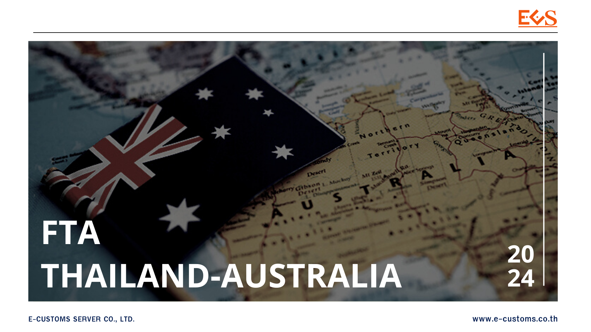



กรมศุลกากรเผยแพร่ ประกาศกรมศุลกากรที่ *26/2567* เรื่อง หลักเกณฑ์และพิธีการการยกเว้นอากรและลดอัตราอากรศุลกากร สำหรับของที่มีถิ่นกำเนิดจากออสเตรเลีย (ฉบับที่ 2) เพื่อปฏิบัติตามข้อผูกพันตามความตกลงการค้าเสรีไทย - ออสเตรเลีย (Thailand – Australia Free Trade Agreement) และเพื่อให้เป็นไปตามประกาศกระทรวงการคลัง เรื่อง การยกเว้นอากรและลดอัตรา อากรศุลกากรสำหรับของที่มีถิ่นกำเนิดจากออสเตรเลีย ลงวันที่ 28 ธันวาคม พ.ศ. 2564 ซึ่งให้ยกเว้นและ ลดอัตราอากรสำหรับของที่มีถิ่นกำเนิดจากออสเตรเลีย อธิบดีกรมศุลกากรจึงออกประกาศไว้ดังต่อไปนี้

**ข้อ 1** ให้ยกเลิกความใน (2) ของข้อ 3 แห่งประกาศกรมศุลกากร ที่ 216/2564 เรื่อง หลักเกณฑ์และพิธีการการยกเว้นอากรและลดอัตราอากรศุลกากรสำหรับของที่มีถิ่นกำเนิดจากออสเตรเลีย ลงวันที่ 29 ธันวาคม พ.ศ. 2564 และให้ใช้ความต่อไปนี้แทน


“(2) **พิกัดศุลกากรที่ใช้ในการพิจารณาเกณฑ์ถิ่นกำเนิดสินค้า**  

(2.1) การได้ถิ่นกำเนิดสินค้าตามกฎว่าด้วยถิ่นกำเนิดสินค้า ให้พิจารณาตามประเภท และประเภทย่อยของพิกัดศุลกากรระบบฮาร์โมไนซ์ ฉบับปี 2022 (HS 2022) และ  
(2.2) ให้ตรวจสอบการได้รับสิทธิยกเว้นอากรและลดอัตราอากรตามประกาศกระทรวงการคลัง เรื่อง การยกเว้นอากรและลดอัตราอากรศุลกากรสำหรับของที่มีถิ่นกำเนิดจากออสเตรเลีย”


**ข้อ 2** ให้ยกเลิกเอกสารแนบ 2 ภาคผนวก 4.1 กฎว่าด้วยถิ่นกำเนิดสินค้าเฉพาะรายสินค้า แนบท้ายประกาศกรมศุลกากร ที่ 216/2564 เรื่อง หลักเกณฑ์และพิธีการการยกเว้นอากรและลดอัตราอากร ศุลกากรสำหรับของที่มีถิ่นกำเนิดจากออสเตรเลีย ลงวันที่ 29 ธันวาคม พ.ศ. 2564 และให้ใช้เอกสารแนบ 2 ภาคผนวก 4.1 กฎว่าด้วยถิ่นกำเนิดสินค้าเฉพาะรายสินค้าแนบท้ายประกาศนี้แทน

**ข้อ 3** ให้ยกเลิกภาคผนวก 1 - 4 แนบท้ายประกาศกรมศุลกากร ที่ 216/2564 เรื่อง หลักเกณฑ์และพิธีการการยกเว้นอากรและลดอัตราอากรศุลกากรสำหรับของที่มีถิ่นกำเนิดจากออสเตรเลีย ลงวันที่ 29 ธันวาคม พ.ศ. 2564

**ข้อ 4** ประกาศนี้ให้ใช้บังคับ*ตั้งแต่วันที่ 1 มีนาคม พ.ศ. 2567 เป็นต้นไป*

## ประกาศ







## ภาคผนวก





ดาวน์โหลดประกาศ  ดาวน์โหลดภาคผนวก

> ที่มา : [กรมศุลกากร](https://www.customs.go.th/cont_strc_download_with_docno_date.php?lang=th&top_menu=menu_homepage&current_id=14232a32404e505f4d464b4a464b46)
