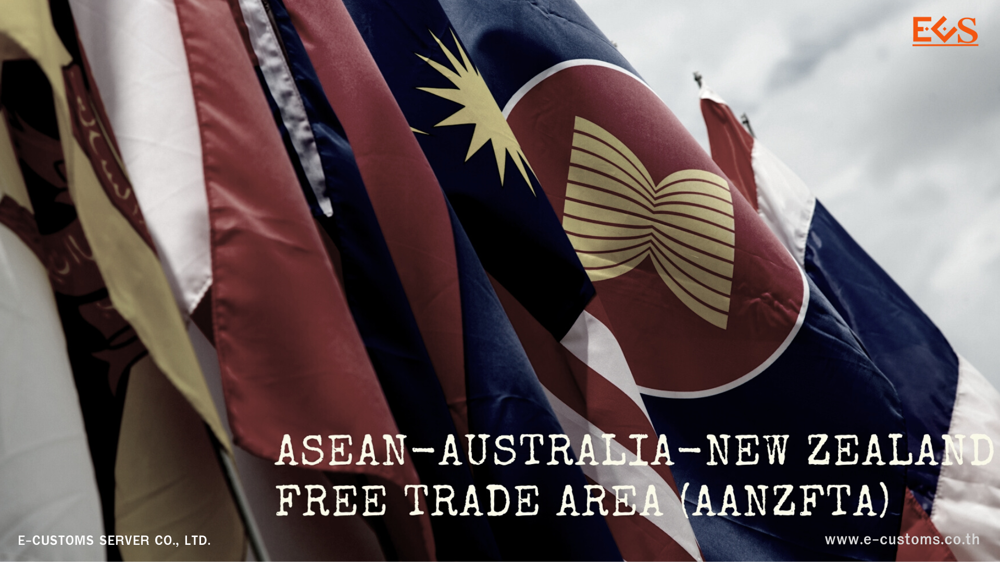



กรมศุลกากรเผยแพร่ประกาศกรมศุลกากรที่ 28/2567 เรื่อง **หลักเกณฑ์และพิธีการการยกเว้นอากรและลดอัตราอากรศุลกากร สำหรับเขตการค้าเสรี** *อาเซียน - ออสเตรเลีย - นิวซีแลนด์* (ฉบับที่ 2) (รายละเอียดตามเอกสารแนบ)เพื่อปฏิบัติตามข้อผูกพัน ตามความตกลงเพื่อจัดตั้งเขตการค้าเสรีอาเซียน - ออสเตรเลีย - นิวซีแลนด์ (Agreement Establishing the ASEAN - Australia - New Zealand Free Trade Area) อธิบดีกรมศุลกากรจึงออกประกาศไว้ ดังต่อไปนี้

**ข้อ 1** ให้ยกเลิกความใน (2) ของข้อ 3 แห่งประกาศกรมศุลกากร ที่ 215/2564 เรื่อง หลักเกณฑ์และพิธีการการยกเว้นอากรและลดอัตราอากรศุลกากรสำหรับเขตการค้าเสรีอาเซียน - ออสเตรเลีย - นิวซีแลนด์ ลงวันที่ 29 ธันวาคม พ.ศ. 2564 และให้ใช้ความต่อไปนี้แทน


(2) พิกัดศุลกากรที่ใช้ในการพิจารณาเกณฑ์ถิ่นกำเนิดสินค้า

(2.1) การได้ถิ่นกำเนิดสินค้าตามกฎว่าด้วยถิ่นกำเนิดสินค้า ให้พิจารณาตาม ประเภทและประเภทย่อยของพิกัดศุลกากรระบบฮาร์โมไนซ์ ฉบับปี 2022 (HS 2022) และ

(2.2) ให้ตรวจสอบการได้รับสิทธิยกเว้นอากรและลดอัตราอากรตามประกาศกระทรวงการคลัง เรื่อง การยกเว้นอากรและลดอัตราอากรศุลกากรสำหรับเขตการค้าเสรีอาเซียน - ออสเตรเลีย - นิวซีแลนด์
 
 

**ข้อ 2** ให้ยกเลิกความใน (2.2) ของข้อ 5 แห่งประกาศกรมศุลกากร ที่ 215/2564 เรื่อง หลักเกณฑ์และพิธีการการยกเว้นอากรและลดอัตราอากรศุลกากรสำหรับเขตการค้าเสรีอาเซียน - ออสเตรเลีย - นิวซีแลนด์ ลงวันที่ 29 ธันวาคม พ.ศ. 2564 และให้ใช้ความต่อไปนี้แทน


(2.2) การระบุพิกัดศุลกากรในหนังสือรับรองถิ่นกำเนิดสินค้า (Form AANZ)

ต้องเป็นพิกัดศุลกากรระบบฮาร์โมไนซ์ ฉบับปี 2022 (HS 2022) ในระดับ 5 หลัก
 
 

**ข้อ 3** ให้ยกเลิกเอกสารแนบ 2 ภาคผนวก 2 กฎเฉพาะรายสินค้า แนบท้ายประกาศกรมศุลกากร ที่ 25/2564 เรื่อง หลักเกณฑ์และพิธีการการยกเว้นอากรและลดอัตราอากรศุลกากรสำหรับเขตการค้าเสรี อาเซียน - ออสเตรเลีย - นิวซีแลนด์ ลงวันที่ 29 ธันวาคม พ.ศ. 2564 และให้ใช้เอกสารแนบ 2 ภาคผนวก 2 กฎเฉพาะรายสินค้า แนบท้ายประกาศนี้แทน

 

**ข้อ 4** ให้ยกเลิกภาคผนวก 1 ตารางเปรียบเทียบพิกัดศุลกากรระบบฮาร์โมโน ฉบับปี 200 (HS 2017) เป็นพิกัดศุลกากรระบบฮาร์โมไนซ์ ฉบับปี 2002 (HS 2022) แนบท้ายประกาศกรมศุลกากร ที่ 235/2564 เรื่อง หลักเกณฑ์และพิธีการการยกเว้นอากรและลดอัตราอากรศุลกากรสำหรับเขตการค้าเสรี อาเซียน-ออสเตรเลีย-นิวซีแลนด์ ลงวันที่ 29 ธันวาคม พ.ศ. 2554

 

**ข้อ 5** ประกาศนี้ให้ใช้บังคับ*ตั้งแต่วันที่ 1 มีนาคม พ.ศ. 2567 เป็นต้นไป*

## ประกาศ







## ภาคผนวก





ดาวน์โหลดประกาศ  ดาวน์โหลดภาคผนวก

> ที่มา : [กรมศุลกากร](https://www.customs.go.th/cont_strc_download_with_docno_date.php?lang=th&top_menu=menu_homepage&current_id=14232a32404f505e4e464b46464b4c)
