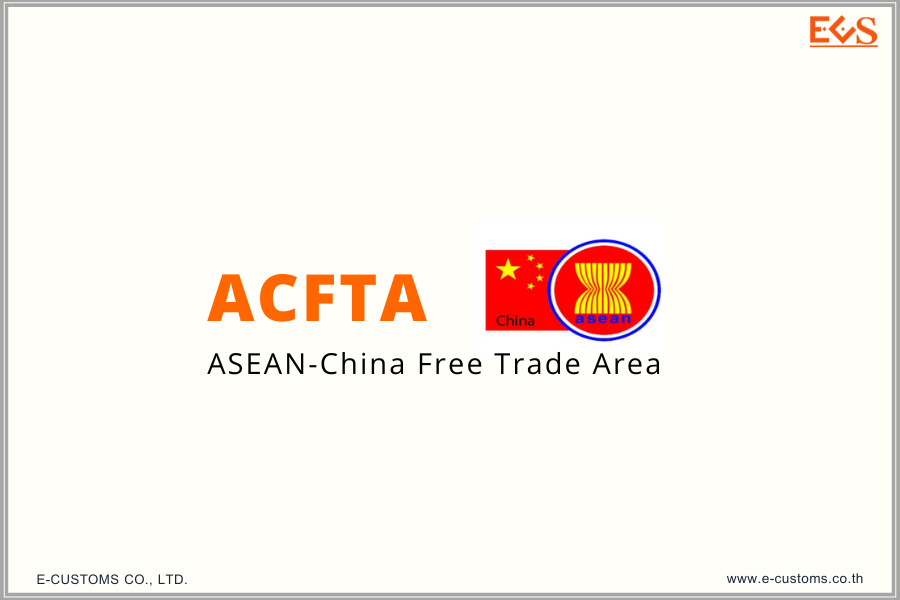



**ประกาศกองนโยบายและอุทธรณ์พิกัดอัตราศุลกากร ที่ 1/2566 เรื่อง สีของหนังสือรับรองถิ่นกําเนิดสินค้า (Form E) ในรูปแบบตราประทับและลายมือชื่ออิเล็กทรอนิกส์ (ESS) ที่ออกโดยประเทศจีน ภายใต้เขตการค้าเสรีอาเซียน-จีน (ACFTA)** 

เนื่องจากกองนโยบายและอุทธรณ์พิกัดอัตราศุลกากรได้รับทราบปัญหาเกี่ยวกับ Form E ในรูปแบบ ESS ที่ออกโดยหน่วยงานผู้มีอํานาจในการออกหนังสือรับรองถิ่นกําเนิดสินค้าของประเทศจีน ซึ่งจัดพิมพ์โดยผู้ส่งของออกของประเทศจีน และพบว่า Form E ดังกล่าวไม่เป็นสีขาวทั้งฉบับตามที่กําหนดใน ประกาศกรมศุลกากร เรื่อง หลักเกณฑ์และพิธีการการยกเว้นอากร และลดอัตราอากรศุลกากรสําหรับเขตการค้าเสรีอาเซียน-จีน ดังนั้น 

กองนโยบายและอุทธรณ์พิกัดอัตราศุลกากรจึงได้หารือกับหน่วยงานดังกล่าว และหน่วยงานฯ แจ้งว่าปัญหาดังกล่าว เป็นข้อผิดพลาดทางการพิมพ์ของผู้ส่งของออก โดยหากเจ้าหน้าที่ศุลกากรมีข้อสงสัย Form E ในประเด็นดังกล่าว เจ้าหน้าที่ศุลกากรสามารถตรวจสอบความแท้จริงของ Form E ในรูปแบบ ESS ผ่านเว็บไซต์ของศุลกากรจีนและ CCPIT

ดังนั้น หากผู้นําของเข้าได้รับ Form E ที่ไม่เป็นสีขาวทั้งฉบับอันเนื่องมาจากข้อผิดพลาด ทางการพิมพ์ของผู้ส่งของออก สามารถตรวจสอบความแท้จริงของ Form E ฉบับดังกล่าวได้จากเว็บไซต์ของ ศุลกากรจีน ([origin.customs.gov.cn](origin.customs.gov.cn)) และ CCPIT ([check.ccpiteco.net](check.ccpiteco.net)) ประกอบกับการตรวจสอบความถูกต้องจากเอกสารประกอบการนําเข้าอื่น ๆ โดยหากพบว่าถูกต้องตรงกัน สามารถนํา Form E ฉบับดังกล่าวมายื่นใช้ประกอบการพิจารณาขอรับสิทธิพิเศษทางอากรศุลกากรได้



Download

> ที่มา : [กรมศุลกากร](https://www.customs.go.th/cont_strc_simple_with_date.php?current_id=14232932414a505e4f464b48464a4f)
