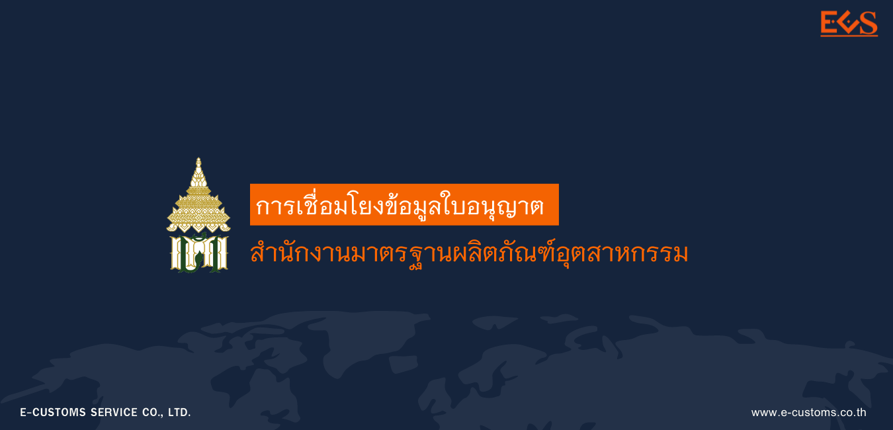
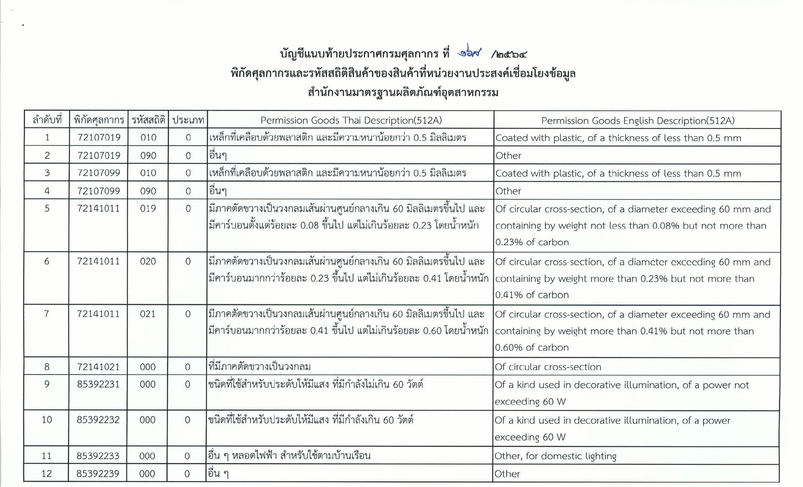
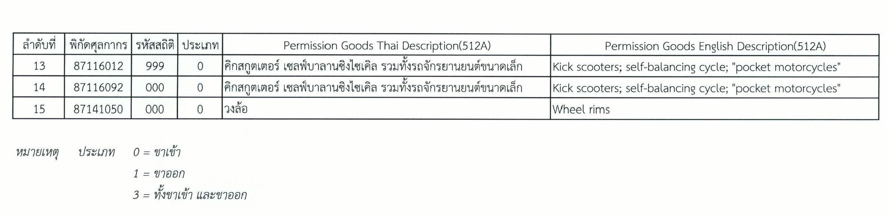


 



ประกาศกรมศุลกากรที่ 126/.2564 เรื่อง การเชื่อมโยงข้อมูลใบอนุญาต/ใบรับรองอิเล็กทรอนิกส์ร่วมกับ**สำนักงานมาตรฐานผลิตภัณฑ์อุตสาหกรรม** มีผลบังคับตั้งแต่*วันที่ 1 พฤศจิกายน พ.ศ. 2564* เป็นต้นไป




 

<a class="badge badge-danger" href="./docs.pdf" target="_blank" id="download_files_new">Download</a>

 


> ที่มา : [กรมศุลกากร](http://www.customs.go.th/cont_strc_download_with_docno_date.php?lang=th&top_menu=menu_homepage&current_id=14232932404f505f48464b47464b47)
