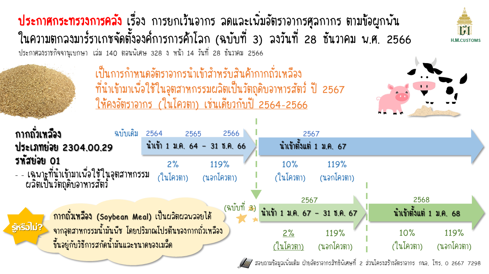
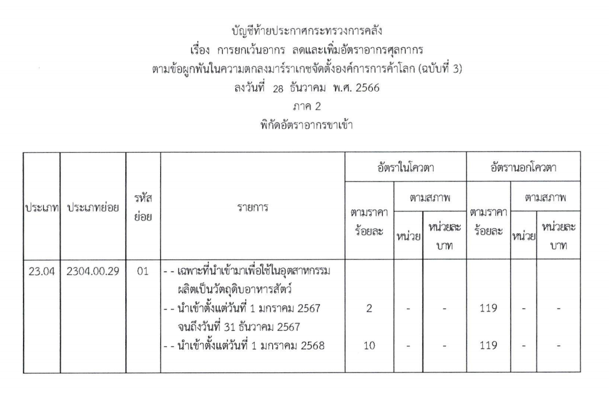



กรมศุลกากรเผยแพร่ **ประกาศกระทรวงการคลัง เรื่อง การยกเว้นอากร ลดและเพิ่มอัตราอากรศุลกากร ตามข้อผูกพันในความตกลงมาร์ราเกซจัดตั้งองค์การการค้าโลก (ฉบับที่ 3)**

โดยที่เป็นการสมควรแก้ไขเพิ่มเติมอัตราอากรศุลกากรสำหรับการนำเข้ากากถั่วเหลือง ตามประเภทย่อย 2304.00.29 รหัสย่อย 01  *เฉพาะที่นำเข้ามา เพื่อใช้ในอุตสาหกรรมผลิตเป็นวัตถุดิบอาหารสัตว์* สำหรับปี พ.ศ. 2567 และเพื่อปฏิบัติตามข้อผูกพันในความตกลงมาร์ราเกซจัดตั้งองค์การการค้าโลก โดยความเห็นชอบของคณะรัฐมนตรี เมื่อวันที่ 26 ธันวาคม พ.ศ. 2566 ออกประกาศไว้ ดังต่อไปนี้

ข้อ 1 ประกาศนี้ให้ใช้บังคับ*ตั้งแต่วันที่ 1 มกราคม พ.ศ. 2567 เป็นต้นไป*   
ข้อ 2 ให้ยกเลิกการลดและเพิ่มอัตราอากรศุลกากรสำหรับของตามประเภทย่อย 2304.00.29 รหัสย่อย 01 และให้ลดและเพิ่มอัตราอากรศุลกากร สำหรับของตามบัญชีท้ายประกาศนี้แทน





ดาวน์โหลดประกาศ

> ที่มา : [กรมศุลกากร](https://www.customs.go.th/cont_strc_download_with_docno_date.php?lang=th&top_menu=menu_homepage&current_id=14232a32404e505e4e464b4a464b49)
