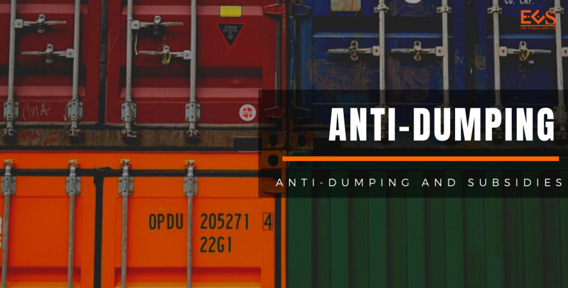
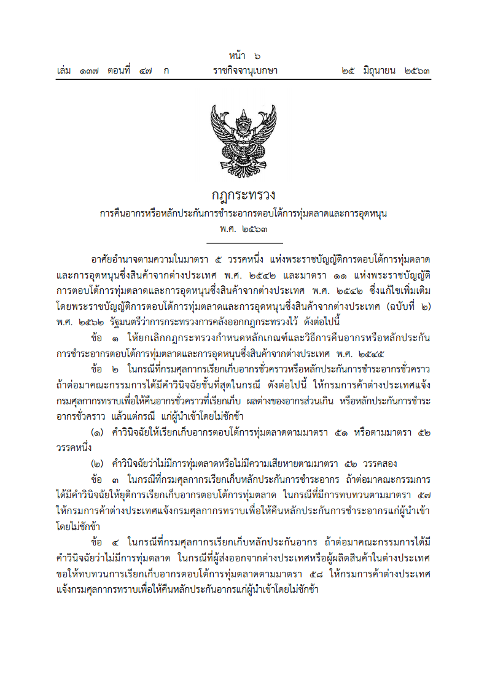
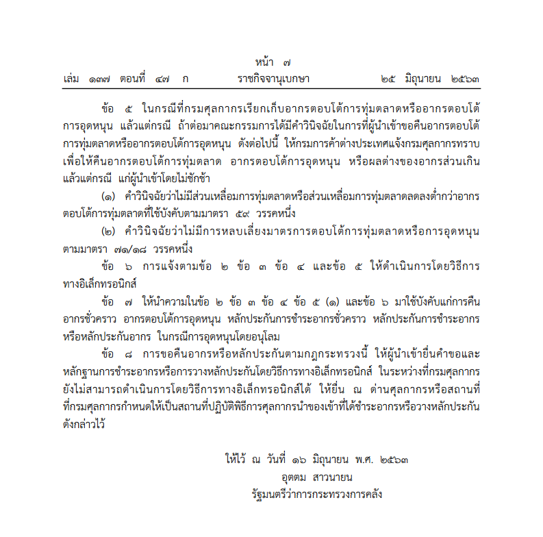
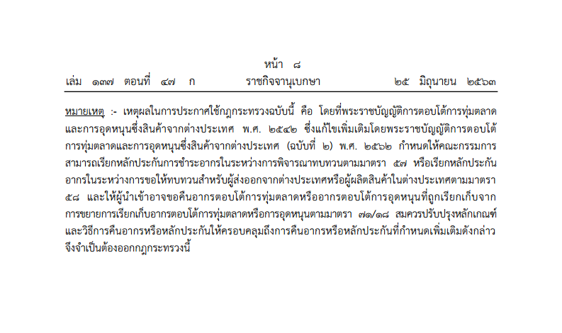

 <a href="./2563-06-refunding-for-anti-dumping.pdf" target="_blank">ดาวน์โหลดประกาศ 
                <i class=" fas fa-file-pdf" style="font-size:30px; color: red;"></i>
            </a>

> ที่มาบทความ : [กรมศุลกากร](http://th.customs.go.th/cont_strc_download_with_docno_date.php?lang=th&top_menu=menu_homepage&current_id=14232832414b505f46464b4d464b4a)
