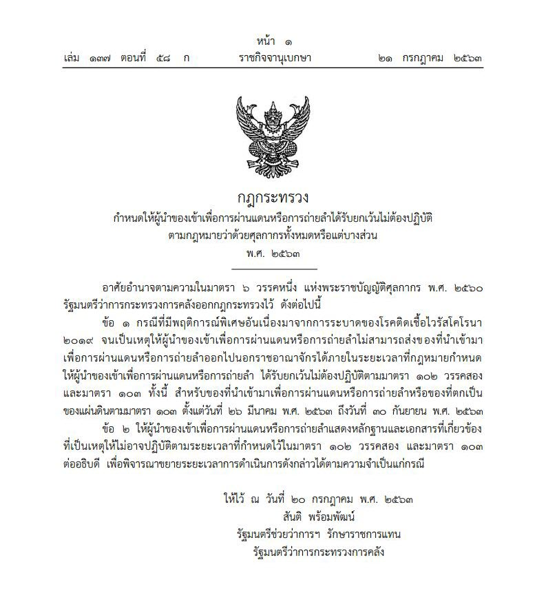
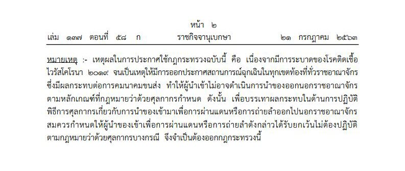

กฏกระทรวง  เรื่อง กำหนดให้ผู้นำของเข้าเพื่อการผ่านแดนหรือการถ่ายลำได้รับยกเว้นไม่ต้องปฏิบัติตามกฎหมายว่าด้วยศุลกากรทั้งหมดหรือแต่บางส่วน (รายละเอียดตามเอกสารแนบ) สำหรับของที่นำเข้ามาเพื่อ*การผ่านแดนหรือการถ่ายลำ* หรือของที่ตกเป็นของแผ่นดิน *ตั้งแต่วันที่ 26 มีนาคม พ.ศ. 2563 ถึงวันที่ 30 กันยายน พ.ศ. 2563* 

 <a href="./2563-07_transit.pdf" target="_blank">ดาวน์โหลดประกาศ 
                <i class=" fas fa-file-pdf" style="font-size:30px; color: red;"></i>
            </a>

