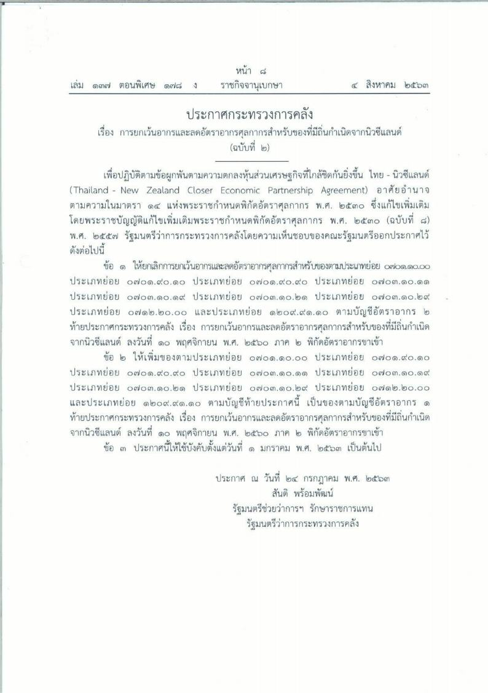
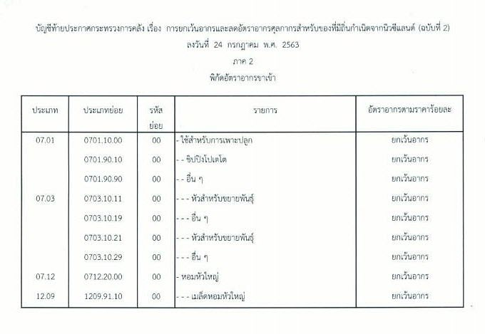

## ประกาศกระทรวงการคลัง เรื่อง การยกเว้นอากรและลดอัตราอากรศุลกากรสำหรับของที่มีถิ่นกำเนิดจากนิวซีแลนด์ (ฉบับที่ 2 ) 

 <a href="./new-zealand.pdf" target="_blank" id="download_files">ดาวน์โหลดประกาศ 
                <i class=" fas fa-file-pdf" style="font-size:30px; color: red;" id="icon_download"></i>
            </a>

