ประกาศกระทรวงการคลัง เรื่อง การยกเว้นอากรและลดอัตราอากรศุลกากรสำหรับ*เขตการค้าเสรีอาเซียน - จีน* ระบบได้ทำการแก้ไขเพิ่มเติมฐานข้อมูลพิกัดอัตราอากรขาเข้า สำหรับเขตการค้าเสรีอาเซียน-จีน ตามประกาศดังกล่าวให้โดยอัตโนมัติเรียบร้อยแล้ว

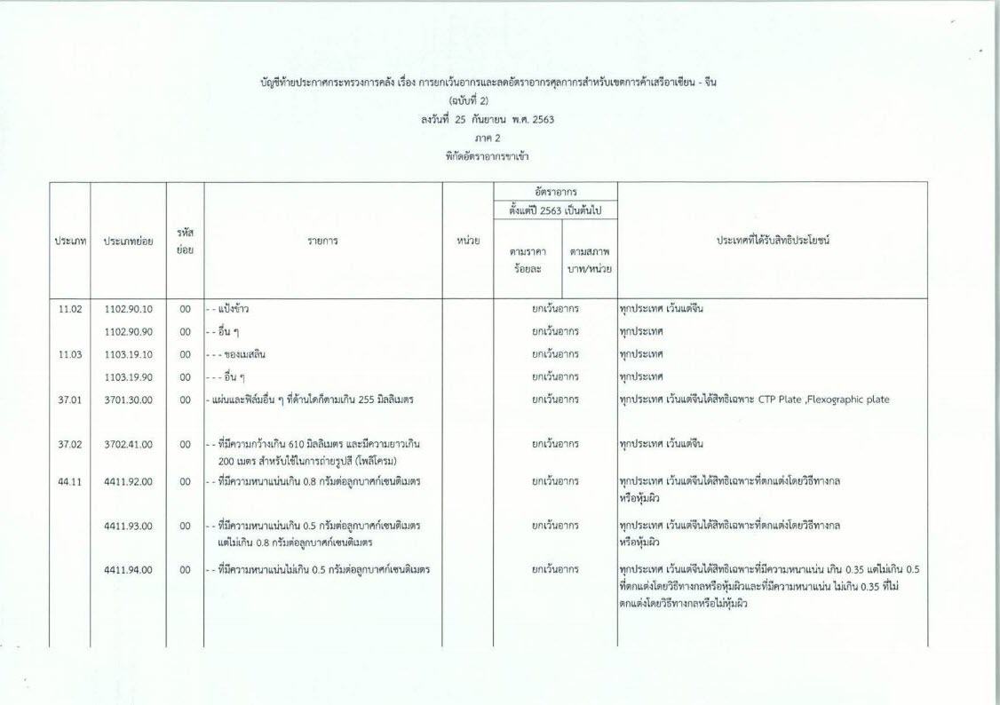
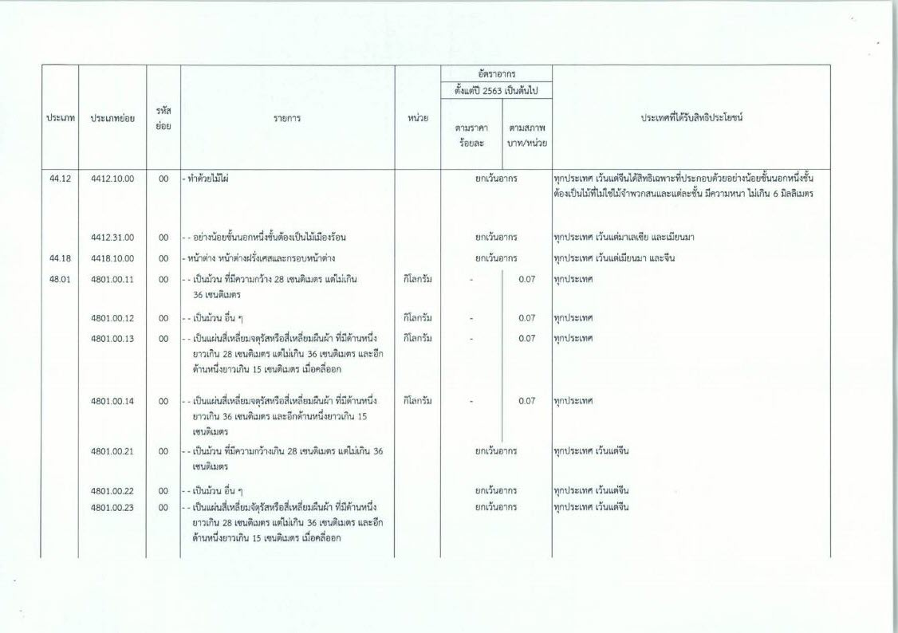
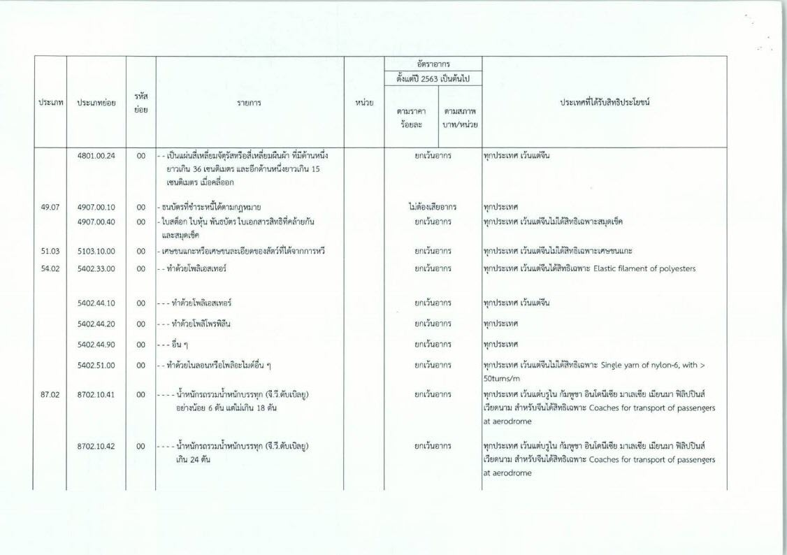
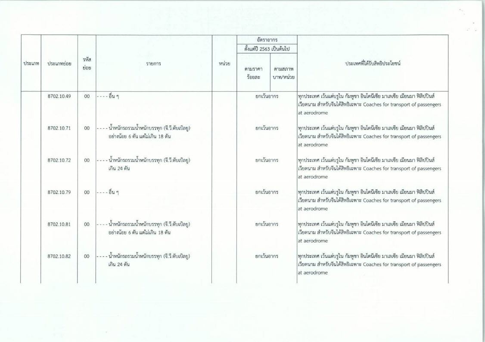
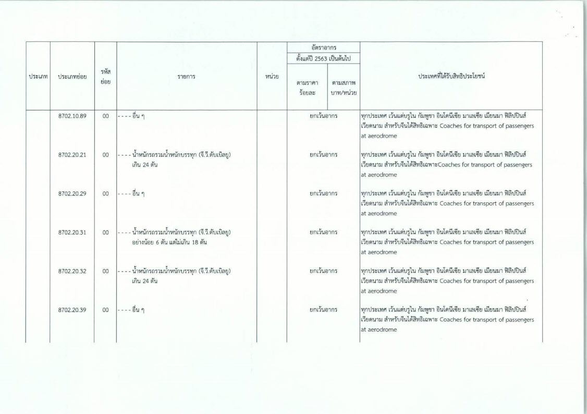
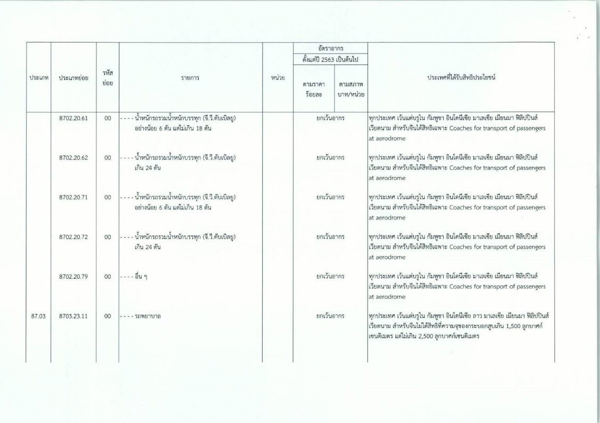
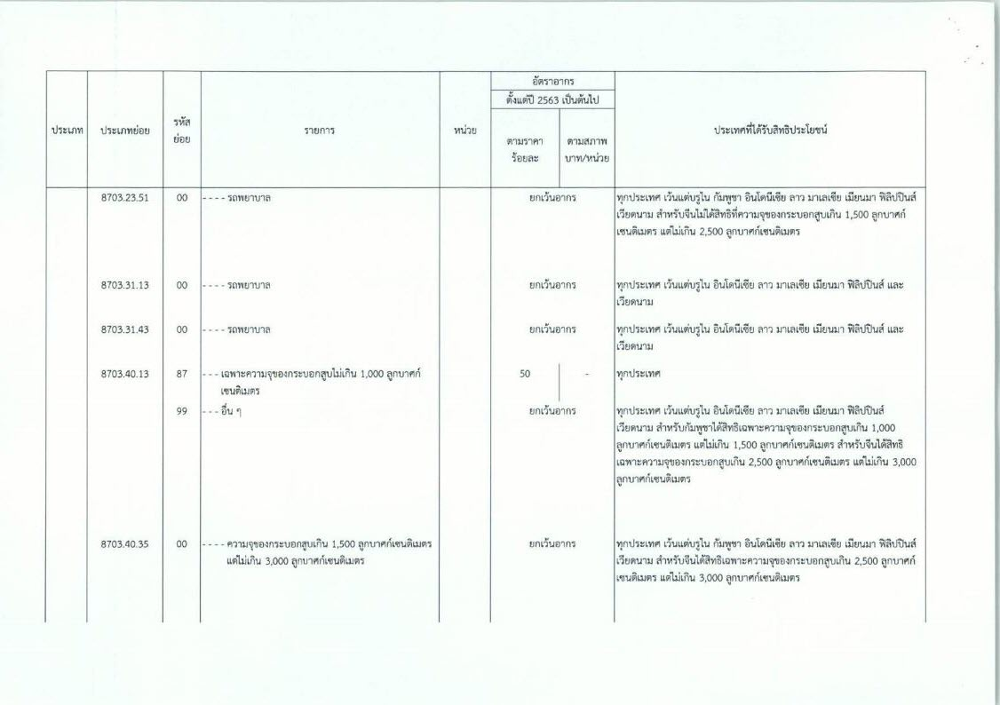
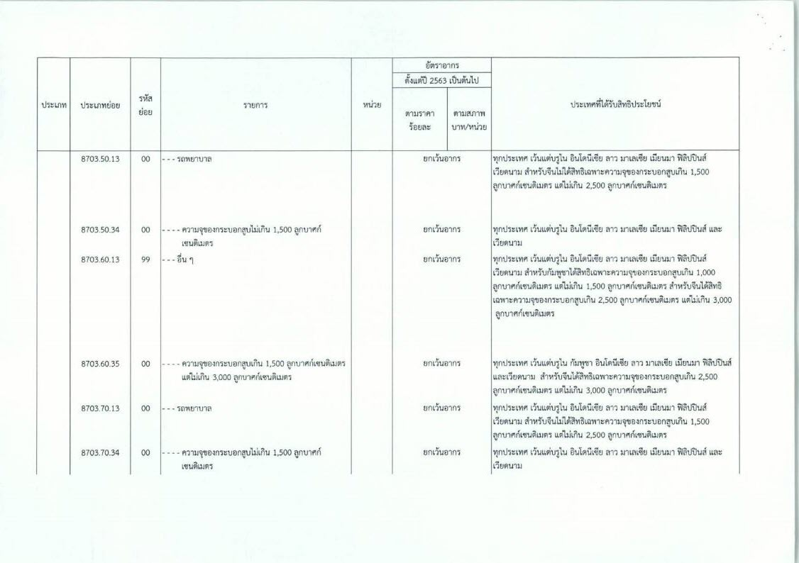
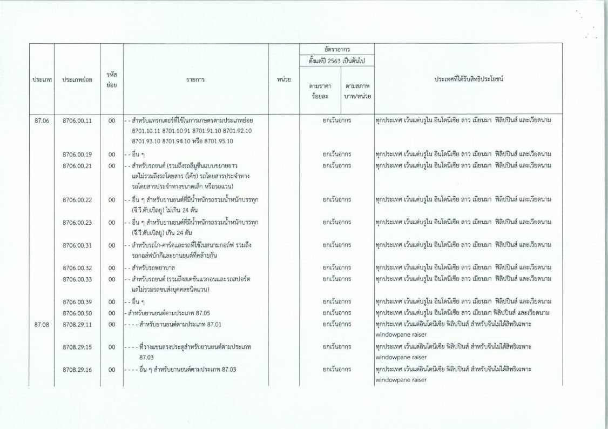
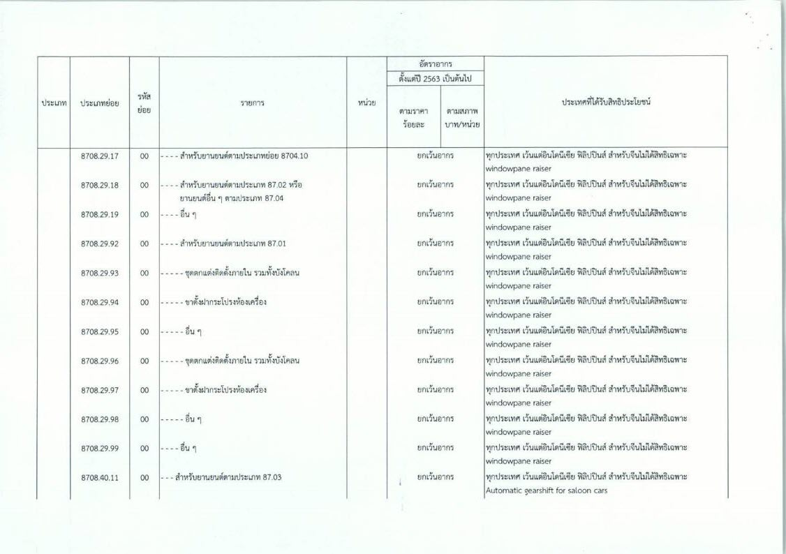
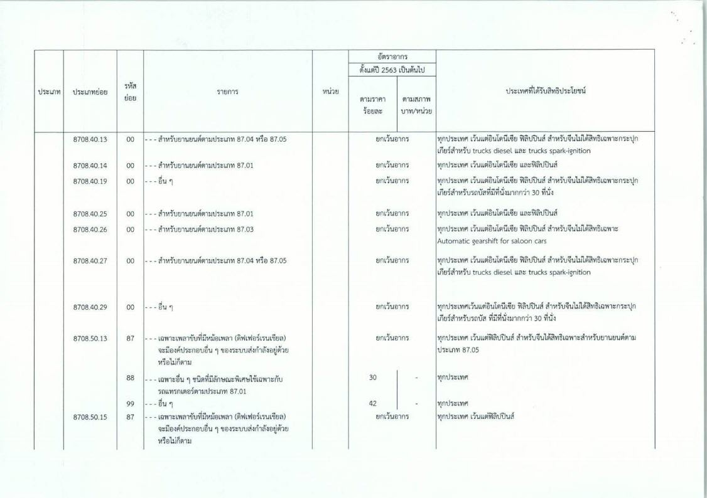
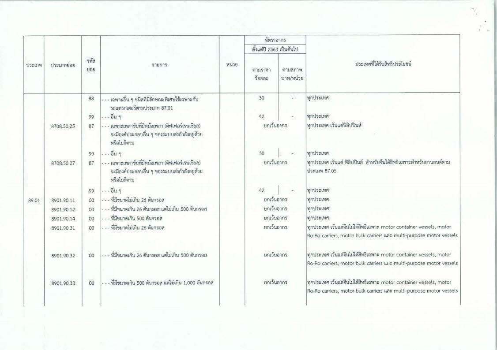
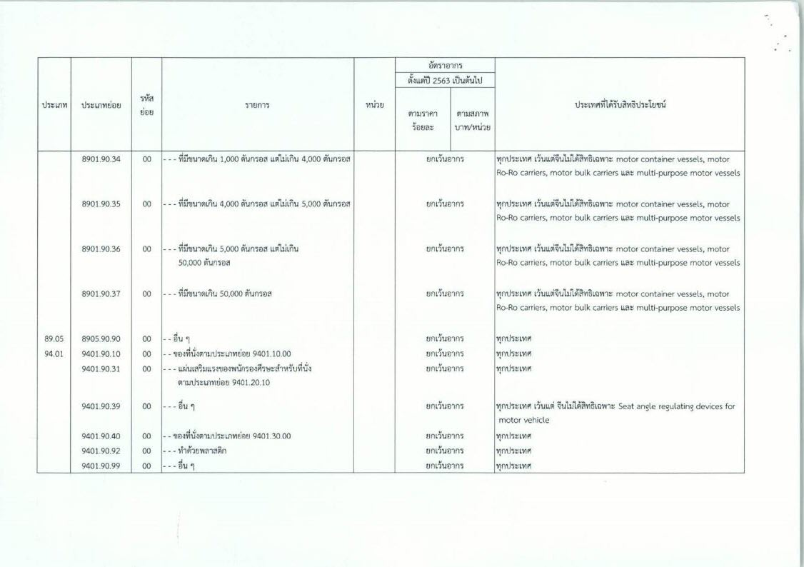

 
## ประกาศฉบับเต็ม



 

 

<a href="./2563-10-ACN.pdf" target="_blank" id="download_files">Download  <i class=" fas fa-file-pdf"></i> </a>

> ที่มา : [กรมศุลกากร](http://www.customs.go.th/data_files/2636eaadda87b5f3a3932289a595c8eb.pdf)
