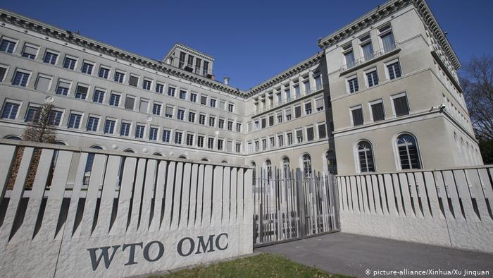
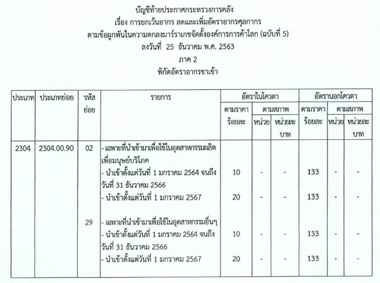

ประกาศกระทรวงการคลัง เรื่อง การยกเว้นอากร ลดและเพิ่มอัตราอากรศุลกากรตามข้อผูกพัน ในความตกลงมาร์ราเกชจัดตั้งองค์การการค้าโลก (ฉบับที่ 5) สำหรับพิกัด *2304.00.90* ซึ่งบังคับใช้ตั้งแต่*วันที่ 1 มกราคม 2564* เป็นต้นมา

 

## ประกาศฉบับเต็ม



 

 

<a href="./WTO-5.pdf" target="_blank" id="download_files">Download  <i class=" fas fa-file-pdf"></i> </a>

> ที่มา : [กรมศุลกากร](http://www.customs.go.th/cont_strc_download_with_docno_date.php?lang=th&top_menu=menu_homepage&current_id=14232832414c505f4d464b4b464b4d)
