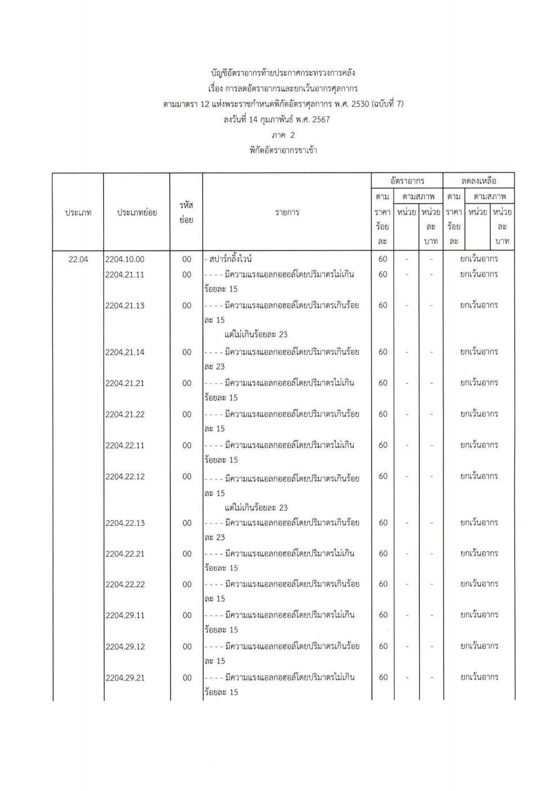
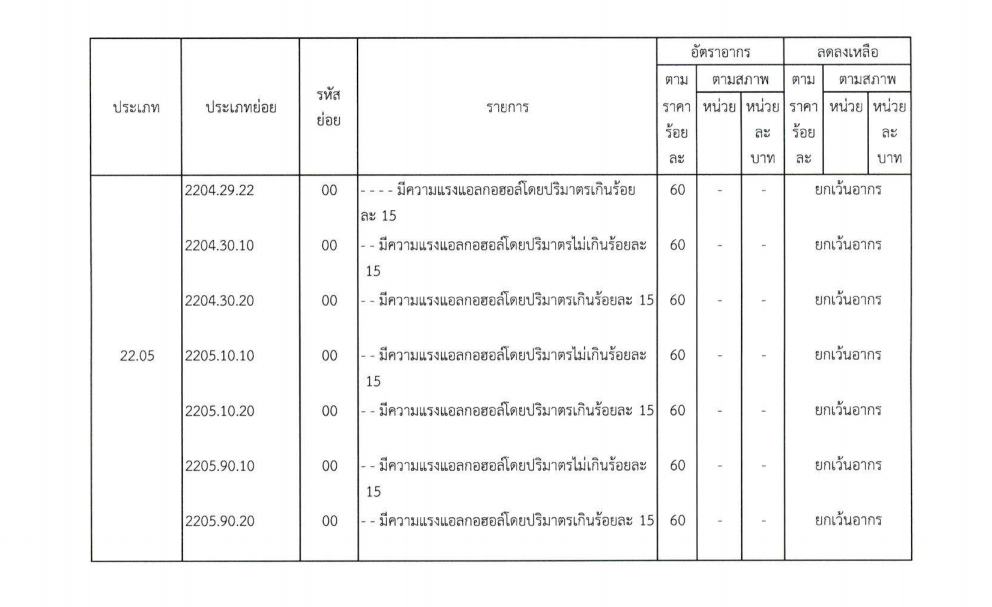



กรมศุลกากรเผยแพร่ ประกาศกระทรวงการคลัง เรื่อง **การลดอัตราอากรและยกเว้นอากรศุลกากร ตามมาตรา 72 แห่งพระราชกำหนดพิกัดอัตราศุลกากร พ.ศ. 2530 (ฉบับที่ 7)** *(สปาร์กลิ้งไวน์)* (รายละเอียดตามเอกสารแนบ) เพื่อประโยชน์แก่การเศรษฐกิจของประเทศ อาศัยอำนาจตามความในมาตรา 12 วรรคหนึ่ง แห่งพระราชกำหนดพิกัดอัตราศุลกากร พ.ศ. 2530 รัฐมนตรีว่าการกระทรวงการคลังโดยความเห็นชอบ ของคณะรัฐมนตรี ออกประกาศไว้ ดังต่อไปนี้

 

**ข้อ 1** ให้ยกเลิกการลดอัตราอากรสำหรับของสามประเภทย่อย 2204.10,00 ประเภทย่อย 2204.21.1 ประเภทย่อย 2204.22.11 ประเภทย่อย 2204.29.11 ประเภทย่อย 2205.10.10 และประเภทย่อย 2055.90.00 ตามบัญชีอัตราอากรท้ายประกาศ กระทรวงการคลัง เรื่อง การลดอัตราอากรและยกเว้นอากรศุลกากรตามมาตรา 12 แห่งพระราชกำหนด พิกัดอัตราศุลกากร พ.ศ. 2530 ลงวันที่ 28 ธันวาคม พ.ศ. 2564 ภาค 2 พิกัดอัตราอากรขาเข้า และให้ยกเว้นอากรสำหรับของดังกล่าวตามบัญชีอัตราอากรท้ายประกาศนี้แทน

 

**ข้อ 2** ให้เพิ่มของตามประเภทย่อย 2204.21.13 ประเภทย่อย 2204.29.14 ประเภทย่อย 2204.21.21 ประเภทย่อย 2204.21.22 ประเภทย่อย 2204.22.12 ประเภทย่อย 2204.22.13 ประเภทย่อย 2204.22.21 ประเภทย่อย 2204.22.22 ประเภทย่อย 2204.29.12 ประเภทย่อย 2204.29.21 ประเภทย่อย 2204.29.22 ประเภทย่อย 2204.30.10 ประเภทย่อย 2204.30.20 ประเภทย่อย 2205.10.20 และประเภทย่อย 2205.90.20 ตามบัญชีอัตราอากรท้ายประกาศนี้ เป็นของในบัญชีอัตราอากร ท้ายประกาศกระทรวงการคลัง เรื่อง การลดอัตราอากรและยกเว้นอากรศุลกากรตามมาตรา 12 แห่งพระราชำหนดพิกัดอัตราศุลกากร พ.ศ. 2530 ลงวันที่ 28 ธันวาคม พ.ศ. 2564 ภาค 2 พิกัดอัตราอากรขาเข้า

 

**ข้อ 3** ประกาศนี้ให้ใช้บังคับตั้งแต่วันถัดจากวันประกาศในราชกิจจานุเบกษาเป็นต้นไป






ดาวน์โหลดประกาศ

> **ที่มา :** [กรมศุลกากร](https://www.customs.go.th/cont_strc_download_with_docno_date.php?lang=th&top_menu=menu_homepage&current_id=14232a32404f505e4e464b46464b4b)

