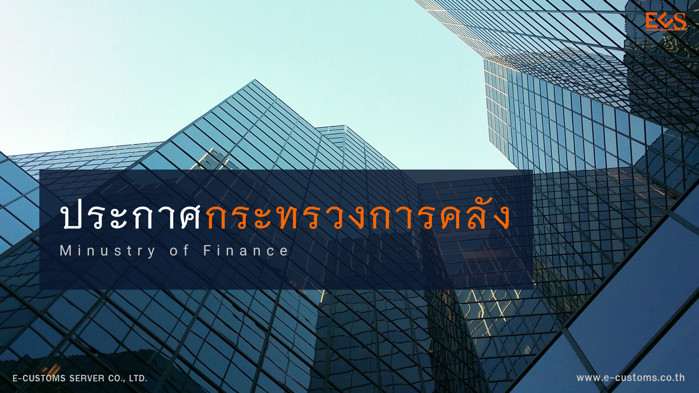



กรมศุลกากรเผยแพร่**ประกาศกระทรวงการคลัง เรื่อง การยกเว้นอากรศุลกากรสำหรับของที่มีมูลค่าไม่เกิน 1,500 บาท**   โดยที่รัฐบาลมีนโยบายที่จะแก้ไขปัญหาความไม่เป็นธรรมในการขายสินค้าให้แก่ผู้บริโภคระหว่าง ผู้ขายในต่างประเทศซึ่งไม่ต้องเสียภาษีมูลค่าเพิ่มกับผู้ขายในประเทศไทยซึ่งต้องเสียภาษีมูลค่าเพิ่ม ประกอบกับประเทศไทยต้องปฏิบัติตามความตกลงระหว่างประเทศซึ่งให้กำหนดราคาขั้นต่ำของของที่นำเข้าแต่ละรายเพื่อให้คุ้มค่า กับการจัดเก็บอากรศุลกากร อันเพื่อประโยชน์แก่การเศรษฐกิจของประเทศ รัฐมนตรีว่าการกระทรวงการคลังโดยความเห็นชอบของคณะรัฐมนตรีเมื่อวันที่ 4 มิถุนายน พ.ศ. 2567 ออกประกาศไว้ ดังต่อไปนี้

**ข้อ 1** ให้*ยกเว้นอากร*สำหรับของที่นำเข้า ซึ่ง**แต่ละรายผู้รับในประเทศมีราคารวมค่าขนส่ง และค่าประกันภัย (CIF)** ที่มีมูลค่า*มากกว่าหนึ่งบาทแต่ไม่เกินหนึ่งพันห้าร้อยบาท*

**ข้อ 2** ผู้นำของเข้าต้องปฏิบัติตามพิธีการที่อธิบดีกรมศุลกากรประกาศกำหนด

**ข้อ 3** ประกาศนี้ให้ใช้บังคับเมื่อพ้นกำหนด*สิบห้าวัน*นับแต่วันประกาศในราชกิจจานุเบกษา *จนถึงวันที่ 31 ธันวาคม พ.ศ. 2567*

ประกาศ ณ *วันที่ 19 มิถุนายน พ.ศ. 2567*







ดาวน์โหลดประกาศ  

> ที่มา : [กรมศุลกากร](https://www.customs.go.th/cont_strc_download_with_docno_date.php?lang=th&top_menu=menu_homepage&current_id=14232a324146505f4b464b48464b4a)
