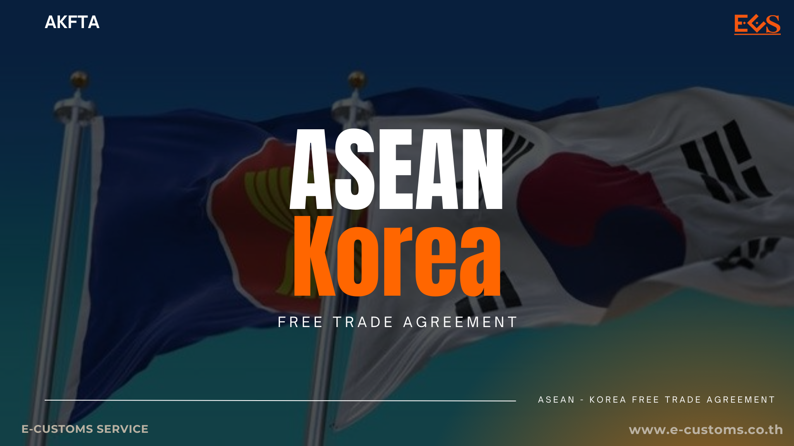
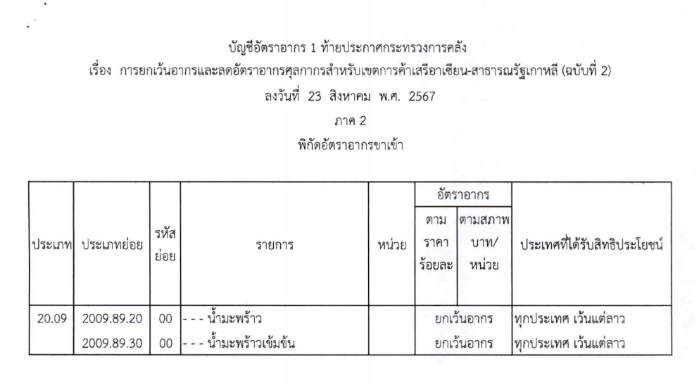



กรมศุลกากรเผยแพร่ ประกาศกระทรวงการคลัง เรื่อง **การยกเว้นอากรและลดอัตราอากรศุลกากร สำหรับเขตการค้าเสรี** *อาเซียน - สาธารณรัฐเกาหลี* **(ฉบับที่ 2)** มีรายละเอียดเบื้องต้นดังนี้ อาศัยอำนาจตามความในมาตรา 14 วรรคหนึ่ง แห่งพระราชกำหนดพิกัดอัตราศุลกากร พ.ศ. 2530 ซึ่งแก้ไขเพิ่มเติมโดยพระราชบัญญัติแก้ไขเพิ่มเติมพระราชกำหนดพิกัดอัตราศุลกากร พ.ศ. 2530 (ฉบับที่ 4) พ.ศ. 2557 รัฐมนตรีว่าการกระทรวงการคลังโดยความเห็นชอบของ คณะรัฐมนตรี เมื่อวันที่ 18 มิถุนายน พ.ศ. 2567 ออกประกาศไว้ ดังต่อไปนี้

**ข้อ 1** ประกาศนี้ให้ใช้บังคับตั้งแต่วันถัดจากวันประกาศในราชกิจจานุเบกษาเป็นต้นไป (*วันที่ 26 สิงหาคม พ.ศ. 2567*)

**ข้อ 2** ให้ยกเลิกการยกเว้นอากรสำหรับของตาม*ประเภทย่อย 2009.89.20 และ ประเภทย่อย 2009.89.30* ตามบัญชีอัตราอากร 1 ท้ายประกาศกระทรวงการคลัง เรื่อง การยกเว้น อากรและลดอัตราอากรศุลกากรสำหรับเขตการค้าเสรีอาเซียน - สาธารณรัฐเกาหลี ลงวันที่ 28 ธันวาคม พ.ศ. 2564 ภาค 2 พิกัดอัตราอากรขาเข้า และให้ยกเว้นอากรสำหรับของดังกล่าว ตามบัญชี อัตราอากร 1 ท้ายประกาศนี้แทน





ดาวน์โหลดประกาศ

> **ที่มา :** [กรมศุลกากร](https://www.customs.go.th/cont_strc_download_with_docno_date.php?lang=th&top_menu=menu_homepage&current_id=14232a324147505f49464b48464b47)

