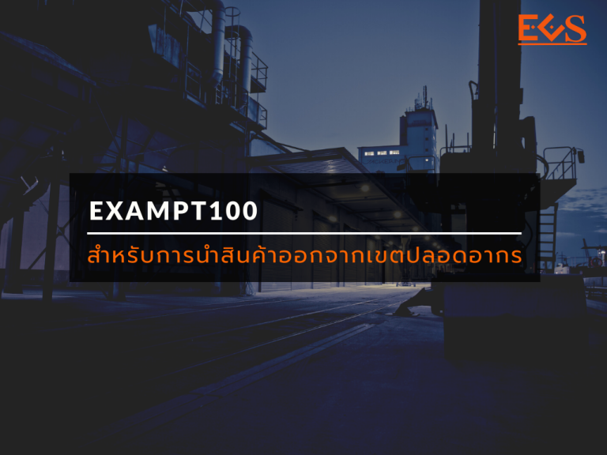
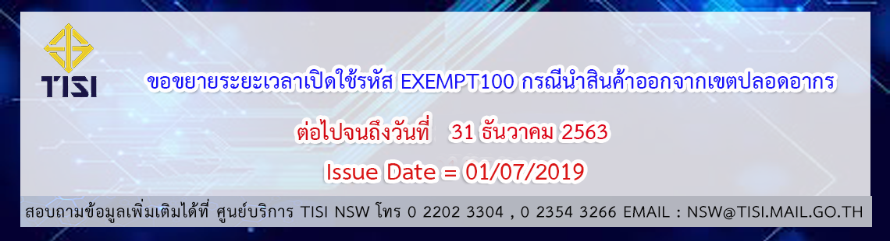

สำนักงานมาตรฐานผลิตภัณฑ์อุตสาหกรรม ขยายเวลาระยะเวลาเปิดใช้รหัส _**EXEMPT100**_ กรณีนำสินค้าออกจากเขตปลอดอากร ต่อไปจนถึง _**วันที่ 31 ธันวาคม 2563**_

 

 

 
 <a href="./EXEMPT100.pdf" target="_blank" id="download_files">ดาวน์โหลดเอกสาร
                <i class=" fas fa-file-pdf" ></i>
            </a>

> สอบถามปัญหาในการใช้งานระบบ :   ศูนย์บริการ TISI NSW 0 2202 3304 , 0 2354 3266 e-Mail : nsw@tisi.mail.go.th

> ที่มา : [สำนักงานมาตรฐานผลิตภัณฑ์อุตสาหกรรม](https://www.tisi.go.th/website/nsw/n_nsw)