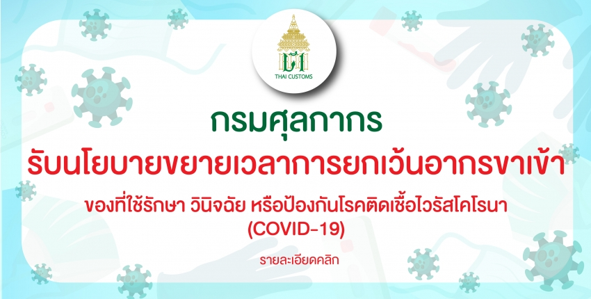
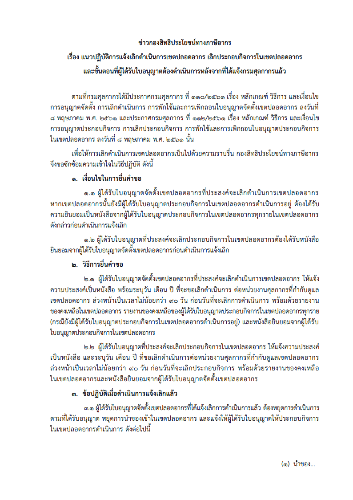

กรมศุลกากรเผยแพร่ ข่าวกองสิทธิประโยชน์ทางภาษีอากร เรื่อง แนวปฏิบัติการแจ้งเลิกดำเนินการเขตปลอดอากร เลิกประกอบกิจการในเขตปลอดอากร และขั้นตอนที่ผู้ได้รับใบอนุญาตต้องดำเนินการหลังจากที่ได้แจ้งกรมศุลกากรแล้ว 

 

 
 <a href="http://www.customs.go.th/cont_strc_download.php?current_id=14232832414c505f49464b4d464a4e" target="_blank" id="download_files">ดาวน์โหลดเอกสาร
                <i class=" fas fa-file-pdf" ></i>
            </a>
 

> ที่มา : [กรมศุลกากร](http://www.customs.go.th/cont_strc_download.php?current_id=14232832414c505f49464b4d464a4e)