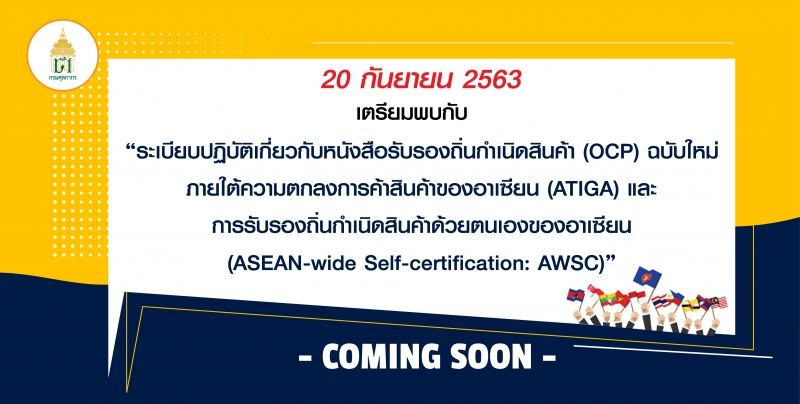
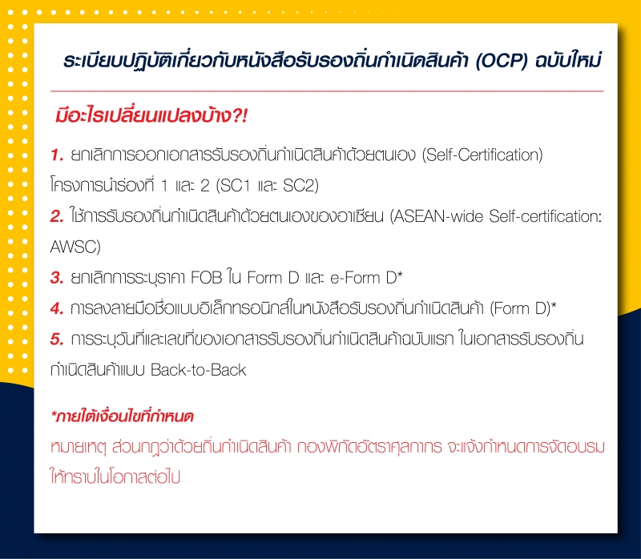

## ระเบียบปฏิบัติเกี่ยวกับหนังสือรับรองถิ่นกำเนิดสินค้า (OCP) ฉบับใหม่ (20 กันยายน 2563)

ภายใต้ความตกลงการค้าสินค้าของอาเซียน (ATIGA) และการรับรองถิ่นกำเนิดสินค้าด้วยตนเองของอาเซียน (ASEAN-wide Self-certification: AWSC)

 

> ที่มา : [กรมศุลกากร](http://www.customs.go.th/cont_strc_simple_with_date.php?current_id=14232832414b505f4c464b46464b48)
