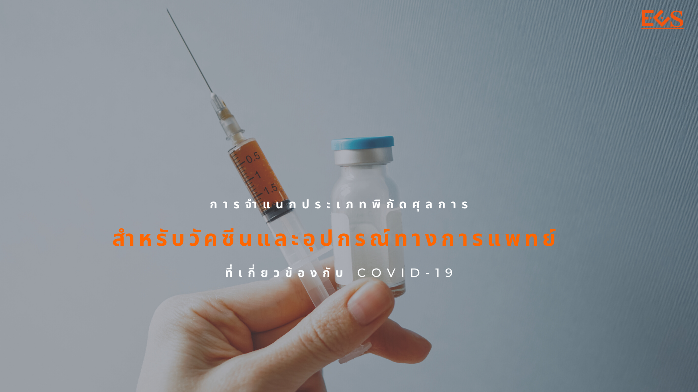

กรมศุลกากรเผยแพร่เอกสาร **รายการอ้างอิงในการจำแนกประเภทพิกัดศุลการสำหรับวัคซีนและอุปกรณ์ทางการแพทย์ที่เกี่ยวข้องกับ COVID-19** 

 



 

<a class="badge badge-danger" href="./news.pdf" target="_blank" id="download_files_new">Download </a>

 

> ที่มา : [กรมศุลกากร](http://www.customs.go.th/cont_strc_simple_with_date.php?current_id=14232832414d505f47464a4e464b4b)