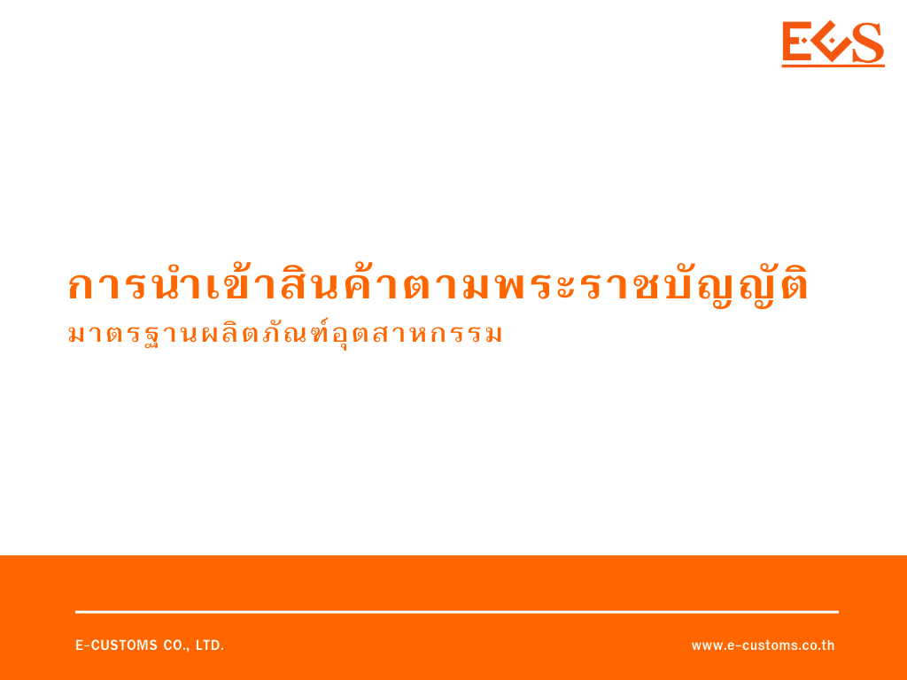
 

ตามที่สำนักงานมาตรฐานผลิตภัณฑ์อุตสาหกรรม (สมอ.) ได้ประชาสัมพันธ์ แนวทางการปฏิบัติสำหรับ **การนำเข้าสินค้าตามพระราชบัญญัติมาตรฐานผลิตภัณฑ์อุตสาหกรรม** พ.ศ. 2511 เริ่มตั้งแต่*วันที่ 1 เมษายน 2564* เป็นต้นไป มีรายละเอียดดังนี้

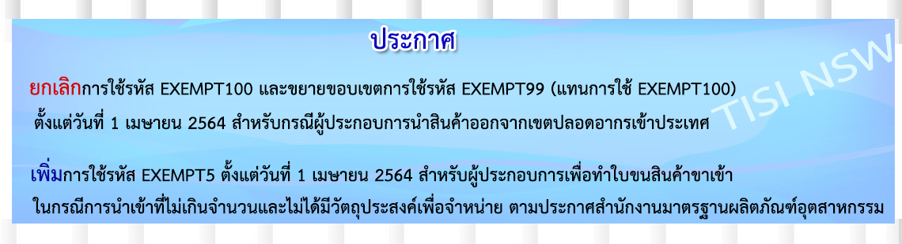
 

- แจ้ง**ยกเลิกการใช้รหัส EXEMPT100** และขยายขอบเขตการใช้รหัส **EXEMPT99** (แทนการใช้ EXEMPT100) สำหรับกรณีผู้ประกอบการ**นำสินค้าออกจากเขตปลอดอากรเข้าประเทศ**



- **เพิ่มการใช้รหัส EXEMPT5** สำหรับผู้ประกอบการ เพื่อทำใบขนสินค้าขาเข้า ในกรณี **การนำเข้าที่ไม่เกินจำนวนและไม่ได้มีวัตถุประสงค์เพื่อจำหน่ายในราชอาณาจักร**


{}

 

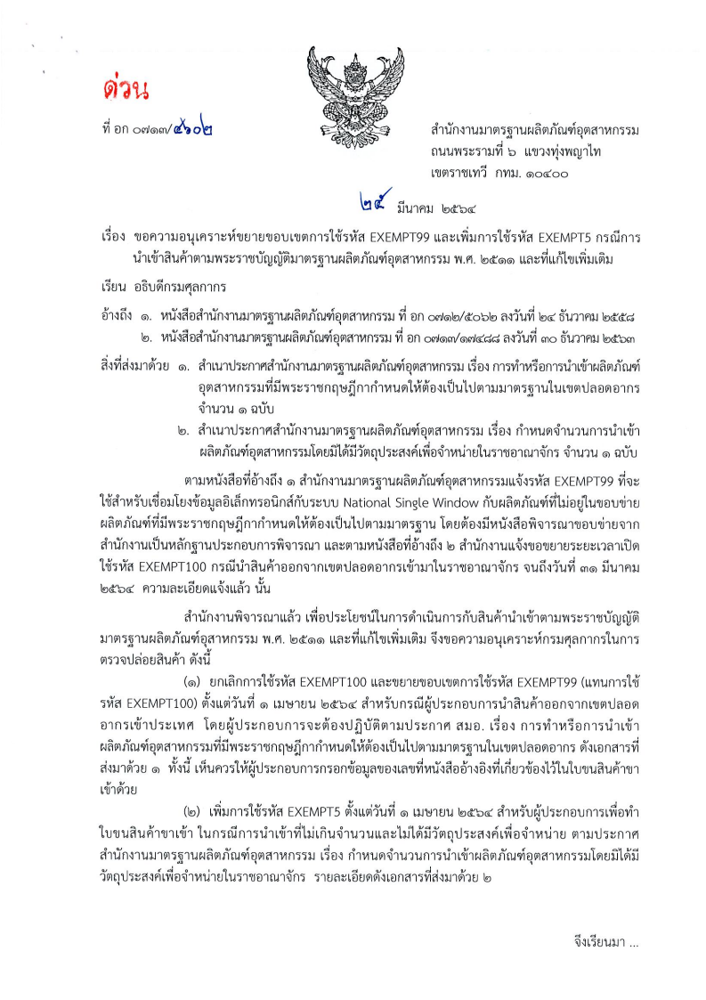

## การนำสินค้าออกจากเขตปลอดอากรเข้าประเทศ

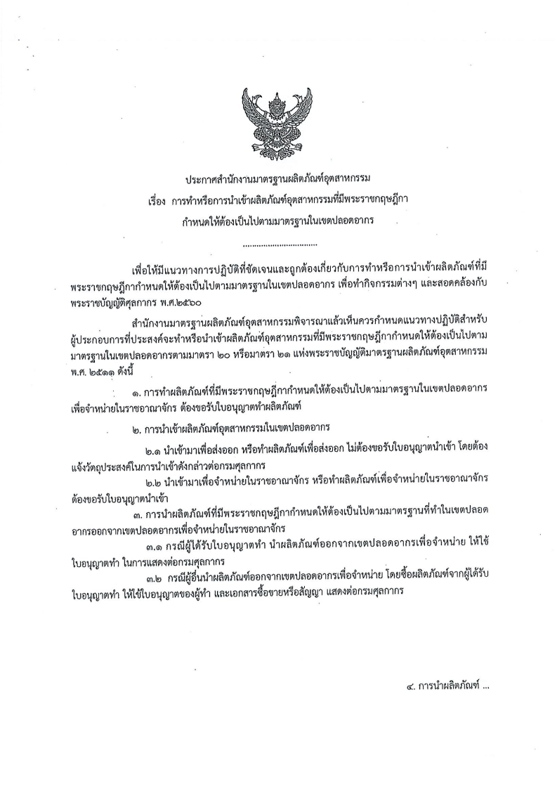

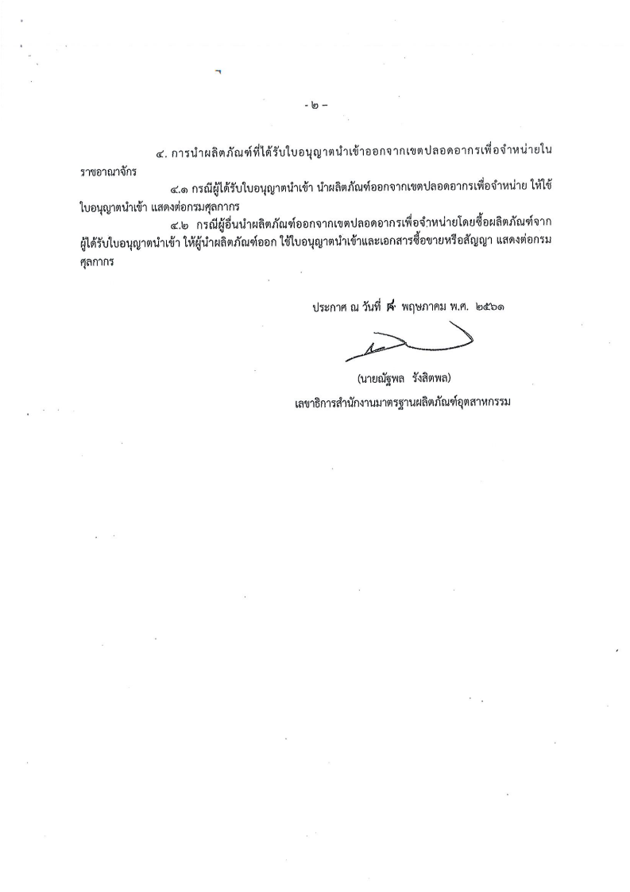

----

## การนำเข้าที่ไม่เกินจำนวนและไม่ได้มีวัตถุประสงค์เพื่อจำหน่ายในราชอาณาจักร

 

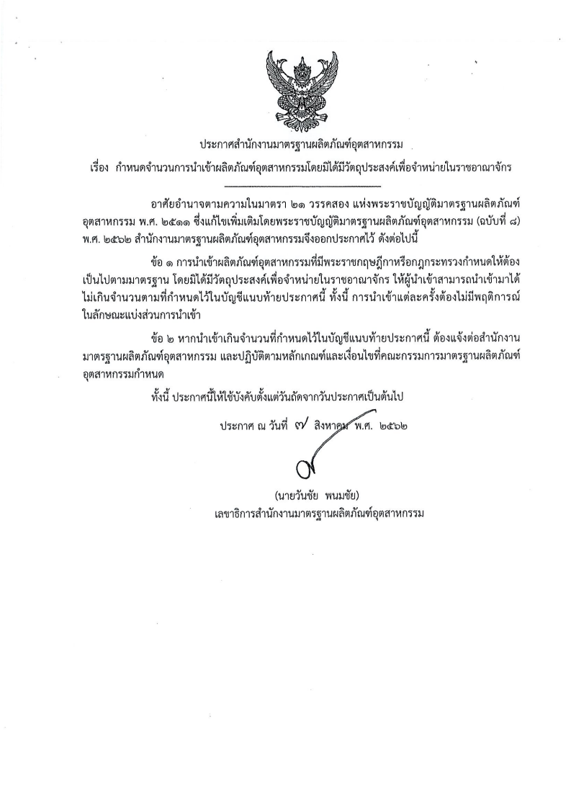

## บัญชีแนบท้าย

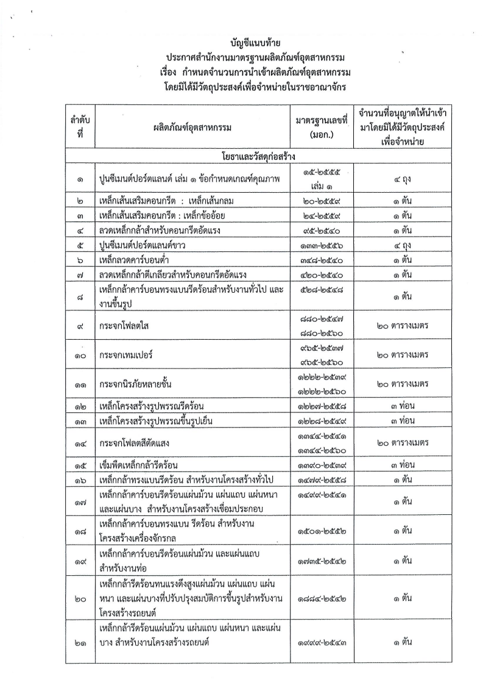
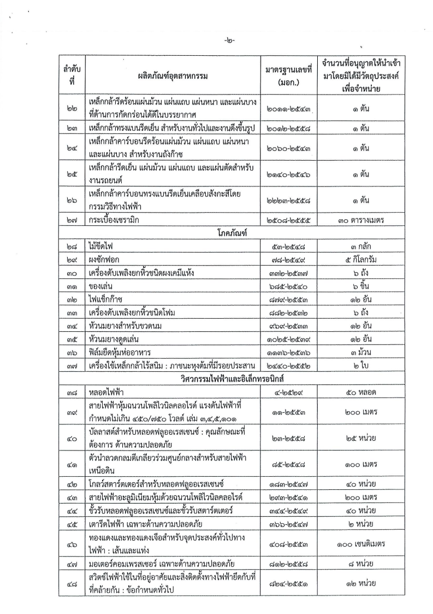
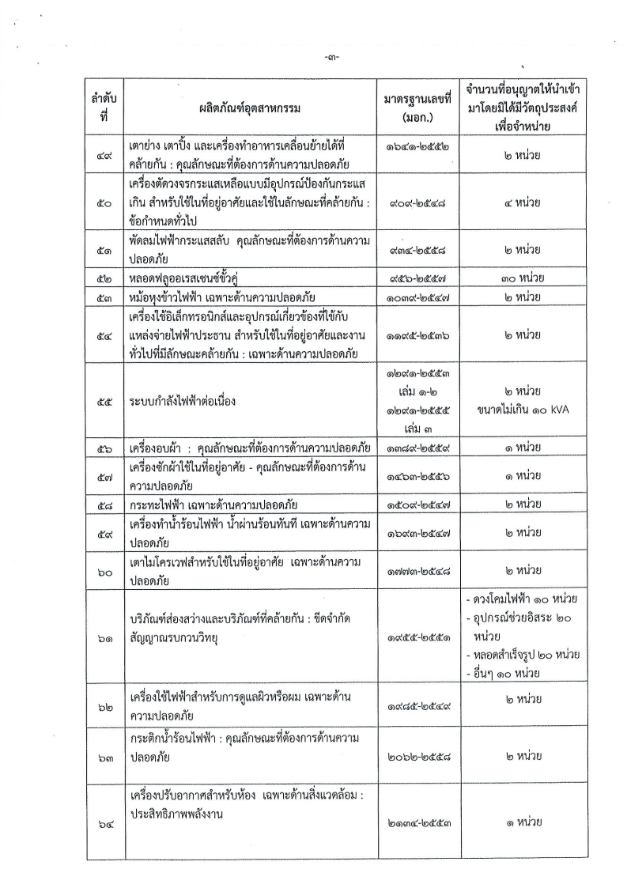
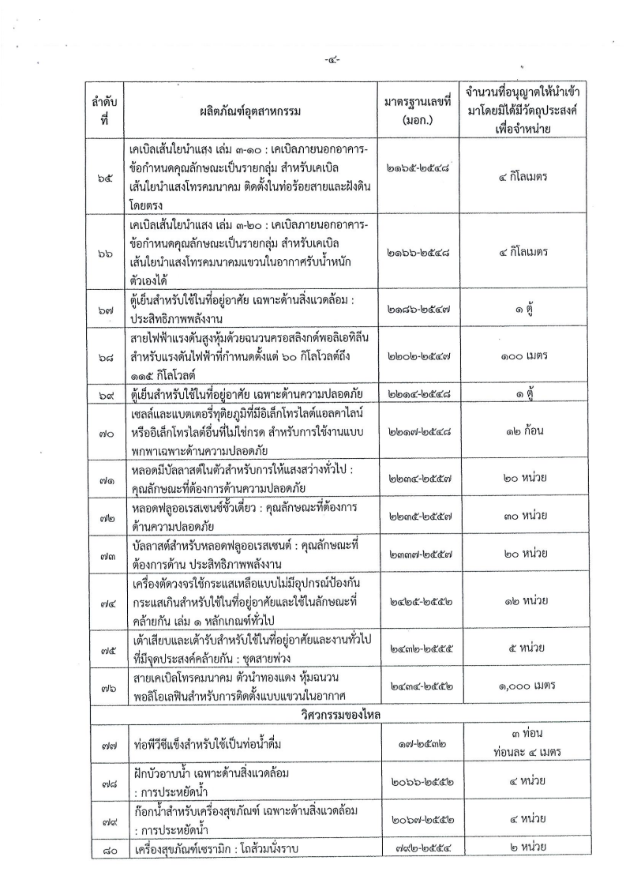
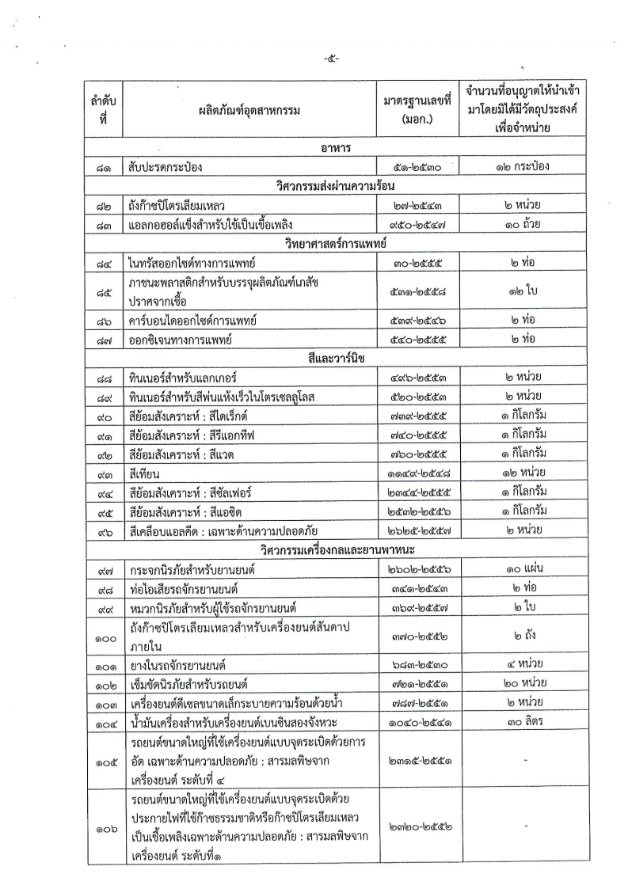
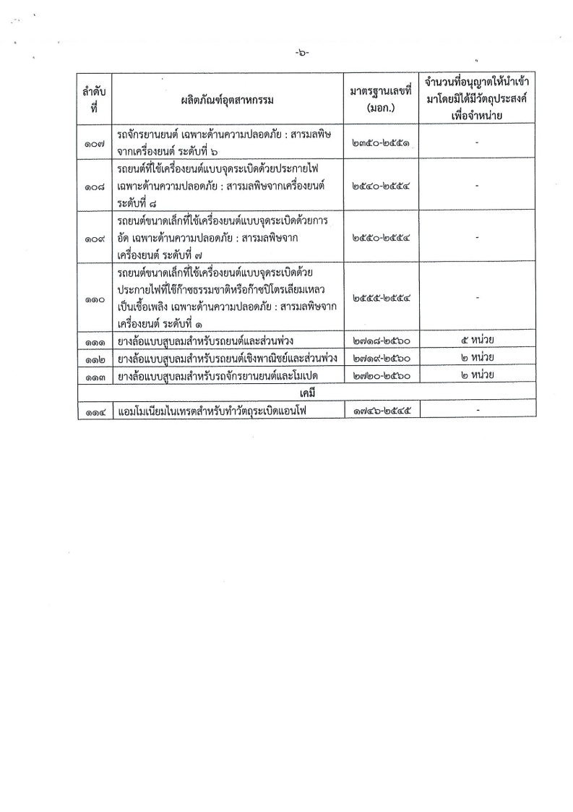

<a class="badge badge-danger" href="./doc.pdf" target="_blank" id="download_files_new">Download </a>

 

> ที่มา : [สำนักงานมาตรฐานผลิตภัณฑ์อุตสาหกรรม (สมอ.)](https://www.tisi.go.th/data/banner/pdf/EXEMPT99-25032564_01042564.pdf)